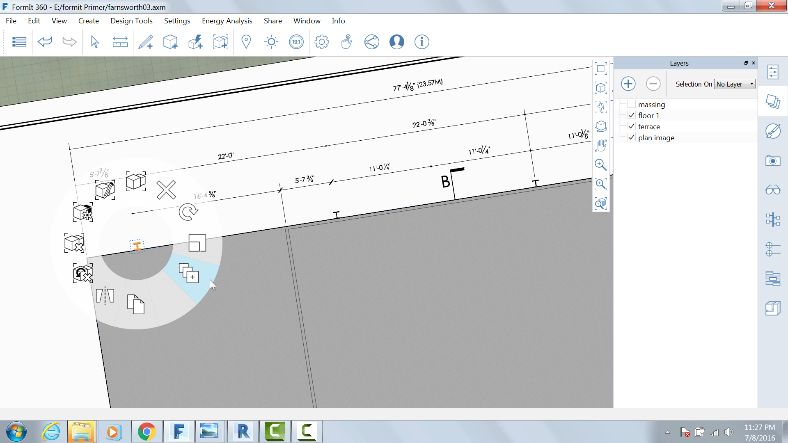
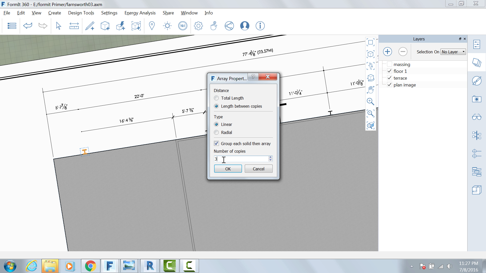

### Array the columns

Select the Column group

Right click and choose Array (A R)

Use the following settings

Length Between Copies

Linear

Number of Copies: 3

Press OK, begin moving the cursor towards the right and lock on to the
red axis

Press Tab and enter **22' -** you now have four columns 22' apart

Hover over the first Column and press the Tab key – all four columns
will be selected

Repeat the array, but this time do 1 copy of all four and snap the
copies to the south side of the building

