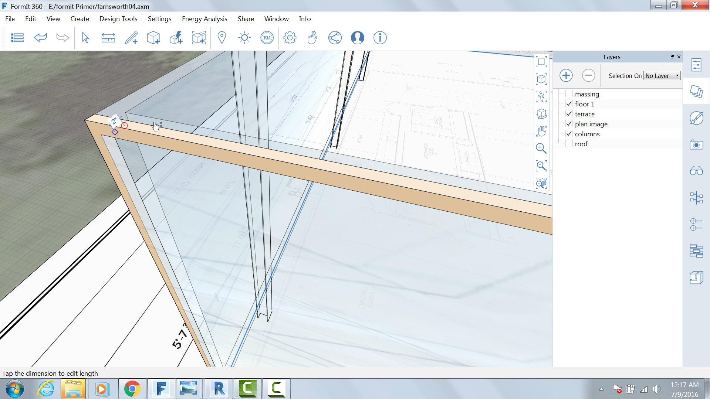

Adding Detail
-------------

If you did not complete the last section, click the File &gt; Open and
choose **farnsworth04.axm** from the FormIt Primer folder

We are going to create a 2" metal frame and mullions around the window
glass.

Hide the Roof Layer

Use the Rectangle tool ( R ) to draw a surface over the western face of
glass

Use the Offset Face tool (O F) and the Tab key to offset another
rectangle **2"** towards the interior

Select and extrude the frame 2" towards the interior

Group and name the assembly **EW Frame**

Import and paint the column with the material **Metal &gt; Anodized –
Gray**

Copy or Array the assembly to the eastern side of the building.

Repeat steps 1-6 for the North and South sides as well.