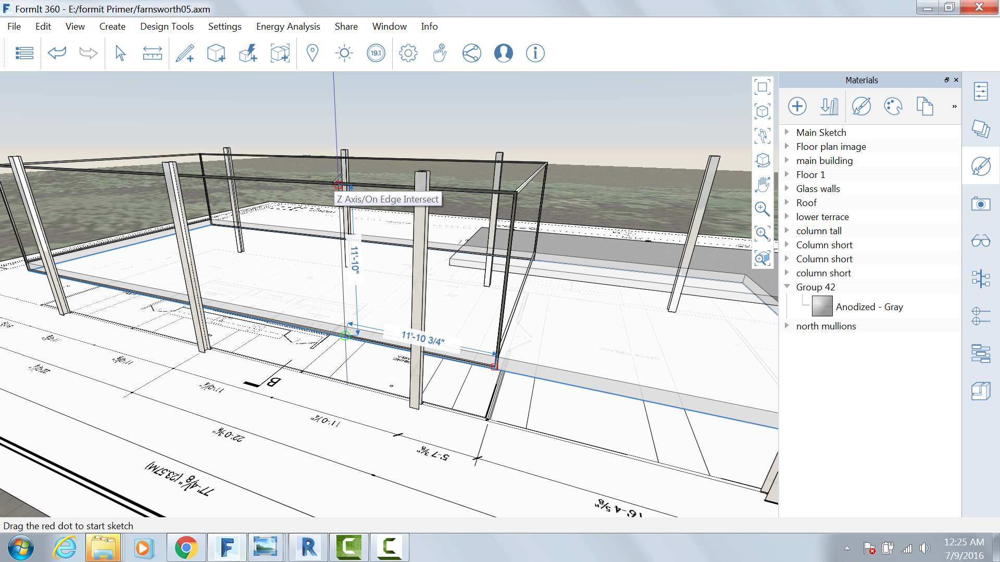
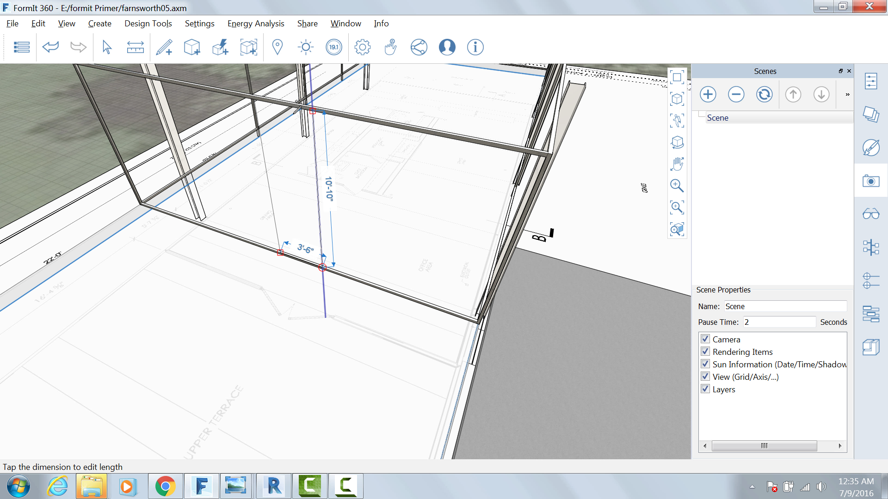

### Create Mullions

1. Using the same methods in the previous exercise, create a 2" thick and deep mullion **11'-10 ¾"** from the North West corner. 
2. Make the mullion the entire height of the glass walls (11'10").
3. Group and name the assembly **mullion**.
4. Import and paint the column with the material **Metal &gt; Anodized – Gray**.
5. Array them three times at a distance of 11'.
6. Use the hover + Tab key to select all mullion instances and copy to the south side of the wall.

### Create Door
Using the same methods as in the previous two exercises, create a 3'6" double door centered in the western wall. 