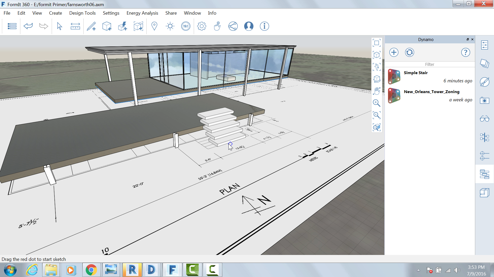

Computational Groups with Dynamo
--------------------------------

In this section we will leverage the computational power of
[Dynamo](http://dynamobim.org/) to place and modify flexible groups.

If you did not complete the last section, click the File &gt; Open and
choose **farnsworth06.axm** from the FormIt Primer folder

### Place and modify Dynamo Groups

Open they Dynamo Palette

Click the + icon

Paste the following URL into the box

<https://www.dynamoreach.com/share/5780fb888794379c4b65b941>

This will load a previously created Dynamo Group named Simple Stair.
Click the icon in the palette and the stair will be loaded into the
scene

Go to the Plan view and place the stair roughly centered where the stair
to the lower terrace appears on the plan

Double click the Group to edit it and go to the Properties Palette