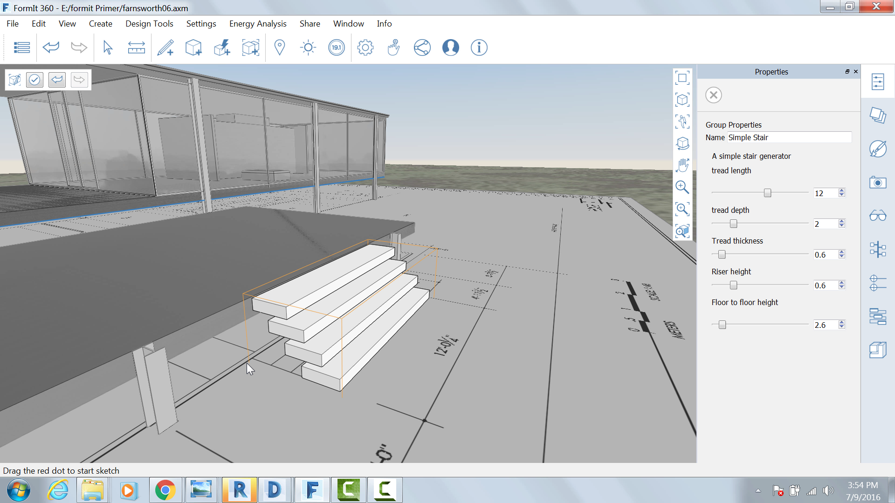

Modify the settings:

Once it is placed, copy the stair to the upper terrace. Right click on
copied group and select Make Unique (M U)

Double click the copied group to edit and change the Floor to floor
height setting to **1.5**
