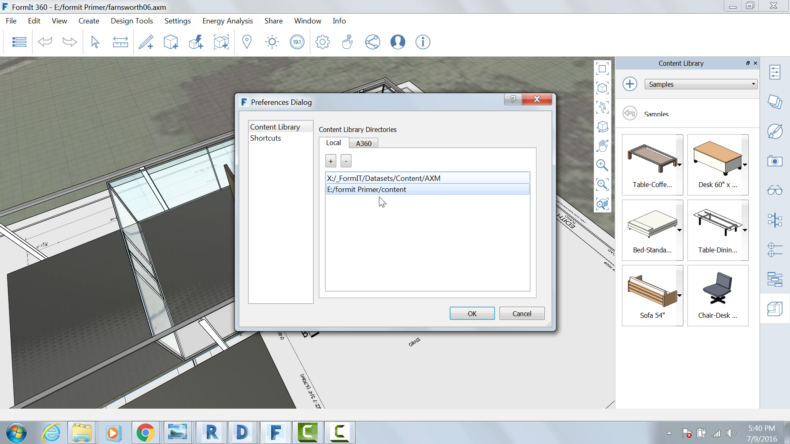
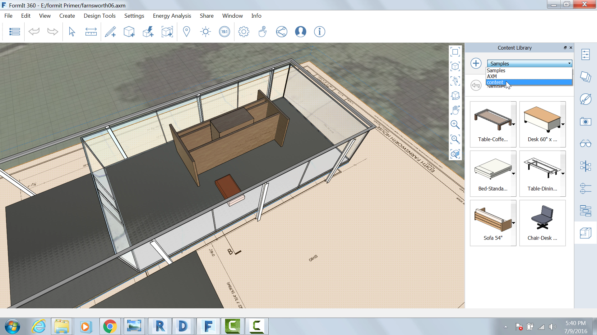
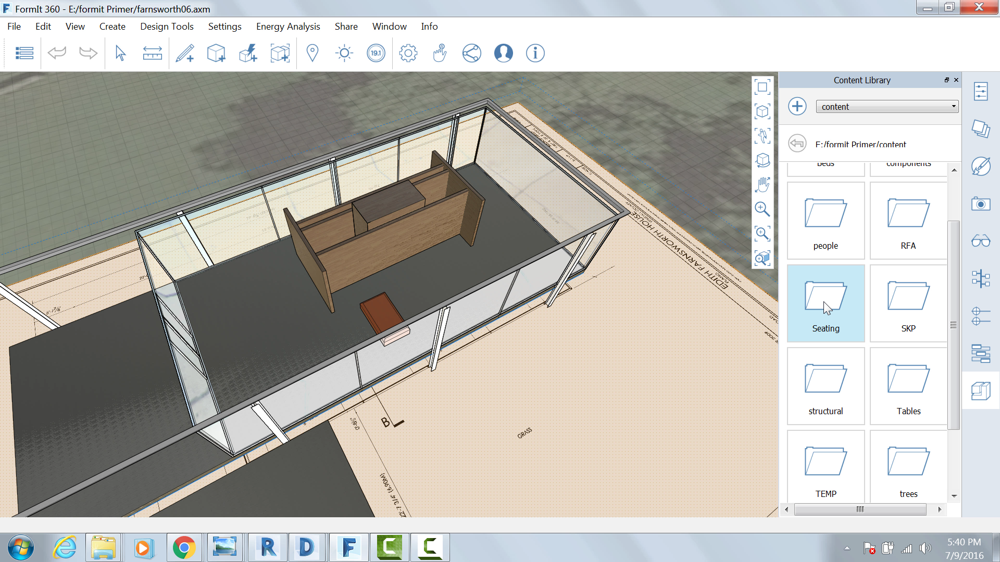
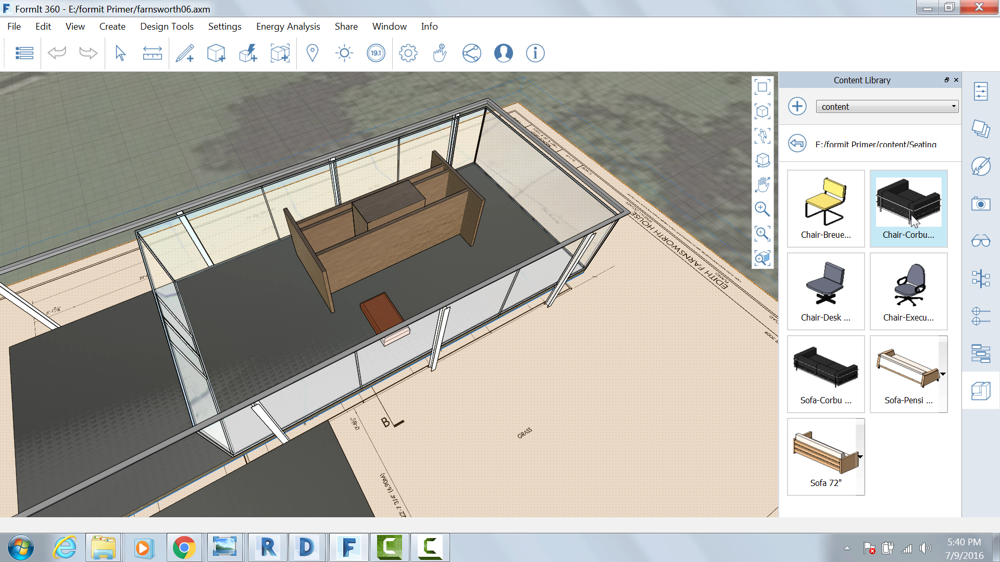

### Set up and use the Content Library

Open the Content Library palette

Click the + icon to create a path to your local Content Library. Select

the **FormIt Primer\\content** folder and Click OK.

Select the Content folder from the menu

Select the Seating sub-folder

Select the **Corbu Chair** and place two instances of it

