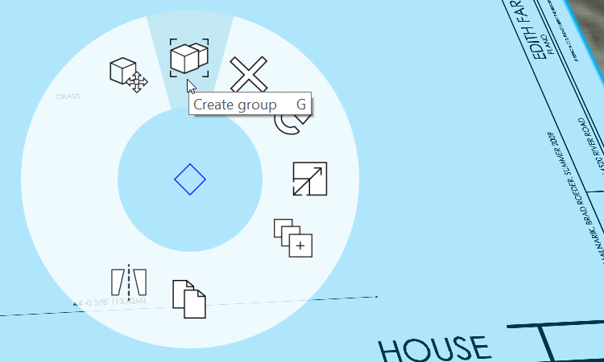
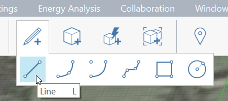
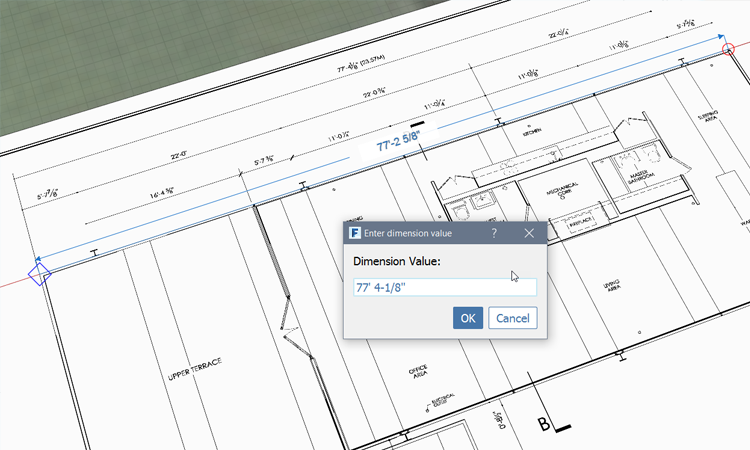
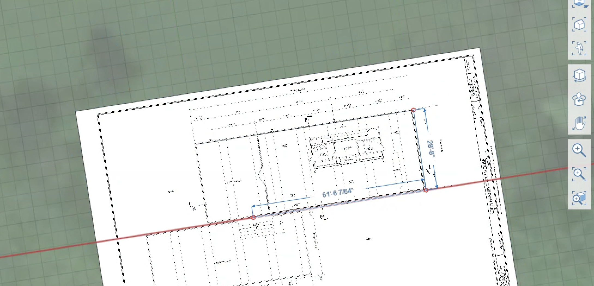
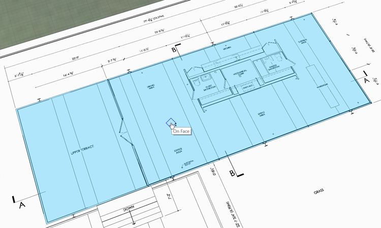
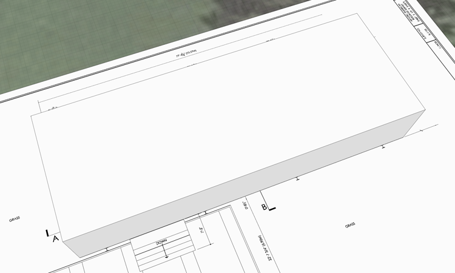

# 3D Sketch and Drag Face

If you did not complete the last section, download and open the **farnsworth01.axm** file from the [FormIt Primer folder](https://autodesk.app.box.com/s/thavswirrbflit27rbqzl26ljj7fu1uv/1/9025446442).

## Drawing Lines

1. Make sure that you're in the **3D Perspective** view by clicking the 3D icon in the Navigation bar

   

2. **Group** the rectangle in order to prevent new geometry from "sticking" to it. **Double click** the rectangle to select it. **Right-click** and choose **Group \(G\)**

   

3. Click the **Pencil** to open the [**Sketching Toolbar**](../formit-introduction/tool-bars.md) Choose the [**Line tool \(L\)**](../tool-library/line-tool.md)

   

4. You are ready to start sketching out the upper terrace of the Farnsworth house. Click [**here**](../tool-library/world-axes.md) to learn more about 3D sketching with World Axes. Now let's start by creating a rectangle on the imported image
5. Click **Settings &gt; turn off Snap to Grid \(S G\)**
6. While in the **Line tool**, click near **the upper left corner** of the upper terrace in the imported sketch
7. **Move** your mouse along the red axis that appears. Click the **Tab key** to input the exact dimension. Make the long side **77'-4 1\8"**

   

8. **Move your mouse** down along the green axis to define the short edge of the upper terrace. Set the dimension of the short side **28'-8**"
9. To define the other edge of the rectangle, **move your mouse** along the red axis and hold down the **Shift key**. The red axis line with thicken to indicate that the line is locked to this axis

**Note**: _The red and green axes keep you parallel and perpendicular to the grid. When you draw a line off of the world axes, a purple axis line will allow you to stay 90 degrees relative to your off-axis line_

1. While the **Shift key** is pressed - move your mouse to the first point you drew. Click to commit the end-point.
2. Release the **Shift key** and click the first point you drew to finish enclosing the rectangle. Press **Esc** twice to clear the sketch tool.

## Drag the Face

1. **Single-click** inside the outline you just drew to select the face. You are automatically in the drag face tool.

   

2. **Single-click** to start the drag face operation. Move your mouse away from the face to drag in that direction. Start typing **12'-2"**, and a dimension box will appear with this value, then hit **Enter**. You've created a mass!

   

## 3D Sketching with Arc, Spline, and Circle

The following exercise is not critical to finishing the house. It will allow you to experiment with some of the other 3D Sketching tools.

1. Select the [**Arc tool**](../tool-library/arc-tool.md). Click to define the start, and then the endpoint. The third click defines the radius of the circle that defines the arc
2. Select the [**Spline Tool**](../tool-library/spline-tool.md). Click to define any number of points to draw a spline
3. Select the [**Circle Tool**](../tool-library/circle-tool.md). Hover and Click to define the center point of the circle. Click and drag to define the radius of the circle.

**Note:** _When you draw a curve that intersects with other points, curves, and solids, the objects may be jointed into one object. To avoid this, we will use Groups in a later exercise to isolate geometry._

