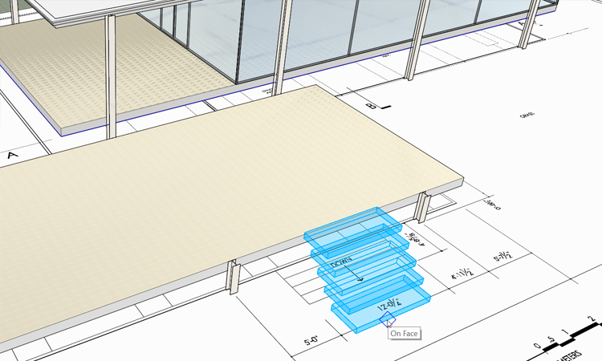
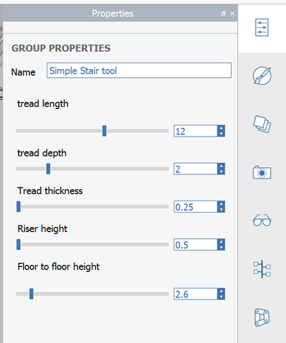
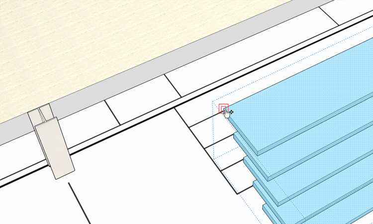
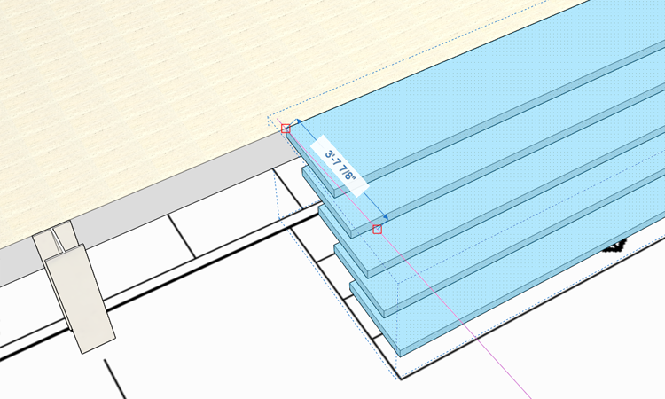
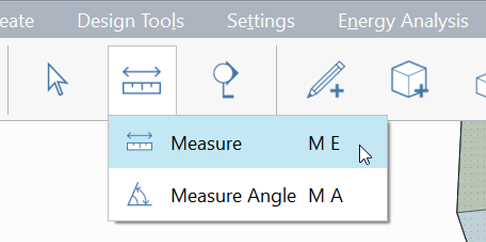
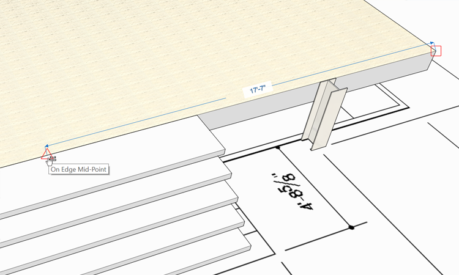
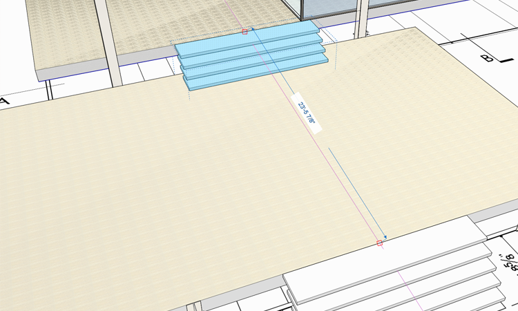
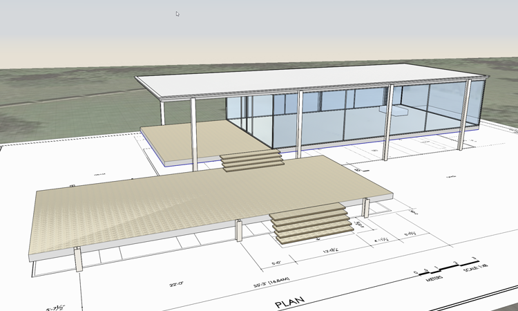

# Computational Groups with Dynamo

In this section we will leverage the computational power of [Dynamo](http://dynamobim.org/) to place and modify flexible groups.

If you did not complete the last section, download and open the **farnsworth06.axm** file from the [FormIt Primer folder](./#prerequisites-for-this-turorial).

## Place and Modify Dynamo Content

1. Open the [**Dynamo Palette**](../formit-introduction/tool-bars.md) in the Palette Bar

   

2. You should see a few built-in Dynamo objects in the Dynamo Samples directory
3. Single click the **Stairs** Dynamo sample. FormIt will run the graph behind-the-scenes and generate the stair geometry from this graph.
4. Once the stair is loaded, move your cursor over the canvas, near the terrace. Click to place the stair. Click **Esc** to clear the selection

   

5. Edit the Simple Stair group, just like you would a normal group, by **double clicking** into it
6. The [**Properties Palette**](../formit-introduction/tool-bars.md) automatically toggles to view the stair's parameters. Modify the settings so they are the same as the picture below

   

## Locate the Stair Group

1. **Single click** to select the stairs, click one of the top corners to start the move tool

   

2. **Move** the top of the stairs so it aligns with the edge of the terrace

   

3. Next, **center** the stairs between the two columns. This could be done with **guide lines** as we did in the previous exercise, but we'll introduce the **Measure \(ME\)** tool

   

4. Start the **Measure \(ME\)** tool. Your first click should be the edge of the lower terrace. This is where you are measuring **from**
5. You second click should be the **mid point** of the stair. A dimension string will appear

   

6. Press the **Tab key** and enter **16' 7"**. The measure tool will move the geometry using the reference and target points you provided

## Locate the Upper Stair Group

1. **Single click** to select the stair group, click the same mid point to start the **move tool**
2. Press the **Ctrl key** once to make a **quick copy** - and move the ghost preview geometry to the upper terrace

   

3. Right click on copied group and select **Make Unique \(M U\)**
4. **Double click** to edit the copied group. Change the **Floor to Floor height** setting to **1.75**. You will need to **move** the stairs up to align with the upper terrace floor
5. Create a new **layer** called **stairs** and put both stairs on that layer
6. Paint both of the **stair** groups with the material **Travertine** to match the floors

   

