# Create Columns with Array

In this exercise we'll sketch a detail element - an I-beam column. Then use the Array tool to copy multiple items with a specific distance between them.

If you did not complete the last section, download and open the **farnsworth03.axm** file from the [FormIt Primer folder](https://autodesk.app.box.com/s/thavswirrbflit27rbqzl26ljj7fu1uv/1/9025446442).

## Sketch the Column Profile

1. Go to the **Top View \(VT\)** to view the plan image from above.

   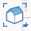

2. **Turn off** the **Floor 1** layer so that you don't snap to the **Roof or Floor** geometry we drew in the last exercise.
3. Zoom into the upper left corner of the **imported floor plan** image so you can view the column in detail.

   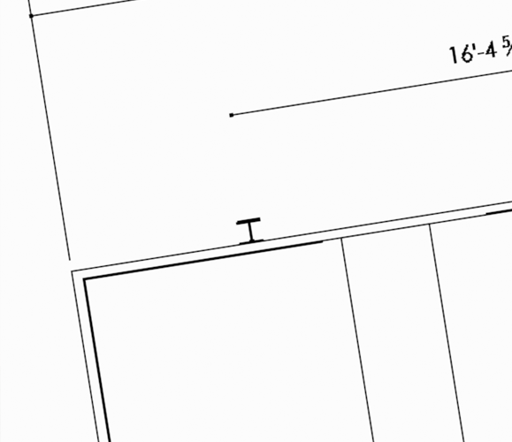

4. Turn off the **Snap to Grid \(SG\)** feature \(if you have it on\). This will help with drawing detail lines.
5. Use the [**Line tool \(L\)**](../formit-introduction/tool-bars.md) to make the following sketch using the specified dimensions.

   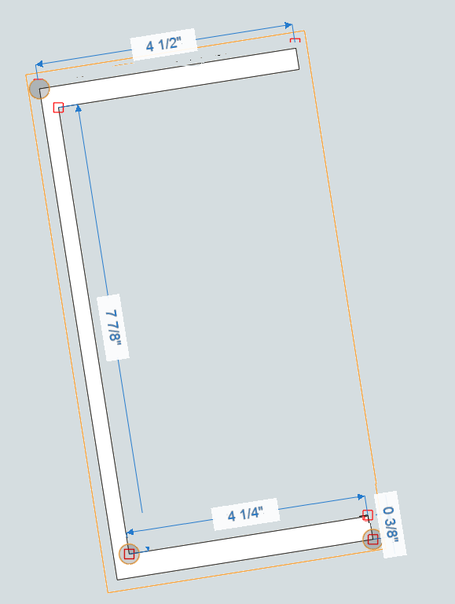

6. **Turn off** the **Plan Image** layer so that you can see the profile lines.
7. **Double-click** to select the entire profile. **Right-click** and select the [**Mirror Tool \(MI\)**](../tool-library/mirror.md).
8. **Single click** to select the orange center grip of the Mirror widget. **Move** it and click to snap to the mid point of the long edge.

   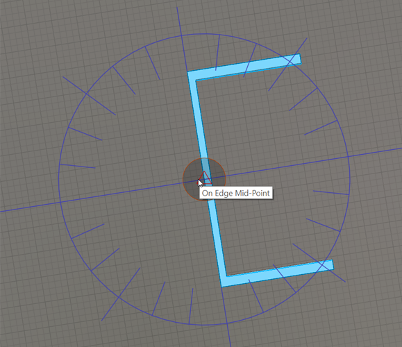

9. **Single click** the lower arrow and move it 90**°** clock wise. Snap it to the blue compass line. The result should look like an I-beam profile.

   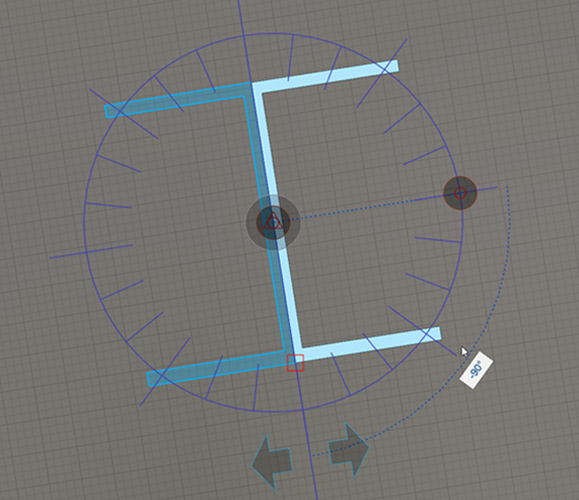

10. **Single-click** off in space to commit the mirror command. Click **Esc** to clear the selection.
11. **Double-click** to select one of the profiles. Hold down the **Ctrl** or the **Shift** key and **double click** the other profile. Both of the profiles should be in selection.
12. **Right-click** to bring up the context menu. Choose the **Join Geometry \(JC\)** command to merge the two profiles into one.

    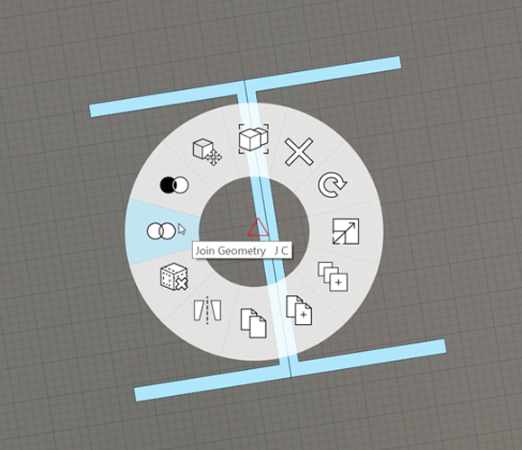

13. Once the outline of the profile is complete, the profile becomes a single face. Select the face with a **single click.**

## Extrude and Array the Column

1. While the profile is still selected, go to the **3D View \(ZD\)** to change to a perspective view

   

2. Zoom to your selection with the **ZS** command. You'll need to **scroll zoom** back as you're too close to the small profile

   

3. Click to select the profile face, and click again to start the drag face operation. Start to **drag the face** up
4. Turn on the **Floor 1** layer. Click on the top of the roof to snap the height of the column - it should be **17' 8".**

   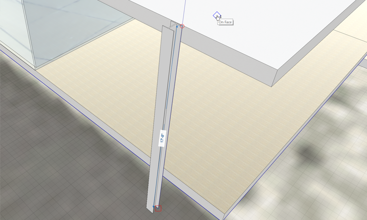

5. **Double-click** to select the column. Add the column to  **Group \(G\).**
6. **Double-click** to edit the group and name it **Column Tall** and change the Category to be **Generic Models** from the drop down menu.
7. Import the material **Metal &gt; Anodized – White**. Next, **paint** the material onto the column group
8. Click **Esc** to clear the paintbrush tool.

## Array the Columns

1. Go to the **Top View \(ZT\)** to view the plan image from above.

   

2. **Turn off** the **Floor 1** layer, **turn on** the **plan image** layer.
3. **Single-click** to select the column group. **Right-click** and choose [**Array \(AR\)**](../tool-library/tilt-array-copy-and-paste.md).

   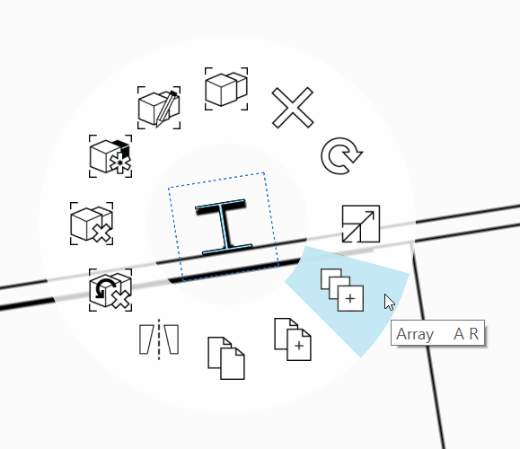

4. Use the following settings in the **Array** dialog: **Length Between Copies**, **Linear**, **Number of Copies: 3**. Press **OK** to close the dialog.

   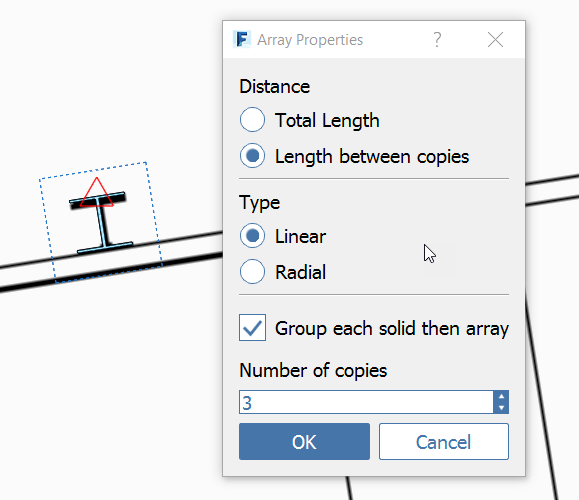

5. **Single-click** to start the **array**. Move the cursor to the right, along the red axis. Hold down **Shift** to lock to the red axis.
6. Start typing **22'** to bring up the Edit Dimension dialog, then hit **OK.** Press **Esc** to clear the selection. You now have **four** columns **22'** apart.

   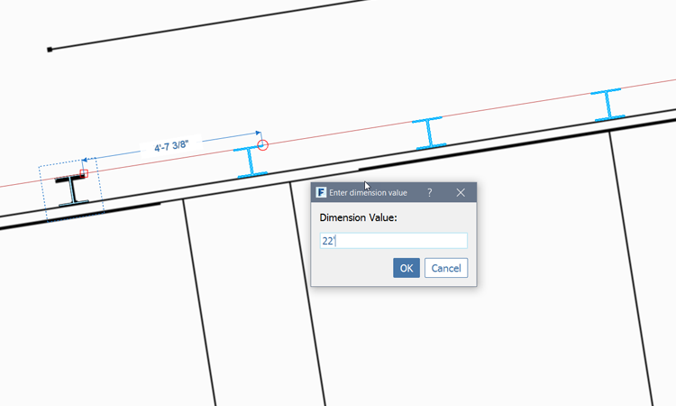

7. **Hover** your mouse over the first Column and press the **Tab key** once. All four columns will be highlighted. **Single click** to select them.
8. Perform another **Array \(AR\)** but this time make **1 copy** and move the copies long the green axis to the south side of the building. Start typing **29'-5"** to bring up the Edit Dimension dialog, and hit Enter or press OK to accept the value.

   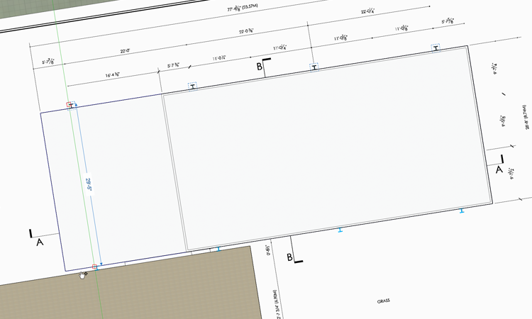

## Create Unique Groups

1. Go to the **3D View \(ZD\)** to change to a perspective view.

   

2. **Turn on** the **Floor 1** layer if it is off.
3. **Single click** one of the columns at the base. Hold down the **Ctrl** or the **Shift** key and select two of the columns next to it.

   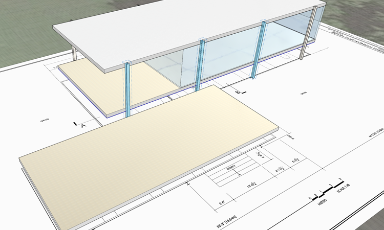

4. Click to start moving the 3 selected columns. Press the **Ctrl key** once to create a **quick copy**. A ghost preview of the copy should appear.

   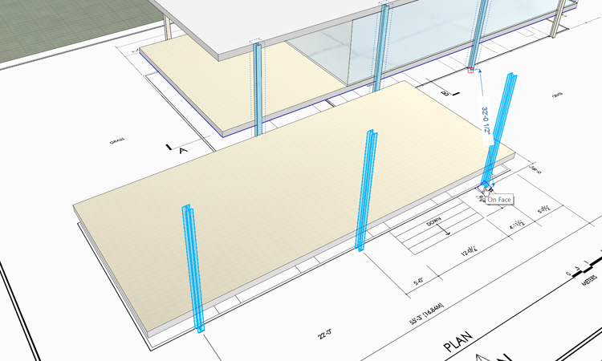

5. **Single-click** to place the new columns. **Right-click** the copied columns and select **Make Unique \(M U\)** - These columns are now associated with each other, and unique from the originals.
6. **Double click** to edit one of the new groups and name it **Column Short.**
7. Adjust the new columns by dragging the top face down to the same height as the **lower terrace** floor height. They should be **3’-2”.**
8. Using the plan image as a guide, copy the last short column so your result looks like this.

   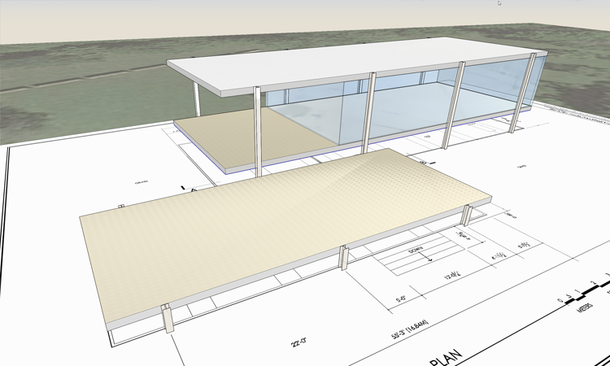

9. Before moving on - make a new **Layer** called **columns** and put all of the columns on that layer.

