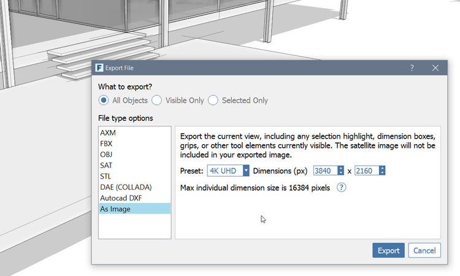

# Export Image

1. Click **File &gt; Export \(Ctrl + E\)**
2. Choose **As Image** from the bottom of the list
3. Choose the resolution from the Preset drop down list. Note that if you have any element selected in the canvas, the selection color will be exported too

   

If you want to the file for this completed section, download and open the **farnsworth11.axm** file from the [FormIt Primer folder](https://s3-us-west-1.amazonaws.com/downloads.autodeskformit.com/Primer/Part1_datasets.zip).

