# Modelado avanzado

En nuestros ejercicios de Farnsworth House, nos hemos centrado en herramientas básicas de modelado como la creación de bocetos, Arrastrar cara, Mover, Matriz y Desfasar cara. También hemos abordado los flujos de trabajo esenciales en los que se utilizan grupos, capas, materiales y niveles. En esta sección, le presentaremos las herramientas de modelado avanzado **Barrido** y **Empalme**.

Si no ha completado la última sección, descargue y abra el archivo **farnsworth05.axm** de la [carpeta de FormIt Primer](https://autodesk.app.box.com/s/thavswirrbflit27rbqzl26ljj7fu1uv/1/9025446442).

## Barrido

Utilice la herramienta Barrido para crear una cornisa a lo largo de la cubierta. 

1. Con la herramienta **Rectángulo \(R\)**, cree un perfil de **6" de altura por 4 5/8"** en cualquier esquina de la cubierta.

   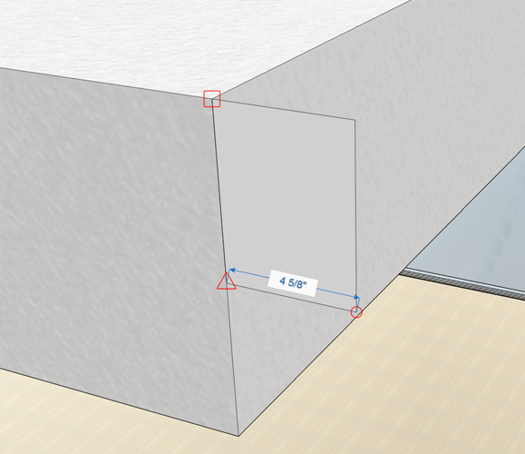

2. Con la herramienta**Rectángulo \(R\)**, cree otro perfil de **2" x 2".**

   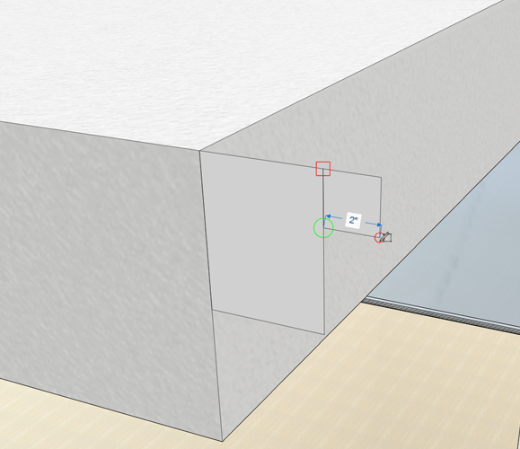

3. **Haga clic una vez** para seleccionar la línea entre los perfiles. Utilice la tecla **Supr** para eliminar la línea; de este modo, se crea un único contorno.

   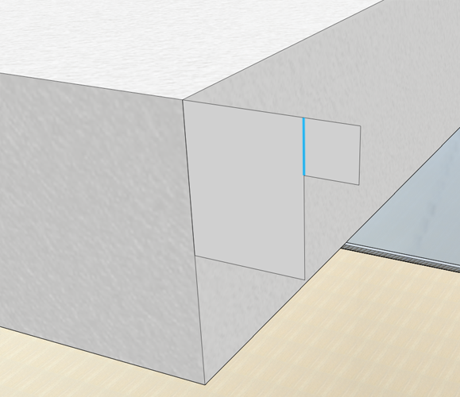

4. Seleccione la [**herramienta Barrido \(SW\)**](../../tool-library/cover-sweep-loft.md) en el [**menú Herramientas avanzadas de modelado**](../../formit-introduction/tool-bars.md)**.**

   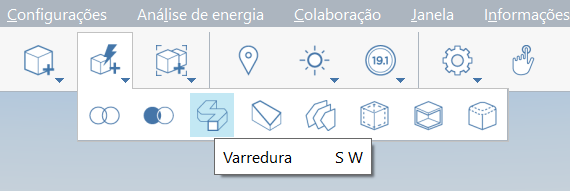

5. Aparece la barra de herramientas **Herramientas avanzadas de geometría** en la esquina superior izquierda del lienzo con instrucciones de texto del asistente.

   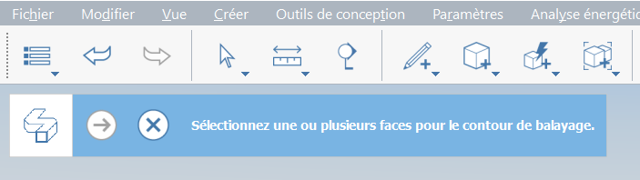

6. **Haga clic una vez** para seleccionar la cara que acaba de dibujar. Este será el **perfil** que desea barrer.

   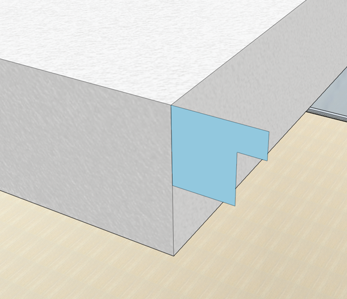

7. La barra de herramientas **Herramientas avanzadas de geometría** cambia una vez que se selecciona una cara. Ahora se le solicita que seleccione un **camino** para el barrido.

   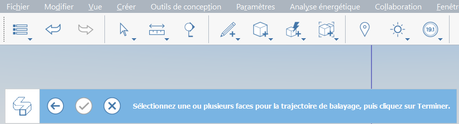

8. **Haga clic una vez** para seleccionar la **cara superior de la cubierta**. La herramienta infiere los bordes de la cara como el camino. El barrido se crea después de seleccionar la cubierta.

   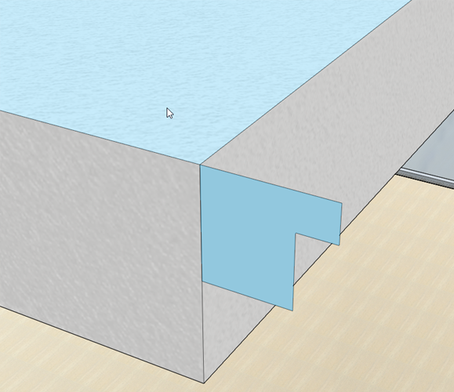

9. Haga doble clic para seleccionar todo el elemento de cornisa. Con la herramienta **Grupo \(G\)**, agrupe la cornisa. Edite el grupo y asígnele el nombre **cornisa.**

   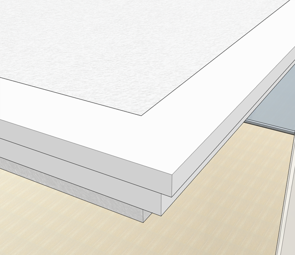

10. Pinte el grupo de cornisa con el material **Concrete &gt; White** para que coincida con la cubierta. Añada el **grupo de cornisa** a la capa de **cubierta**.

Es necesario ajustar la **altura de los pilares** para que finalice en la cornisa. Edite uno de los grupos de pilares altos, seleccione la cara superior y reduzca hasta obtener la altura correcta. Es posible que también deba ajustar la ubicación de los pilares para que queden nivelados con respecto a las losas. Ahora es un buen momento para realizar estos pequeños ajustes.

## Empalme

Ahora aprenderá a usar la herramienta Empalme para crear un borde redondeado que dé un aspecto más suave a un mueble.

1. **Desactive** la capa de **cubierta** para ver el interior de la casa.
2. Cree un rectángulo de **4' x 7'** con la herramienta **Rectángulo \(R\)** en la esquina noroeste de la casa. Seleccione la cara y extrúyala con una altura de **1'-6".**

   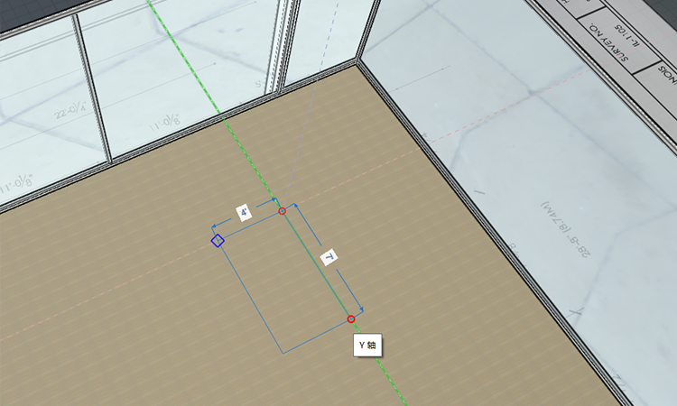

3. Seleccione la [**herramienta Empalme \(FI\)**](../../tool-library/cover-sweep-loft.md) de las **Herramientas avanzadas de modelado** en la [**barra de herramientas de acciones**](../../formit-introduction/tool-bars.md)**.**

   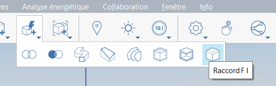

4. Cambie el valor de **empalme** por defecto a 1" en el cuadro de diálogo que aparece.
5. **Haga clic una vez** en la cara superior de la cama. El empalme se crea automáticamente después de seleccionar la cara.

   

## Árbol de grupos

En lugar de editar el grupo para asignarle un nombre y clasificarlo por categoría, vamos a utilizar la función **Árbol de grupos**, que permite realizar rápidamente varias tareas de administración de modelos.

1. **Haga doble clic** para seleccionar toda la cama. Utilice la herramienta **Grupo \(G\) para añadir la cama al grupo.**
2. Haga clic en el icono **Árbol de grupos** de las paletas de la derecha.

   

3. Si selecciona el grupo de camas en el lienzo, este se resaltará en la lista **Árbol de grupos** \(también sucede lo contrario; si selecciona un grupo de la lista, este se resaltará en el lienzo\).
4. Puede **hacer doble clic** en el nombre de la lista y cambiarlo a **Cama** (todos los ejemplares del grupo se actualizarán); en este caso, solo hay uno.
5. Con el **grupo de camas** seleccionado en la lista, puede definir la categoría en **Mobiliario** en la lista desplegable situada en la parte superior de la paleta Árbol de grupos.

   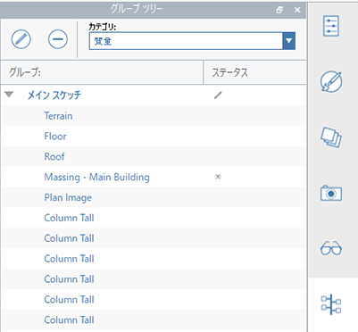

## Fusionar y suavizar bordes y filtrar selección

Ahora ocultaremos los bordes no deseados en nuestro mobiliario para darle un aspecto más suave y limpio.

1. **Haga doble clic** para editar el grupo. Seleccione toda la cama con un **doble clic**. **Haga clic con el botón derecho** y seleccione **Fusionar \(MG\)** en el menú contextual.

   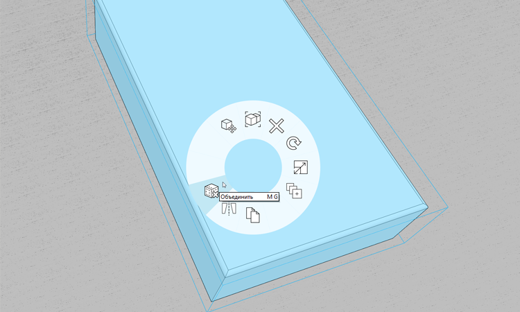

2. Utilice el **Filtro de selección** para restringir una selección de ventana a solo **Bordes.**

   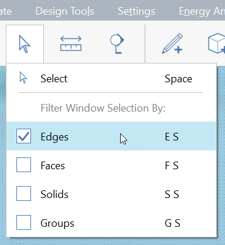

3. **Arrastre el ratón** desde la esquina superior izquierda hasta la esquina inferior derecha para realizar una **selección de ventana**. Realice una selección de ventana del arco y el borde en cada esquina de la cama. Mantenga pulsada la tecla **Ctrl** o **Mayús** para añadir elementos al conjunto de selección.
4. **Haga clic con el botón derecho** y seleccione **Suavizar bordes \(SE\)**.

   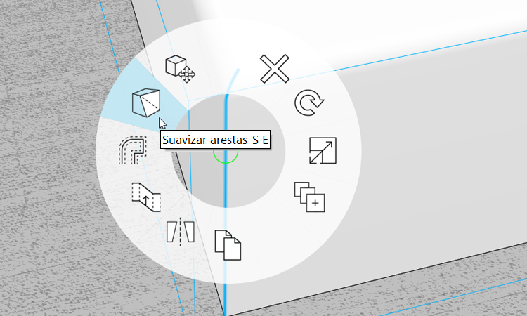

5. Para que estos bordes vuelvan a estar visibles, **haga clic una vez** a fin de seleccionar la cara superior de la cama. A continuación, **haga clic con el botón derecho** y seleccione **Facetar bordes suaves** \(UE\).

   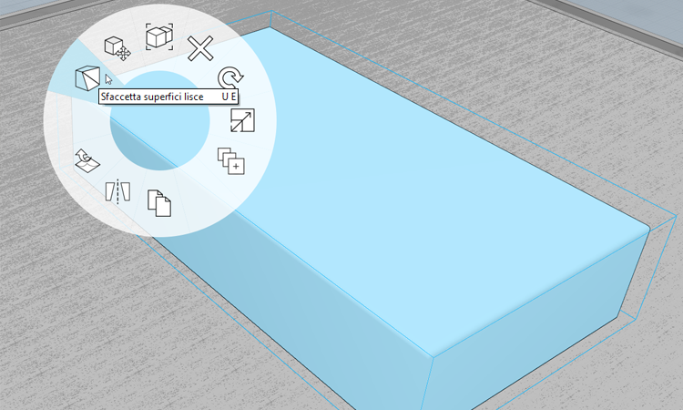

6. Vuelva a cambiar el **Filtro de selección** para incluir de nuevo las caras y los grupos. Vuelva a activar la capa de **cubierta**. El modelo de la Farnsworth House le está quedando muy bien.

   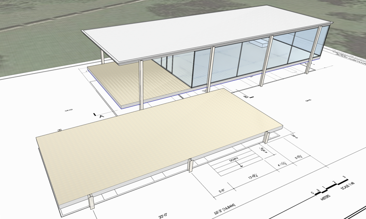

