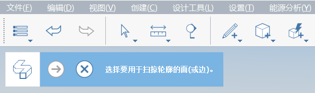

# Modellazione avanzata

Negli esercizi di Casa Farnsworth ci siamo concentrati sugli strumenti di modellazione di base, quali il disegno, il trascinamento della superficie, lo spostamento, la matrice e l'offset della superficie. Abbiamo anche trattato i workflow essenziali che coinvolgono gruppi, layer, materiali e livelli. In questa sezione presenteremo gli strumenti di Modellazione avanzata **Estrusione su percorso** e **Raccordo**.

Se non è stata completata l'ultima sezione, scaricare e aprire il file **farnsworth05.axm** dalla [cartella della Guida introduttiva di FormIt](https://autodesk.app.box.com/s/thavswirrbflit27rbqzl26ljj7fu1uv/1/9025446442).

## Estrusione su percorso

Utilizzare lo strumento Estrusione su percorso per creare un cornicione lungo il tetto.

1. Con lo strumento **Rettangolo \(R\)**, creare un profilo di **6" per 4 5/8"** in qualsiasi angolo del tetto.

   

2. Creare un altro profilo **Rettangolo \(R\)** che sia **2" x 2".**

   

3. **Fare un singolo clic** per selezionare la linea tra i profili. Utilizzare il tasto **CANC** per rimuovere la linea, in modo da creare un singolo contorno.

   

4. Selezionare lo [**strumento Estrusione su percorso \(SW\)**](../../tool-library/cover-sweep-loft.md) dal [**menu Modellazione avanzata**](../../formit-introduction/tool-bars.md)**.**

   

5. La barra degli strumenti **Geometria avanzata** viene visualizzata nell'angolo superiore sinistro dell'area di disegno con istruzioni di testo utili.

   

6. **Fare un singolo clic** per selezionare la superficie appena disegnata. Si tratta del **profilo** di cui si desidera eseguire l'estrusione su percorso.

   

7. La barra degli strumenti **Geometria avanzata** cambia quando si seleziona una superficie. Ora viene richiesto di selezionare una **traiettoria** per l'estrusione su percorso.

   

8. **Fare un singolo clic** per selezionare la **superficie superiore del tetto**. Lo strumento deduce i bordi della superficie come traiettoria. L'estrusione su percorso viene creata dopo la selezione del tetto.

   

9. Fare doppio clic per selezionare l'intero elemento cornicione. Selezionare **Gruppo \(G\)** per il cornicione. Modificare il gruppo e denominarlo **cornice.**

   

10. Dipingere il gruppo cornice con il materiale **Concrete &gt; White** in modo che corrisponda al tetto. Aggiungere il **gruppo cornice** al layer **Roof**.

È necessario regolare l'**altezza dei pilastri** per terminare il cornicione. Modificare uno dei gruppi di pilastri alti, selezionare la superficie superiore e portarla all'altezza corretta. Potrebbe inoltre essere necessario regolare la posizione dei pilastri in modo che siano allineati ai solai. Ora è il momento giusto per apportare queste piccole modifiche.

## Raccordo

Ora imparerete a utilizzare lo strumento Raccordo per creare un bordo arrotondato e conferire un aspetto più morbido ad un componente di arredo.

1. **Disattivare** il layer **Roof** in modo da poter vedere all'interno della casa.
2. Creare un **rettangolo \(R\)** **di 4' x 7'** nell'angolo nord-est della casa. Selezionare la superficie ed estruderla ad **un'altezza di 1'-6".**

   

3. Selezionare lo [**strumento Raccordo \(FI\)**](../../tool-library/cover-sweep-loft.md) dagli **strumenti di Modellazione avanzata** sulla [**barra degli strumenti delle azioni**](../../formit-introduction/tool-bars.md)**.**

   

4. Modificare il valore di default del **raccordo** in 1" nella finestra di dialogo che viene visualizzata.
5. **Fare un singolo clic** sulla superficie superiore del letto. Il raccordo viene creato automaticamente dopo la selezione della superficie.

   

## Struttura gruppi

Anziché modificare il gruppo per assegnargli un nome e una categoria, utilizzare **Struttura gruppi**, che consente di eseguire rapidamente più attività di gestione dei modelli.

1. **Fare doppio clic** per selezionare l'intero letto. Aggiungere il letto a **Gruppo \(G\).**
2. Fare clic sull'icona **Struttura gruppi** dalle tavolozze a destra.

   

3. Se si seleziona il gruppo Bed nell'area di disegno, viene evidenziato nell'elenco **Struttura gruppi** \(è vero anche l'opposto; se si seleziona un gruppo nell'elenco, questo verrà evidenziato nell'area di disegno\).
4. È possibile **fare doppio clic** sul nome nell'elenco e modificarlo in **Bed**. Tutte le istanze del gruppo verranno aggiornate. Nel nostro caso, ne esiste solo una.
5. Quando il **gruppo Bed** è stato selezionato nell'elenco, è possibile impostare la categoria su **Arredo** dall'elenco a discesa nella parte superiore della tavolozza Struttura gruppi.

   

## Unione di bordi, levigatura di bordi e filtro di selezione

Ora nasconderemo i bordi indesiderati nel nostro arredo, per conferire un aspetto più uniforme e più morbido.

1. **Fare doppio clic** per modificare il gruppo. Selezionare l'intero letto con un **doppio clic**. **Fare clic con il pulsante destro del mouse** e scegliere **Unisci \(MG\)** dal menu contestuale.

   

2. Utilizzare il **Filtro di selezione** per vincolare una selezione tramite finestra solo ai **bordi di selezione.**

   

3. **Trascinare il mouse** dall'angolo superiore sinistro all'angolo inferiore destro per eseguire una **selezione tramite finestra**. Selezionare tramite finestra l'arco e il bordo in corrispondenza di ogni angolo del letto. Tenere premuto **CTRL** o **MAIUSC** per aggiungere elementi al gruppo di selezione.
4. **Fare clic con il pulsante destro del mouse** e scegliere **Leviga bordi\(SE\)**.

   

5. Per rendere nuovamente visibili questi bordi, **fare un singolo clic** per selezionare la superficie superiore del letto, **fare clic con il pulsante destro del mouse** e scegliere **Leviga bordi** \(UE\).

   

6. Modificare il **Filtro di selezione** per includere nuovamente le superfici e i gruppi. Riattivare il layer **Roof**. Il modello di Casa Farnsworth sta venendo bene.

   

