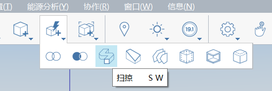
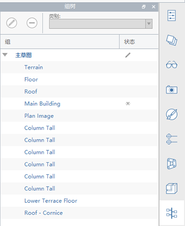

# 고급 모델링

판스워스 하우스 연습에서는 스케치, 면 끌기, 이동, 배열, 면 간격띄우기 등의 기본 모델링 도구를 중점적으로 다루었습니다. 그룹, 레이어, 재료 및 레벨과 관련된 필수 워크플로우도 살펴보았습니다. 이 섹션에서는 고급 모델링 도구 **스윕** 및 **모깎기**를 소개합니다.

마지막 섹션을 완료하지 않은 경우 [FormIt Primer 폴더](https://autodesk.app.box.com/s/thavswirrbflit27rbqzl26ljj7fu1uv/1/9025446442)에서 **farnsworth05.axm** 파일을 다운로드한 후 엽니다.

## 스윕

스윕 도구를 사용하여 지붕을 따라 처마를 작성합니다.

1. **직사각형\(R\)** 도구를 사용하여 지붕의 코너에 **6" 높이 x 4 5/8"** 프로파일을 작성합니다.

   

2. 또 다른 **직사각형\(R\)** 프로파일을 **2" x 2"**

   

3. **한 번 클릭**하여 프로파일 사이의 선을 선택합니다. **Delete** 키를 사용하여 선을 제거합니다. 그러면 단일 윤곽이 작성됩니다.

   

4. [**고급 모델링 메뉴**](../../formit-introduction/tool-bars.md) 에서 [**스윕 도구 \(SW\)**](../../tool-library/cover-sweep-loft.md)를 선택합니다.

   

5. **고급 형상** 도구막대가 도우미 텍스트 지침이 포함된 캔버스의 왼쪽 상단 코너에 나타납니다.

   

6. **한 번 클릭**하여 방금 그린 면을 선택합니다. 이 프로파일은 스윕하려는 **프로파일**입니다.

   

7. 면을 선택하면 **고급 형상** 도구막대가 변경됩니다. 이제 스윕에 대해 **경로**를 선택하라는 메시지가 표시됩니다.

   

8. **한 번 클릭**하여 **지붕 상단 면**을 선택합니다. 이 도구는 면의 모서리를 경로로 추정합니다. 지붕을 선택하면 스윕이 작성됩니다.

   

9. 두 번 클릭하여 전체 처마 요소를 선택합니다. 처마를 **그룹화\(G\)**합니다. 그룹을 편집하고 이름을 **코니스**

   

10. 지붕에 맞게 **콘크리트 &gt; 흰색** 재료로 처마 그룹에 페인트를 적용합니다. **코니스 그룹**을 **지붕** 레이어에 추가합니다.

처마에서 끝나도록 **기둥의 높이**를 조정해야 합니다. 긴 기둥 그룹 중 하나를 편집하고, 상단 면을 선택한 다음, 올바른 높이로 내립니다. 또한 기둥이 슬래브에 플러시되도록 기둥의 위치를 조정해야 할 수도 있습니다. 지금이 이러한 사소한 조정을 수행할 적기입니다.

## 모깎기

이제 모깎기 도구로 둥근 모서리를 작성하여 가구를 좀 더 부드럽게 나타내는 방법을 살펴보겠습니다.

1. 집 내부를 볼 수 있도록 **지붕** 레이어를 **끕니다**.
2. 집의 북동쪽 코너에 **4' x 7'** **직사각형\(R\)**을 작성합니다. 면을 선택하고 **1'-6" 높이**

   

3. [**작업 도구막대**](../../formit-introduction/tool-bars.md)의 **고급 모델링 도구**에서 [**모깎기 도구\(FI\)**](../../tool-library/cover-sweep-loft.md)를 선택합니다.

   

4. 표시되는 대화상자에서 기본 **모깎기** 값을 1"로 변경합니다.
5. 침대 상단 면을 **한 번 클릭**합니다. 면을 선택하면 모깎기가 자동으로 작성됩니다.

   

## 그룹 트리

그룹을 편집하여 이름을 지정하고 카테고리로 분류하는 대신, 여러 모델 관리 작업을 신속하게 수행할 수 있는 **그룹 트리**를 사용해 보겠습니다.

1. **두 번 클릭**하여 전체 침대를 선택합니다. 침대를 **그룹\(G\)**
2. 오른쪽의 팔레트에서 **그룹 트리** 아이콘을 클릭합니다.

   

3. 캔버스에서 침대 그룹을 선택하면 **그룹 트리** 리스트에서 강조표시됩니다. 반대의 경우도 마찬가지입니다. 즉, 리스트에서 그룹을 선택하면 해당 그룹이 캔버스에서 강조표시됩니다.
4. 리스트에서 이름을 **두 번 클릭**하여 **침대**로 변경할 수 있습니다. 이 경우 그룹의 모든 인스턴스(instance)가 업데이트됩니다. 여기에는 인스턴스(instance)가 1개만 있습니다.
5. 리스트에서 **침대 그룹**을 선택하면 그룹 트리 팔레트 상단에 있는 드롭다운 리스트에서 카테고리를 **가구**로 설정할 수 있습니다.

   

## 모서리 병합, 부드러운 모서리 및 선택 필터링

이제 가구에서 원치 않는 모서리를 숨겨 더 부드럽고 보이도록 해보겠습니다.

1. **두 번 클릭**하여 그룹을 편집합니다. **두 번 클릭**하여 전체 침대를 선택합니다. **마우스 오른쪽 버튼을 클릭**하고 상황에 맞는 메뉴에서 **병합\(MG\)**을 선택합니다.

   

2. **선택 필터**를 사용하여 **모서리**

   

3. 왼쪽 상단에서 오른쪽 하단 코너로 **마우스를 끌어** **창 선택**을 수행합니다. 창에서 침대의 각 코너에 있는 호와 모서리가 선택됩니다. **Ctrl** 키 또는 **Shift** 키를 누른 상태로 선택 세트에 추가합니다.
4. **마우스 오른쪽 버튼을 클릭**하고 **부드러운 모서리\(SE\)**를 선택합니다.

   

5. 이러한 모서리를 다시 표시하려면 **한 번 클릭**하여 침대의 상단 면을 선택하고 **마우스 오른쪽 버튼을 클릭**한 후 **깍인면의 부드러운 모서리**\(UE\)를 선택합니다.

   

6. 면 및 그룹을 다시 포함하도록 **선택 필터**를 다시 변경합니다. **지붕** 레이어를 다시 켭니다. 판스워스 하우스 모델이 멋지게 구현되었습니다!

   

