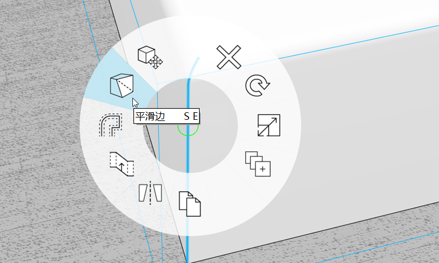

# 進階塑型

在范斯沃斯別墅的練習中，我們專注於基本塑型工具，例如草圖繪製、拖曳面、移動、陣列和偏移面。我們也討論了涉及群組、圖層、材料和樓層的基本工作流程。在本節中，我們將向您介紹**掃掠**和**圓角**進階塑型工具

如果您未完成上一節，請從 [FormIt Primer 資料夾](https://autodesk.app.box.com/s/thavswirrbflit27rbqzl26ljj7fu1uv/1/9025446442)下載並開啟 **farnsworth05.axm** 檔案。

## 掃掠

使用「掃掠」工具沿屋頂建立簷板。

1. 使用**矩形 \(R\)** 工具，在屋頂的任意一角建立一個 **6" 高 x 4 5 8"** 的輪廓。

   

2. 建立另一個 **2" x 2"** 的**矩形 \(R\) 輪廓。**

   

3. **按一下**以選取輪廓之間的直線。使用 **Delete** 鍵移除線 - 這會建立單一輪廓。

   

4. 從[**「進階塑型」功能表**](../../formit-introduction/tool-bars.md)中選取[**「掃掠」工具 \(SW\)**](../../tool-library/cover-sweep-loft.md)**。**

   

5. **「進階幾何圖形」**工具列會顯示在圖元區的左上角，並附上協助文字指示。

   

6. **按一下**以選取您剛剛繪製的面。這會是您要掃掠的**輪廓**。

   

7. 選取面後，**「進階幾何圖形」**工具列會改變。現在，系統會提示您為掃掠選取**路徑**。

   

8. **按一下**以選取**屋頂的頂面**。工具會將面的邊推論為路徑。點選屋頂後就會建立掃掠。

   

9. 按兩下以選取整個簷板元素。**群組 \(G\)** 簷板。編輯群組並將其命名為**簷板。**

   

10. 使用**混凝土 &gt; 白色**材料繪製簷板群組，以符合屋頂。將**簷板群組**加到 **roof** 圖層。

您需要調整**柱高度**以在簷板結束。編輯其中一個高柱群組，選取頂面，並將其下拉至正確的高度。您可能還需要調整柱的位置，使柱與樓板齊平。現在是進行這些微調的好時機

## 圓角

現在，您將學習「圓角」工具建立圓邊，讓家具有更柔和的外觀

1. **關閉** **roof** 圖層，以便可以看到屋內。
2. 在房屋的東北角建立一個 **4' x 7'** 的**矩形 \(R\)**。選取面，並將它擠出 **1'-6" 高。**

   

3. 從[**動作工具列**](../../formit-introduction/tool-bars.md)的**「進階塑型」工具**中選取[**「圓角」工具 \(Fl\)**](../../tool-library/cover-sweep-loft.md)**。**

   

4. 在顯示的對話方塊中，將預設的**圓角**值變更為 1"。
5. **按一下**床的頂面。選取面後，會自動建立圓角。

   

## 群組樹

接下來我們使用**群組樹**，讓您快速執行多個模型管理工作，而不是編輯群組來命名和分類。

1. **按兩下**以選取整張床。將床加到**群組 \(G\)。**
2. 從右側的選項板中按一下**「群組樹」**圖示。

   

3. 如果您選取圖元區中的床群組，它將在**「群組樹」**清單中亮顯 \(反之亦同，如果您選取清單中的群組，它將在圖元區中亮顯\)。
4. 您可以**按兩下**清單中的名稱，將其變更為**床** - 群組的所有實體都會更新 - 在此案例中只有一個。
5. 在清單中選取**「床」群組**後，您可以從「群組樹」選項板頂部的下拉式清單將品類設定為**「家具」**。

   

## 合併邊、平滑邊和選取篩選

我們現在要隱藏家具不需要的邊緣，讓家具的外觀更平滑、更柔和。

1. **按兩下**以編輯群組。**按兩下**以選取整張床。**按一下右鍵**，然後從關聯式功能表中選擇**「合併 \(MG\)」**。

   

2. 使用**「選取篩選」**將窗選約束為只點選**邊。**

   

3. 從左上角**拖曳滑鼠**到右下角，以執行**窗選**。窗選床每個角的弧和邊。按住 **Ctrl** 或 **Shift** 以加到選集中。
4. **按一下右鍵**，然後選擇**「平滑邊 \(SE\)」**

   

5. 若要讓這些邊再次可見，請**按一下**以選取床的頂面，**按一下右鍵**，然後選擇**「刻面平滑邊」**\(UE\)。

   

6. 將**「選取篩選」**變更回來，以再次包括面和群組。重新開啟 **roof** 圖層。您的范斯沃斯別墅模型看起來很不錯！

   

