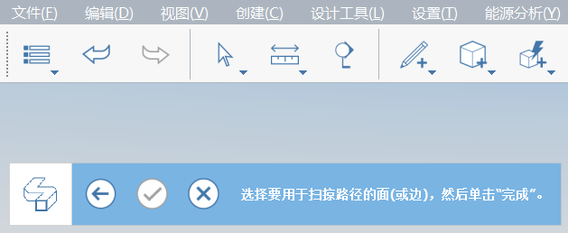

# Modélisation avancée

Dans nos exercices Maison Farnsworth, nous nous sommes concentrés sur les outils de modélisation de base, comme Esquisse, Faire glisser la face, Déplacer, Réseau et Décaler la face. Nous avons également abordé les workflows essentiels concernant les groupes, les calques, les matériaux et les niveaux. Dans cette section, nous allons vous présenter les outils de modélisation avancée **Balayage** et **Congé**.

Si vous n’avez pas terminé la dernière section, téléchargez et ouvrez le fichier **farnsworth05.axm** à partir du [dossier FormIt Primer](https://autodesk.app.box.com/s/thavswirrbflit27rbqzl26ljj7fu1uv/1/9025446442).

## Balayage

Utilisez l’outil Balayage pour créer une corniche le long du toit.

1. À l’aide de l’outil **Rectangle \(R\)**, créez un contour de **6” de haut par 4 5/8”** à n’importe quel coin du toit.

   

2. Créez un autre contour **Rectangle \(R\)** de **2” x 2”.**

   

3. **Cliquez une fois** sur la ligne entre les contours pour la sélectionner. Utilisez la touche **Suppr** pour supprimer la ligne et créer un contour simple.

   

4. Sélectionnez l’[**outil Balayage \(SW\)**](../../tool-library/cover-sweep-loft.md) dans le [**menu Modélisation avancée**](../../formit-introduction/tool-bars.md)**.**

   

5. La barre d’outils **Géométrie avancée** s’affiche dans le coin supérieur gauche de la zone de dessin avec des instructions d’aide-mémoire.

   

6. **Cliquez une fois** sur la face que vous venez de dessiner pour la sélectionner. Il s’agit du **contour** que vous souhaitez balayer.

   

7. La barre d’outils **Géométrie avancée** change lorsque vous sélectionnez une face. Vous êtes maintenant invité à sélectionner une **trajectoire** pour le balayage.

   

8. **Cliquez une fois** sur la **face supérieure du toit** pour la sélectionner. L’outil déduit les arêtes de la face comme trajectoire. Le balayage est créé après la sélection du toit.

   

9. Double-cliquez sur l’élément de la corniche pour le sélectionner en entier. Utilisez l’outil **Grouper \(G\)** pour créer un groupe avec la corniche. Modifiez le groupe et nommez-le **Corniche.**

   

10. Peignez le groupe Corniche avec le matériau **Béton > Blanc** pour qu’il corresponde au toit. Ajoutez le **groupe Corniche** au calque **Toit**.

Vous devez ajuster la **hauteur des poteaux** afin d’atteindre la corniche. Modifiez l’un des groupes de grands poteaux, sélectionnez la face supérieure et abaissez-la à la hauteur appropriée. Vous devrez peut-être également ajuster l’emplacement des poteaux afin qu’ils affleurent les dalles. C’est le moment idéal d’effectuer ces ajustements mineurs.

## Congé

Vous allez maintenant apprendre à utiliser l’outil Congé afin de créer une arête arrondie et d’adoucir ainsi l’aspect d’un meuble.

1. **Désactivez** le calque **Toit** afin de distinguer l’intérieur de la maison.
2. Créez un **rectangle de 4’ x 7’** à l’aide de l’outil **Rectangle (R\)** dans le coin nord-est de la maison. Sélectionnez la face et extrudez-la de **1’-6” de haut.**

   

3. Sélectionnez l’[**outil Congé \(FI\)**](../../tool-library/cover-sweep-loft.md) dans les **outils de modélisation avancés** de la [**barre d’outils Action**](../../formit-introduction/tool-bars.md)**.**

   

4. Définissez la valeur du **congé** par défaut sur 1” dans la boîte de dialogue qui s’affiche.
5. **Cliquez une fois** sur la face supérieure du lit. Le congé est créé automatiquement après la sélection de la face.

   

## Arborescence des groupes

Au lieu de modifier le groupe pour le nommer et le classer par catégorie, utilisez l’**arborescence des groupes** afin d’effectuer rapidement plusieurs tâches de gestion de modèles.

1. **Double-cliquez** sur le lit pour le sélectionner en entier. Ajoutez le lit au groupe à l’aide de l’outil **Grouper \(G\).**
2. Cliquez sur l’icône **Arborescence des groupes** dans les palettes de droite.

   

3. Si vous sélectionnez le groupe de lits dans la zone de dessin, il est mis en surbrillance dans la liste **Arborescence des groupes** \(l’inverse est également vrai, si vous sélectionnez un groupe dans la liste, il est mis en surbrillance dans la zone de dessin\).
4. Vous pouvez **double-cliquer** sur le nom dans la liste et le nommer **Lit**. Toutes les occurrences du groupe sont mises à jour, une seule dans notre cas.
5. Lorsque le **groupe Lit** est sélectionné dans la liste, vous pouvez définir la catégorie sur **Mobilier** dans la liste déroulante située dans la partie supérieure de la palette Arborescence des groupes.

   

## Fusionner les arêtes, Lisser les arêtes et Filtrage de la sélection

Vous allez maintenant masquer les arêtes indésirables du mobilier pour lui donner un aspect plus lisse et plus doux.

1. **Double-cliquez** sur le groupe pour le modifier. **Double-cliquez** sur le lit pour le sélectionner en entier. **Cliquez avec le bouton droit de la souris**, puis choisissez **Fusionner \(MG\)** dans le menu contextuel.

   

2. Utilisez le **filtre de sélection** pour ne sélectionner que les **arêtes dans une sélection de fenêtres.**

   

3. **Faites glisser la souris** du coin supérieur gauche vers le coin inférieur droit pour effectuer une **sélection de fenêtres**. Sélectionnez l’arc et l’arête à chaque coin du lit. Maintenez la touche **Ctrl** ou **Maj** enfoncée pour ajouter des éléments au jeu de sélection.
4. **Cliquez avec le bouton droit de la souris** et choisissez **Lisser les arêtes \(SE\)**.

   

5. Pour que ces arêtes soient de nouveau visibles, **cliquez une fois** sur la face supérieure du lit pour la sélectionner, **cliquez avec le bouton droit de la souris**, puis choisissez **Lisser les arêtes de facette** \(UE\).

   

6. Modifiez le **filtre de sélection** de manière à inclure à nouveau les faces et les groupes. Réactivez le calque **Toit**. Votre modèle de maison Farnsworth avance bien !

   

