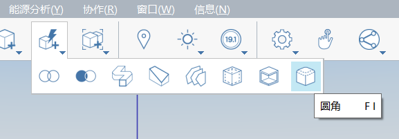

# 高度なモデリング

ファンズワース邸の演習では、スケッチ、面をドラッグ、移動、配列、面をオフセットなどの基本的なモデリング ツールに焦点を当てました。グループ、レイヤ、マテリアル、レベルに関連する基本的なワークフローについても説明しました。このセクションでは、高度なモデリング ツールである**スイープ**と**フィレット**について説明します

直前のセクションをまだ完了していない場合は、[FormIt Primer フォルダ](https://autodesk.app.box.com/s/thavswirrbflit27rbqzl26ljj7fu1uv/1/9025446442)から **farnsworth05.axm** ファイルをダウンロードして開きます。

## スイープ

屋根に沿ってコーニスを作成するには、[スイープ]ツールを使用します。

1. **[長方形\(R\)]**ツールを使用して、屋根の任意のコーナーに**高さ 6" x 横 4 5/8"** のプロファイルを作成します。

   

2. 別の**[長方形\(R\)]**プロファイル\(**2" x 2"\)を作成します。**

   

3. **シングルクリック**して、プロファイル間のラインを選択します。**[Delete]**キーを使用してラインを削除します。これで、単一のアウトラインが作成されます。

   

4. [**高度なモデリング ツール**](../../tool-library/cover-sweep-loft.md) のメニューから [**[スイープ\(SW\)ツール]**](../../formit-introduction/tool-bars.md) を選択します。

   

5. キャンバスの左上コーナーに**[高度なジオメトリ]**ツールバーとそのヘルプ テキストが表示されます。

   

6. **シングルクリック**して、先ほど描画した面を選択します。これがスイープする**プロファイル**になります。

   

7. 面を選択すると、**[高度なジオメトリ]**ツールバーが変化します。スイープの**パス**を選択するようプロンプトが表示されます。

   

8. **シングルクリック**して、**屋根の上面**を選択します。このツールは、面のエッジをパスとして推測します。屋根を選択した後にスイープが作成されます。

   

9. ダブルクリックしてコーニス要素全体を選択します。コーニスを**グループ化\(G\)**します。グループを編集し、**Cornice**

   

10. コーニス グループをマテリアル**[コンクリート] &gt; [白]**でペイントして屋根と一致させます。**コーニス グループ**を **Roof** レイヤに追加します。

コーニスとそろえるために**柱の高さ**を調整する必要があります。高い柱のグループのいずれかを編集し、上面を選択して、正しい高さまで下げます。また、スラブと同一平面上になるように柱の位置を調整する必要がある場合もあります。ここで、これらの微調整を行います。

## フィレット

ここでは、[フィレット]ツールについて学習し、丸みのあるエッジを作成して、家具の外観をよりソフトにします。

1. 家の中が見えるように、**Roof** レイヤを**オフ**にします。
2. 家の北東のコーナーに **4' x 7'** の**長方形\(R\)**を作成します。面を選択し、**高さ 1'-6"**

   

3. [**[アクション ツールバー]**](../../formit-introduction/tool-bars.md)の**[高度なモデリング ツール]**で[**[フィレット\(FI\)ツール]**](../../tool-library/cover-sweep-loft.md)を選択します。

   

4. 表示されるダイアログで、既定の**フィレット**値を 1" に変更します。
5. ベッドの上面を**シングルクリック**します。面を選択すると、フィレットが自動的に作成されます。

   

## グループ ツリー

グループを編集して名前を付けて分類する代わりに、**グループ ツリー**を使用して複数のモデル管理タスクをすばやく実行できます。

1. **ダブルクリック**して、ベッド全体を選択します。ベッドを**グループ\(G\)**
2. 右側のパレットで**[グループ ツリー]**アイコンをクリックします。

   

3. キャンバスでベッド グループを選択すると、**グループ ツリー**リストでハイライト表示されます\(逆に、リストでグループを選択した場合も、キャンバスでハイライト表示されます\)。
4. リスト内の名前を**ダブルクリック**して、**Bed** に変更します。グループのすべてのインスタンスが更新されます。この場合、インスタンスは 1 つしかありません。
5. リストで **Bed グループ**を選択した状態で、[グループ ツリー]パレットの上部にあるドロップダウン リストからカテゴリを **Furniture** に設定できます。

   

## エッジを結合、エッジをスムーズ化、選択フィルタリング

家具の不要なエッジを非表示にして、より滑らかで柔らかい外観にします。

1. **ダブルクリック**してグループを編集します。**ダブルクリック**してベッド全体を選択します。**右クリック**し、コンテキスト メニューから**[結合\(MG\)]**を選択します。

   

2. **[選択フィルタ]**を使用して、ウィンドウ選択を**エッジ**

   

3. **ウィンドウ選択**を実行するには、左上から右下のコーナーまで**マウスをドラッグ**します。ベッドの各コーナーの円弧とエッジをウィンドウ選択します。**[Ctrl]**または**[Shift]**キーを押しながら選択セットに追加します。
4. **右クリック**して**[エッジをスムーズ化\(SE\)]**を選択します。

   

5. これらのエッジを再び表示するには、**シングルクリック**でベッドの上面を選択し、**右クリック**で**[面をスムーズ ファセット**\(UE\)]を選択します。

   

6. **[選択フィルタ]**を変更して面とグループを再び含めます。**Roof** レイヤをオンに戻します。素敵なファンズワース邸のモデルができ上がります。

   

