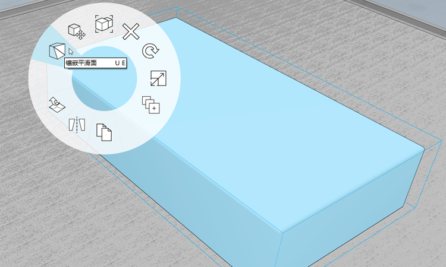

# Расширенное моделирование

В упражнениях, связанных с домом Фарнсуорт, мы использовали базовые инструменты моделирования, такие как построение эскизов, перетаскивание грани, перемещение, массив и смещение грани. Мы также рассмотрели основные рабочие процессы, в том числе группы, слои, материалы и уровни. В этом разделе мы рассмотрим расширенные инструменты моделирования **Сдвиг** и **Скругление**.

Если вы не работали с предыдущим разделом, загрузите и откройте файл **farnsworth05.axm** из [папки FormIt Primer](https://autodesk.app.box.com/s/thavswirrbflit27rbqzl26ljj7fu1uv/1/9025446442).

## Сдвиг

Используйте инструмент «Сдвиг» для создания карниза вдоль крыши.

1. С помощью инструмента **Прямоугольник \(R\)** создайте профиль **высотой 6 дюймов и шириной 4 и 5/8 дюйма** в любом углу крыши.

   

2. Создайте еще один **Прямоугольник \(R\)** для профиля размером **2 дюйма на 2 дюйма.**

   

3. **Щелкните один раз**, чтобы выбрать линию между профилями. Нажмите клавишу **DELETE**, чтобы удалить линию. При этом создается один контур.

   

4. Выберите инструмент [**«Сдвиг» \(SW\)**](../../tool-library/cover-sweep-loft.md) в меню [**Расширенное моделирование**](../../formit-introduction/tool-bars.md)**.**

   

5. В левом верхнем углу активного окна отображается панель инструментов **Дополнительная геометрия** с текстовой справкой.

   

6. **Щелкните один раз**, чтобы выбрать только что нарисованную грань. Этот **профиль** необходимо сдвинуть.

   

7. После выбора грани панель инструментов **Дополнительная геометрия** изменяется. Теперь вам предлагается выбрать **траекторию** сдвига.

   

8. **Щелкните один раз**, чтобы выбрать **верхнюю грань крыши**. В качестве траектории будут выбраны кромки грани. Сдвиг производится после выбора крыши.

   

9. Дважды щелкните, чтобы выбрать весь элемент карниза. **Сгруппируйте \(G\)** карниз. Отредактируйте группу и присвойте ей имя **«карниз».**

   

10. Закрасьте группу карниза материалом **Бетон &gt; Белый**, который соответствует крыше. Добавьте **группу карниза** на слой **крыши**.

Необходимо скорректировать **высоту колонн** таким образом, чтобы они заканчивались карнизом. Отредактируйте одну из групп высоких колонн, выберите верхнюю грань и переместите ее вниз до нужной высоты. Возможно, потребуется также изменить расположение колонн таким образом, чтобы они находились заподлицо с плитами. Теперь необходимо внести небольшие изменения.

## Скругление

Теперь с помощью инструмента «Скругление» вы научитесь создавать скругленные кромки, чтобы придавать элементам мебели более благообразный вид.

1. **Отключите** слой **крыша**, чтобы увидеть внутреннюю часть дома.
2. Создайте прямоугольник размером **4 фута на 7 футов** **(R\)** в северо-восточном углу дома. Выберите грань и выдавите ее вверх на **1 фут 6 дюймов.**

   

3. Выберите [**Инструмент скругления \(FI\)**](../../tool-library/cover-sweep-loft.md) в меню **Расширенные инструменты моделирования** на [**панели операций**](../../formit-introduction/tool-bars.md)**.**

   

4. В открывшемся диалоговом окне измените значение **скругления** на 1" (1 дюйм).
5. **Щелкните** верхнюю грань кровати. Скругление создается автоматически при выборе грани.

   

## Дерево групп

Вместо того чтобы редактировать группу, присваивая ей имя и категорию, воспользуемся **деревом групп**, которое позволяет быстро выполнять различные задачи по управлению моделью.

1. **Двойным щелчком** выберите всю кровать. Добавьте кровать в **Группу \(G\).**
2. Щелкните значок **дерева групп** на палитрах справа.

   

3. При выборе в активном окне группа выделяется в списке **дерева групп** \(и наоборот, если выбрать группу в списке, она будет выделена в активном окне\).
4. Можно **дважды щелкнуть имя группы в списке и изменить его на **Кровать**. При этом все экземпляры группы будут обновлены. В нашем случае экземпляр только один.**
5. Несмотря на то что в списке выбрана **группа кровати**, можно выбрать категорию **Мебель** в раскрывающемся списке в верхней части палитры дерева групп.

   

## Объединение кромок, сглаживание кромок и фильтрация выбора

Теперь скроем ненужные кромки мебели, чтобы придать ей более плавный и благообразный вид.

1. **Дважды щелкните** группу для редактирования. Выберите всю кровать **двойным щелчком**. **Нажмите правую кнопку мыши** и выберите в контекстном меню **Объединить \(MG\)**.

   

2. Воспользуйтесь **фильтром выбора**, чтобы выбрать только **кромки.**

   

3. **Перетащите мышь** из левого верхнего угла в правый нижний, чтобы выполнить **выбор рамкой**. Выберите рамкой дугу и кромку в каждом углу кровати. Удерживайте клавишу **CTRL** или **SHIFT**, чтобы добавить выбранный элемент в набор объектов.
4. **Нажмите правую кнопку мыши** и выберите **Сгладить кромки \(SE\)**.

   

5. Чтобы снова сделать эти кромки видимыми, **щелкните один раз** и выберите верхнюю грань кровати, **нажмите правую кнопку мыши** и выберите **Грань — Сгладить кромки** \(UE\).

   

6. Снова измените **фильтр выбора** так, чтобы включить в него грани и группы. Снова включите слой **крыши**. Модель дома Фарнсуорт преображается на глазах!

   

