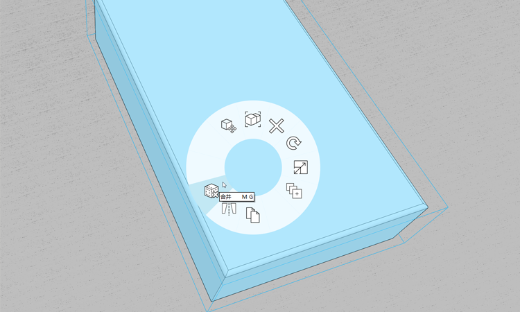

# Erweiterte Modellierung

In den Farnsworth-House-Übungen haben Sie sich auf grundlegende Modellierungswerkzeuge wie Skizzieren, Flächen ziehen, Verschieben, Reihe und Fläche versetzen konzentriert. Außerdem haben Sie die grundlegenden Arbeitsabläufe unter Einbeziehung von Gruppen, Layern, Materialien und Ebenen behandelt. In diesem Abschnitt erhalten Sie eine Einführung in die erweiterten Modellierungswerkzeuge **Sweep** und **Abrunden**.

Wenn Sie den letzten Abschnitt nicht bearbeitet haben, laden Sie die Datei **farnsworth05.axm** aus dem [Ordner FormIt Primer](https://autodesk.app.box.com/s/thavswirrbflit27rbqzl26ljj7fu1uv/1/9025446442) herunter und öffnen sie.

## Sweep

Erstellen Sie mithilfe des Werkzeugs Sweep ein Sims am Dach.

1. Erstellen Sie mit dem Werkzeug **Rechteck \(R\)** ein Profil mit einer **Höhe von 6" x 4 5/8"** an einer beliebigen Ecke des Dachs.

   

2. Erstellen Sie ein weiteres **Rechteck-Profil \(R\)** mit den Maßen **2" x 2"**

   

3. **Klicken Sie einmal**, um die Linie zwischen den Profilen auszuwählen. Verwenden Sie die **ENTF**-Taste, um die Linie zu entfernen. Dadurch wird eine einzelne Kontur erstellt.

   

4. Wählen Sie das [**Werkzeug Sweep \(SW\)**](../../tool-library/cover-sweep-loft.md) aus dem [**Menü Erweiterte Modellierung**](../../formit-introduction/tool-bars.md) **aus.**

   

5. Der Werkzeugkasten für **erweiterte Geometrie** sowie Hilfsanweisungen werden in der oberen linken Ecke des Ansichtsbereichs angezeigt.

   

6. **Klicken Sie einmal**, um die soeben gezeichnete Fläche auszuwählen. Dies ist das **Profil**, für das Sie ein Sweeping erstellen möchten.

   

7. Der Werkzeugkasten für **erweiterte Geometrie** ändert sich, sobald Sie eine Fläche auswählen. Sie werden nun aufgefordert, einen **Pfad** für das Sweeping auszuwählen.

   

8. **Klicken Sie einmal**, um die **obere Fläche des Dachs** auszuwählen. Das Werkzeug leitet die Kanten der Fläche als Pfad ab. Das Sweeping wird nach Auswahl des Dachs erstellt.

   

9. Doppelklicken Sie, um das gesamte Gesimselement auszuwählen. **Gruppieren \(G\)** Sie das Gesims. Bearbeiten Sie die Gruppe, und nennen Sie sie **cornice**

   

10. Versehen Sie die Gesimsgruppe mit dem Material **Beton &gt; Weiß**, damit sie mit dem Dach übereinstimmt. Fügen Sie die **Gesimsgruppe** zum Layer **Roof** hinzu.

Sie müssen die **Höhe der Stützen** anpassen, sodass sie im Gesims enden. Bearbeiten Sie eine der langen Stützengruppen, wählen Sie die obere Fläche aus, und reduzieren Sie sie auf die richtige Höhe. Möglicherweise müssen Sie auch die Position der Stützen anpassen, sodass sie bündig mit den Platten abschließen. Jetzt ist ein guter Zeitpunkt, um diese geringfügigen Änderungen vorzunehmen.

## Abrunden

Nun lernen Sie das Werkzeug Abrunden kennen, mit dem Sie abgerundete Kanten erstellen können, um ein Möbelstück weicher aussehen zu lassen.

1. **Deaktivieren** Sie den Layer **Roof**, sodass Sie das Innere des Hauses sehen können.
2. Erstellen Sie ein **Rechteck \(R\)** mit den Maßen **4' x 7'** in der nordöstlichen Ecke des Hauses. Wählen Sie die Fläche aus, und extrudieren Sie sie auf eine **Höhe von 1'-6"**

   

3. Wählen Sie das [**Werkzeug Abrunden \(FI\)**](../../tool-library/cover-sweep-loft.md) aus den **erweiterten Modellierungswerkzeugen** in der [**Aktionsleiste**](../../formit-introduction/tool-bars.md) aus.

   

4. Ändern Sie im angezeigten Dialogfeld den Vorgabewert für die **Abrundung** in 1".
5. **Klicken Sie einmal** auf die obere Fläche des Betts. Die Abrundung wird automatisch erstellt, nachdem Sie die Fläche ausgewählt haben.

   

## Gruppenstruktur

Anstatt die Gruppe zu bearbeiten, um sie zu benennen und zu kategorisieren, verwenden Sie die **Gruppenstruktur**, mit der Sie schnell mehrere Modellverwaltungsaufgaben durchführen können.

1. **Doppelklicken** Sie, um das gesamte Bett auszuwählen. Fügen Sie das Bett zur **Gruppe \(G\)**
2. Klicken Sie in den Paletten auf der rechten Seite auf das Symbol **Gruppenstruktur**.

   

3. Wenn Sie die Bettgruppe im Ansichtsbereich auswählen, wird sie in der Liste **Gruppenstruktur** hervorgehoben. \(Dies gilt auch umgekehrt: Wenn Sie eine Gruppe in der Liste auswählen, wird sie im Ansichtsbereich hervorgehoben.\)
4. Sie können auf den Namen in der Liste **doppelklicken** und ihn in **Bed** ändern. Alle Exemplare der Gruppe werden aktualisiert. In diesem Fall gibt es nur ein Exemplar.
5. Während die **Bettgruppe** in der Liste ausgewählt ist, können Sie die Kategorie in der Dropdown-Liste oben in der Palette Gruppenstruktur auf **Furniture** festlegen.

   

## Zusammenführen und Glätten von Kanten sowie Auswahlfilterung

Blenden Sie jetzt unerwünschte Kanten an den Möbeln aus, um sie glatter und weicher aussehen zu lassen.

1. **Doppelklicken** Sie, um die Gruppe zu bearbeiten. Wählen Sie das gesamte Bett mit einem **Doppelklick** aus. **Klicken Sie mit der rechten Maustaste**, und wählen Sie die Option **Zusammenführen \(MG\)** aus dem Kontextmenü.

   

2. Verwenden Sie den **Auswahlfilter**, um eine Fensterauswahl auf die Auswahl von **Kanten**

   

3. **Ziehen Sie die Maus** von der oberen linken zur unteren rechten Ecke, um eine **Fensterauswahl** durchzuführen. Wählen Sie per Fensterauswahl den Bogen und die Kante an jeder Ecke des Betts aus. Halten Sie die **STRG**- oder **UMSCHALTTASTE** gedrückt, um Elemente zum Auswahlsatz hinzuzufügen.
4. **Klicken Sie mit der rechten Maustaste**, und wählen Sie **Kanten glätten \(SE\)**.

   

5. Um diese Kanten wieder sichtbar zu machen, **klicken Sie einmal**, um die obere Fläche des Betts auszuwählen, **klicken Sie mit der rechten Maustaste**, und wählen Sie **Glatte Kanten facettieren \(UE\)**.

   

6. Ändern Sie den **Auswahlfilter** zurück, um Flächen und Gruppen wieder einzuschließen. Aktivieren Sie den Layer **Roof** erneut. Das Farnsworth-Hausmodell nimmt langsam Gestalt an.

   

