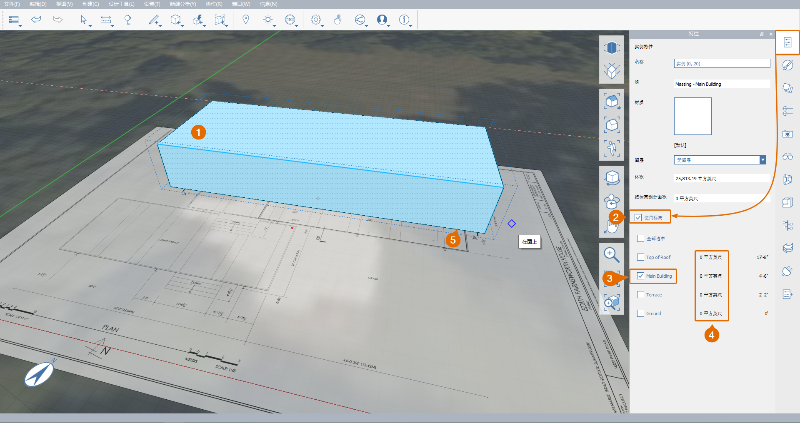

# 1.5 - Group Objects

_Groups in FormIt function similarly to Families in Revit and Components in SketchUp. Grouping different objects prevent their geometry from joining. Copies of a group act as an instance of the original geometry, meaning that changes to one copy will affect all of them._

_If you did not complete the last section, download and open the_ _**1.5 - Group Objects.axm**_ _file from the_ _**Farnsworth House Data Set**._

## **Create a Group**

1 - Select the upper terrace mass by double-clicking it.

2 - Right-click and select **Group \(G\)**, or simply press ‘**G**’.

3 - Notice that after creating a Group, you get automatically placed in the Move tool.

## **Move a Group**

1 - To assist in the modeling process, turn on **Grid Snapping \(SG\)**, if it was off.

2 - To start moving the selected object, while still in the **Move \(M\)** command, click once on any lower corner of the mass. Then move your cursor up, and you should see a blue \(Z\) axis line appear. This line will assist you in moving the object straight up.

3 - With the blue axis visible, type **4'-6"** and a dimension dialog will appear. After entering the dimension, click **OK** or press **Enter** on the keyboard. This will move the entire mass up off the ground plane along the **Z axis**.

_**Note:**_ _Similar to Revit, you can also type_ _**4’6**,_ _**4’6”,**_ _or_ _**4.5**, and the program will interpret the value as 4\(feet\) 6\(inches\) when using imperial units._

## **Edit a Group**

1 - To enter the **Group Edit Mode**, double-click the mass.

1. In the **Properties Palette**, rename the Group **"Massing - Main Building"**.
2. To save the changes and exit the **Group Edit Mode**, click on the **Finish Group Edit** checkmark icon in the upper left corner of the canvas, or double-click off in space.

_**Notes**:_ 

* _To learn about the_ _**Category**_ _options, go to the_ _**Working with Revit**_ _chapter._‌
* _Each Group has its own undo/redo history that is distinct from the overall project - you can click the_ _**Undo**_ _and_ _**Redo**_ _arrows in the_ _**Group Edit Wizard**_ _in the upper left corner of the canvas._

## **Apply Levels to a Group**

_**Note:**_ _Grouping a geometry overrides previous settings you may have applied to the geometry. Because of that, you will require to re-apply the Levels from the previous exercise._

1 - To apply levels to a group:

1. Single-click the **Massing** **- Main Building** group to select it.
2. Go to the **Properties Palette** and check **Use Levels.**
3. Keep only the **Main Building** level by unchecking all the others.
4. The **Area by Level** field will display the currently selected object\(s\) gross area. The area of each **Level** is displayed in front of each **Level**’s name.
5. If you do not see a blue level line crossing the object horizontally, turn on the level display by going to the **Settings menu &gt; Visual Style &gt; Display Levels \(DL\).**

_**Note**: If there is no area reported for the_ _**Main Building**_ _level, the geometry may not be intersecting the Level, which should be at 4’-6” height. Troubleshoot by repositioning the geometry or the_ _**Level**_ _height so they intersect._

2 - Deselect the Group by pressing **Esc** or single-clicking off in space. With no selected object, the **Properties Palette** will report the overall sketch’s gross area - rather than a specific object’s area. 

## **Manage Groups**

1 - To view and manage all groups in the sketch:

1. Go to the **Group Tree Palette**. There you will see:
   * **Terrain** group – group automatically created when the **satellite image was imported**.
   * **Massing - Main Building** – the building mass geometry group we just created.
   * **group 2** – unnamed group containing the floor plan image.
2. To rename **group 2** through the Group Tree Palette, double-click on **group 2**, and then type **Plan Image**.

_**Notes:**_

* _For a tidy model, we recommend keeping the group names descriptive._
* _This is a handy way to manage and edit all groups in the model from one place._

2 - With the **Plan Image** group still selected, navigate to the **Properties Palette**. Note that the group name was also updated in the **Group** field.

## **Hide Group Context**

_This tool is a quick way to hide all geometry outside the group you are currently editing. It becomes very handy whenever you have a large and complex model and other geometries get in the way._

1 - To isolate a group:

1. Double-click on its geometry to edit the group.
2. Navigate to **Settings** in the **Main Menu** and check **Hide Group Context** or simply press **H** on your keyboard. Note how the **Plan Image** disappears.
3. Finish editing the group. Note that the **Hide Group Context \(H\)** mode is only active while inside the **Group Edit Wizard**.
4. To toggle this mode off again, simply press **H**. This option can be toggled at any time, inside or outside of a group.

