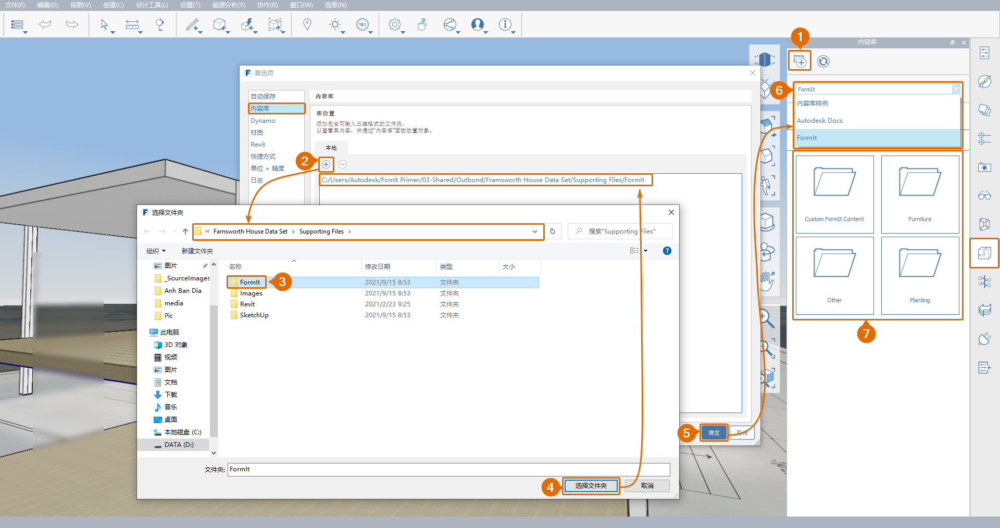

# 1.11 - Import Models with Content Library

_In this chapter, we will import existing SketchUp models, as well as use the FormIt Content Library to place OOTB families that have been converted from Revit. Note that when opening SKP files with FormIt, they come with intact Materials, Groups and Components, Layers \(Tags\), and Scenes. Some clean-up may be needed to keep your projects tidy and organized._

_For this chapter we will be using files from the_ **Farnsworth House Data Set &gt; Supporting Files** folder. If you have not already, be sure to download the required folders, or entire data set, from the _**FormIt Primer Part 1 Datasets**._

## **Import and Edit SKP files**

_First, we will go through the process of adding a piece of downloaded content to your own personal content library_. Note that in this exercise we will be only using SKP files. To learn more about how to open/import other file formats, refer to [**this blog post about Formit 2021.2 features**](https://formit.autodesk.com/blog/post/formit-2021-2-and-new-revit-add-in-now-available) and to **this chapter about** **Expanded Import and Export File Formats**.

1 - Make sure to **Save \(Ctrl + S\)** any open work, then start a new FormIt sketch. To do this, you can either:

1.  Open another session on FormIt in a new window by right-clicking on the FormIt Icon in the **Windows Taskbar** and clicking on the **FormIt** icon. This will open a new FormIt window, allowing you to run two FormIt sessions side-by-side.
2. OR, after saving, start a **New Sketch \(Ctrl + N\)** from the **File** dropdown in the **Main Menu** bar.

2 - Create a new folder called **Custom FormIt Content** inside the **Farnsworth House Data Set &gt; Supporting Files &gt; FormIt** folder in the _**Farnsworth House Data Set**._

3 - **Save \(Ctrl + S\)** your new sketch in that folder. We recommend naming it: **Ottoman – Barcelona\_Mies.axm**

4 - In the new empty FormIt file:

1.  **Import a Local File \(Ctrl + I\)** by selecting **Import &gt; Locally…** from the **File** dropdown in the **Main Menu** bar.
2. Choose: **Ottoman – Barcelona\_Mies.skp** from the **Farnsworth House Data Set &gt; Supporting Files &gt; SketchUp** and click **Open**.

_**Note:**_ _If you do not see the_ _**Ottoman – Barcelona\_Mise.skp file**, make sure the file format dropdown in the bottom right is set to_ _**All Supported Formats**._

5 - Rename the imported group **Ottoman - Barcelona\_Mies**.

6 - When we eventually import this model into our Farnsworth House file, it will be placed by using this file’s **Origin** point. To control l placement point, we want to move the **Ottoman - Barcelona\_Mies** group so one if its corners is located at the **Origin**. To do this:

1. Ensure **Snap to Grid \(SG\)** is on. Draw a reference **Line \(L\)** starting at the **Origin** \(There the X, Y, and Z axes intersect\). Click anywhere to place the second point.
2. Select the ottoman group and start the move command by single-clicking on the lower left corner of its leg, as shown. _To learn more about how to move objects, refer to previous chapters._
3. Move the group to the **Origin**, by snapping to the start point of the reference line we just drew.
4. Delete the reference line.

7 - We recommend deleting any unwanted layers that were imported with the SKP file, as any layers this model has will eventually be imported into our Farnsworth House model. To do that, go to the **Layers Palette**, select **Layer 0**, and click the **-** button. This will delete the layer while keeping its geometry.

_**Note:**_ _Whenever you delete a layer, any geometry or groups that were on that layer are assigned to have_ _**No Layer**, which is the default value for any object that has not yet been assigned to a layer._

## **Create Content Thumbnail**

_This next step will setup a scene to be used as the_ _**Content**_ _thumbnail, which will be displayed in the_ _**Content Library Palette**._

1 - To define the view settings for the thumbnail scene:

1. In the **Environment** tab of the **Visual Style Palette**, uncheck all the checkboxes and set the **Lower/ Background** color to white.
2.  Make sure your view mode is set to **Perspective** **\(VP\)**.
3. Use the **View Navigation Tools** to zoom in pick a camera location that represents the object well, similar to the below image.

2 - To save the settings you just set, create a scene:

1. Go to the **Scene Palette**.
2. Click on the **+** button. This will create a new scene based on your current settings.
3. Rename it **Thumbnail** and make sure that at least the first four \(4\) checkboxes are checked; **Camera**, **Layers**, **Sun and Shadows**, and **Visual Styles**. The rest of the scene settings are not really relevant for creating the thumbnail image.
4. Use the **Update Scene** button any time you want to refresh your **Scene** to match the current camera view and visual settings.

3 - **Save \(Ctrl + S\)** the completed ottoman model again. Note that the **Content Thumbnail** is created from the current view when the model was last saved, so make sure you are in the **Thumbnail Scene** before you save.

_If you wish, you can compare your file against ours by opening the_ _**Ottoman - Barcelona\_Mies.axm**_ _file saved at_ _**Farnsworth House Data Set &gt; Supporting Files &gt; FormIt &gt; Furniture**_ _in the_ _**Farnsworth House Data Set**.‌_

_You can follow the same steps above with the bench and chair SKP files located in the same folder as the ottoman._

_**Tip:**_ _To expedite the process we recommend using the_ _**Ottoman - Barcelona\_Mies.axm**_ _file you just created as a template. While modeling you may want to turn on the_ _**Grid**_ _and the_ _**Axes**_ _again from the_ _**Visual Styles Palette**. By adjusting only the camera position of your_ _**Thumbnail Scene**_ _for each piece of furniture, it will ensure that the_ _**Content Thumbnails**_ _remain consistent for all of your content models._

## **Link a Content Library**

_Now back to our Farnsworth House project. We will learn how to link the **FormIt** folder in the **Farnsworth House Data Set**, to easily access all of its files - including the_ **Custom FormIt Content** _we just created - from within our project._

1 - After switching back to, or re-opening, the Farnsworth House model. _If you did not complete the last chapter, download and open the_ _**1.11 - Import Models with Content Library.axm**_ _file from the_ _**Farnsworth House Data Set**._

1. Open the **Content Library Palette** and click the **Link Content Library Directory** icon. The **Preferences** window will pop-up with the **Content Library** tab open.
2. Click the **+** icon to **Add a new Content Library location**. A third window will pop-up for you to navigate your computer’s directory and select a folder.
3. In the _**Farnsworth House Data Set**, navigate through the folders:_ _**Supporting Files &gt; FormIt**. There you will find the_ folders containing the **.axm** files we created earlier in this chapter. Double-click the **FormIt** folder to select it.
4. Click **Select Folder** and that folder’s path will show up in the **Library Locations – Local** Panel.
5. Back in the **Preferences** window, click **OK**, and the linked folder will be added to the **Content Library**.
6. To access this new library, open the drop-down menu at the top for the **Content Library Palette** and select **FormIt**.
7. Note that the folder structure and all the **.axm** files in the linked folder will show up in the **Content Library Palette**. Double click any sub-folders to access the files in it. 

**Note:** If you have access to **Autodesk Docs** \(previously know as Autodesk 360\), you can also access files you may have stored there through the **Content Library** drop-down menu.

## **Place Content from the Library**

_‌Now we will place the content items we created inside in the Farnsworth model._

1 - So that we can see inside the house to place the furniture, turn off the **Roof** layer and **Orbit \(O\)** the perspective view until you can see the entire Main Building Floor.

2 - Back in the **Content Library Palette**, ensure the dropdown is still set to the **FormIt**. Before placing any of the furniture we just made, we need to place the ‘core’ of the house:

1. Click on the folder named **Other** to open it, and then click on the **Farnsworth House – Core** thumbnail to select it.
2. Hover the mouse over the **Main Building Floor,** to click on the **Centroid** of the floor to place the **Core**.
3. To go back UP to the FormIt folder, use the **Navigate Up** button.

3 - Set the camera to an **Orthographic \(VO\)** **Top View \(VT\)** and turn of the **Main Building Floor** to see the **Plan Image**. Refer to previous chapters to learn more about the **Views** and **Layers** settings.

4 - Select the **Farnsworth House - Core** and move it until it closely aligns with the Plan Image.

_**Note:**_ _While moving the_ _**Core**, be careful not to change its elevation. You can either use the_ _**Shift**_ _key to restrict the movement to always be along one of the axes, or ensure that the start and end reference points of your_ _**Move \(M\)**_ _command are both at the same height by clicking only on the_ _**Plan Image**, not the_ _**Core**_ _itself. Refer to previous chapters to learn more about the_ _**Move \(M\)**_ _Tool.‌_

## **Place Furniture from the Library**

1 - Using a similar process, you can now place the furniture you created earlier in this chapter from the **Custom FormIt Content** folder. If you did not convert all three \(3\) of the SKP files, you can use the premade versions inside the **Furniture** folder instead.

_**Notes:**_

* _Turn the_ _**Main Building Floor**_ _layer back on, so you can place furniture directly on the_ _**Main Building Floor**’s surface._
* _While placing a new object, use the_ _**Tab**_ _key to alternate between placement planes._
* _While placing a new object, use the_ _**Space Bar**_ _key to rotate it by 90 intervals before placing._

2 - Similarly, explore the **Content Library Samples** to place OOTB Content. Note that multiple of these have several different sizes to choose from, similar to Family Types in Revit.

## **Using the Scale Tool**

1 - Using the techniques, you just learned, place one instance of the **tree\_pine** component from the **Farnsworth House Data Set &gt; FormIt &gt; Planting** folder.

1. Once placed, select the group and rename it to **Tree**. Right-click to access the **Context Menu** and choose **Non-Uniform Scale \(NU\)**.
2. Click on one of the **Non-Uniform Scale Buttons** to resize and change the proportions of the **Tree** group as desired.

_**Note:**_ _Similarly, the_ _**Scale \(SC\)**_ _tool can be used to re-scale an entire model or group uniformly._

2 - Copy this group and place multiple trees around the house, using the **Scale Tools** to create a variety of sizes and proportions.

_**Note:**_ _Even though the trees are all instances of the same group, we were able to_ _**Scale**_ _them to different sizes. Using the_ _**Scale \(SC\)**_ _and_ _**Non-Uniform Scale \(NU\)**_ _outside of group edit mode allows you to modify individual instances of the same group. If we were to edit one of the_ _**Tree**_ _groups and modify its geometry or material, all group instances would still be updated, but also each would keep their current customized scale. Give it a try!_

### **Keep Model Tidy**

_Remember to always sort added content onto layers. In this example, we recommend placing the core and all furniture on the_ _**Main Building Floor**_ _layer and the trees on a new layer named_ _**Planting**._

