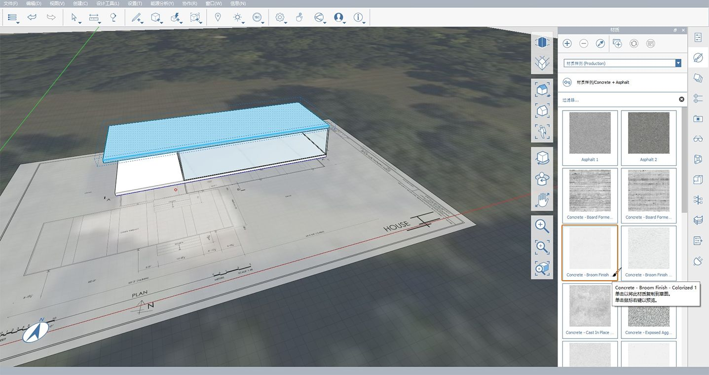
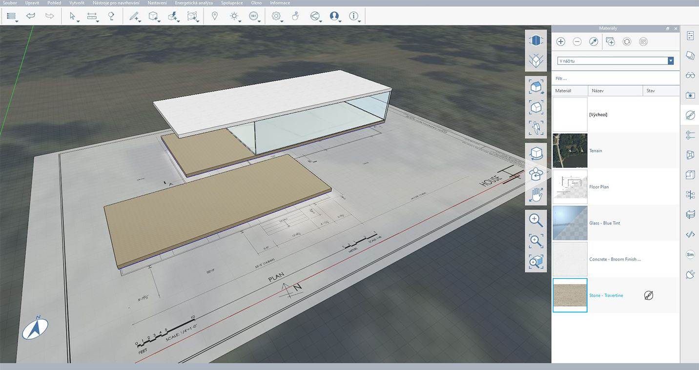

# 1.7 - Paint with Materials

As we saw in an **earlier exercise**, you can create your own materials, and then paint faces with those materials in FormIt. In this exercise, you will create and edit more materials as well as import materials from the Autodesk Material Library.

_If you did not complete the last section, download and open the_ _**1.7 - Paint with Materials.axm**_ _file from the_ _**FormIt Primer Part 1 Datasets**._

## **Create the Glass Walls**

1 - To view the plan containing the dimensions we are going to reference, go to the **Layer Palette** and turn on the **Plan Image** layer.

2 - Select the **Rectangle Tool \(R\)**. We are going to create a rectangle directly on top of the existing floor group. Make sure you are not editing the Floor Group but drawing on top of the existing grouped object.

3 - To start the rectangle for the glass area:

1. Click at the back corner of the existing floor and move the mouse along its shorter edge.
2. Type **28’-8”** to define the first edge length, and click **OK**. This should be the same length as the existing short edge of the floor.
3. To define the second edge, start moving the mouse along the existing floor’s longer edge. Type **55'-5 ½"** to set the length of the second edge, then click **OK**.
4.  Click **Esc** to exit the rectangle tool. Single-click inside the new rectangle to select the face and start dragging it up.

4 - To define the height, move the mouse upwards along the **Z Axis**, press the **Tab** key, and enter **11'-2"**.

_**Note:**_ _Anytime you are using a tool for which you can enter a dimension, you can either press_ _**Tab**_ _or just start typing numbers!_

5 - Double-click and **Group \(G\)** the new geometry.

6 - Double-click the group to edit it. In the **Properties Palette** name the group **Glass Walls.**

7 - To define the glass wall’s thickness:

1. Right-click on the top face and choose the **Offset Face Tool \(OF\).**
2. Move your mouse cursor inward, and type in **4".**
3. Click **Esc** twice to clear the tool, and the selection.

​_**Note:**_ _The default unit for imperial projects are feet, similar to Revit. If you enter a single number without a specified unit, like_ _**4**, you will get_ _**4 feet \(4’\)**_ _and not_ _**4 inches \(4”\)**._

8 - To carve out the interior area, single-click the interior top face to select it, then click again to start the **drag face** operation. Push the face all the way down, until it disappears, and click in the space to finish the process.

_**Note:**_ _In FormIt, unlike other software, you cannot accidentally push the face you are trying to delete ‘too far’ such that a new negative extrusion is formed._

9 - End **Edit Group** mode by double-clicking off in space or pressing **Esc.**

10 - Select the **Glass Walls** group with a single-click and put it on the **Main Building Floor** layer.

## **Import a Material from the Autodesk Material Library**

1 - Edit the **Glass Walls** group again by double-clicking into it.

2 - To import a new material to the model:

1. Go to the **Materials Palette**.
2. Choose **Material Sample** in the drop-down menu at the top of the palette to navigate through the **Autodesk Material Library.** ​
3. Click on the **Glass+Glazing** folder to open it.
4. Find the **Glass – Blue Tint** material and single-click on it to add that material to your **In Sketch** material library.
5. Note that you should be back in the **In Sketch** library, which now includes the newly selected material.

3 - After adding the material, you should automatically be in the **Paintbrush** tool. If not, simply single-click on the **Glass – Blue Tint** material again. To paint all the walls, double-click the geometry with the **Painbrush** tool. This will apply the selected material to the entire object. ​

4 - Click **Esc** to exit the **Paintbrush** tool. Click **Esc** again, or double-click off in space to exit the group.

## **Quick Copy the Floor to Create the Roof**

1 - To quickly create the roof based on the floor geometry:

1. Select the **Floor** group with a single-click.
2. Click one of the lower corners to start the **Move** tool.
3. Start moving the floor up along the blue axis \(**Z Axis**\). Create a **quick copy** by tapping the **Ctrl** key. A "ghost" preview of the copy should appear. ​
4. While moving along the blue axis \(**Z Axis**\), start typing **12' 2"** and a **Dimension Dialog** will appear. Click **OK** or press **Enter** to finalize the position.

## **Edit the Roof**

1 - While the copied group is still selected, use the **Make Unique \(MU\)** command to disassociate this group from the floor group.

2 - Double-click the group to edit it. Re-name the group to **Roof** in the **Properties Palette**. Exit the group by double-clicking off in space.

3 - In the **Layers Palette**, make a new **Layer** called **Roof** and add the **Roof** group to it. You can toggle the layer on and off to verify the correct elements are on the roof. Refer to **Chapter 6** for more information on how to work with **Layers**.

4 - Navigate back to the **Materials Palette** and import the **Concrete - Broom Finish - Colorized 1** material from the **Concrete+Asphalt** folder in the **Material Samples** **\(Production\)** library. Note that by clicking on the material, the selected geometry will be automatically painted, and the new material will be added to the **In Sketch** material library.

_**Note:**_ _Painting a group outside of_ _**Group Edit Mode**_ _is a helpful technique that allows you to paint different instances of the same group with different materials._

## **Create the Lower Terrace**

1 - Based on the **Plan Image**, create the lower terrace as a **Rectangle \(R\)** that is **55' 3"** long and **22'-7 3/4"** wide, and extrude it by 1’. Position the new rectangle so that it is 8 5/8” away from the main building South edge \(the depth of the columns we will create later\).

_**Notes**:_

* _Refer to previous chapters to learn how to draw and extrude rectangles._
* _You may need to toggle_ _**Snap to Grid \(SG\)**_ _on or off to click at_ the terrace's corner.

2 - To finalize the lower terrace:

1. **Group \(G\)** the geometry and name it **Lower Terrace Floor**.
2. **Move** the group up **2'-2"** off the ground plane.
3. Create a new **Layer** called **Lower Terrace** and add the group to it.
4. Add the **Terrace Level Floor** to the group.

_**Note:**_ _This image doesn’t represent the step-by-step process to create and assign the geometry to groups, levels, and layers. For more information on these processes, refer to previous chapters in this Primer._

3 - Import the material **Stone &gt; Stone - Travertine**.

4 - In the **Materials Palette**, find the imported **Travertine** material and modify it:

1. Double-click the preview tile to open the **Material Editor** pop-up.
2. Click the **Color** preview tile to open the **Color Editor** pop-up.
3. Change the **Val** field to **190** to darken the tint of the material.

5 - **Paint** the **Floor** and **Lower Terrace Floor** groups with the modified **Travertine** material.

