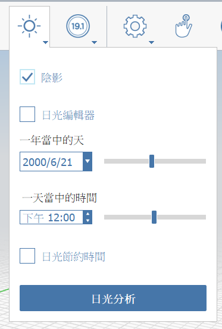
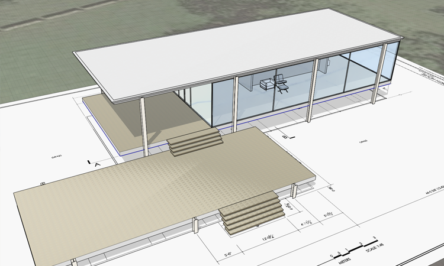
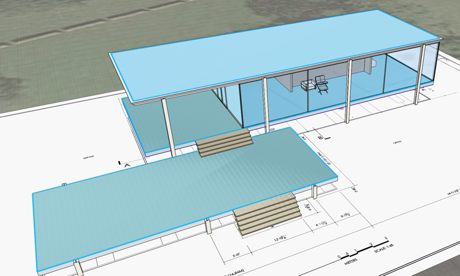
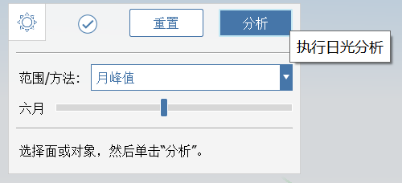
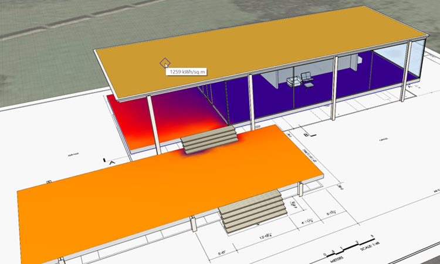
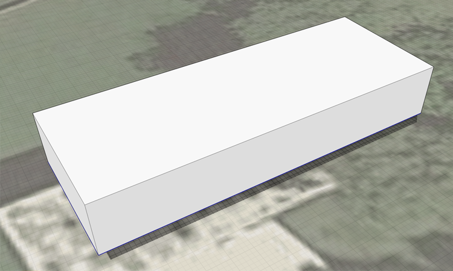
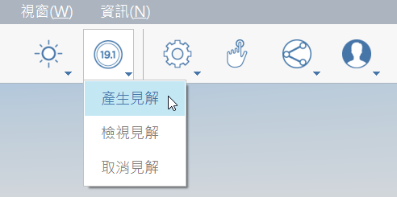
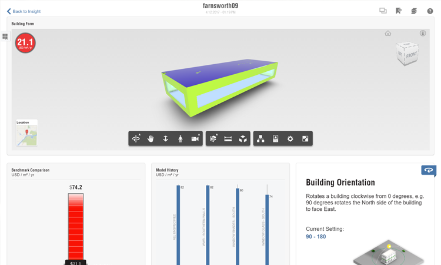

# 日照解析とエネルギー解析

モデルが作成されたので、これを使用して設計の**太陽とエネルギーの影響**を調査できます。これらの機能は FormIt に組み込まれているため、最初の調査を建物のパフォーマンスの観点から理解することができます。これらの機能は、**FormIt Pro** のみに含まれており、Web アプリでフォローしている場合は、アクセスできない可能性があります。

直前の演習がまだ完了していない場合は、[ファイル] &gt; [開く]をクリックし、FormIt Primer フォルダで **farnsworth08.axm** を選択してください。

## 影

これらの解析ツールを使用する前に、[場所を設定]()する必要があります。これにより、FormIt は正確な日照、影、気候データにアクセスできます。

1. [**アクション ツールバー**](../../formit-introduction/tool-bars.md)の太陽アイコンをクリックして、**[影\(DS\)]**をオンにします。

   

2. **[通日]**スライダと**[時間]**スライダを調整して、影がどのように変化するかを確認します。

   

3. 夏の最も暑い時間帯に、ひさしの付いたテラス部分が日陰になることがわかります。もちろん、これは偶然ではなく、そうなるように設計しているためです。

**注:** [影]によってアプリケーション パフォーマンスが低下する可能性があります。これを緩和する方法は 2 つあります。ナビゲーションが遅くなった場合は[影]をオフにするか、影の解析に必要のない **Furniture** (家具)のようなレイヤをオフにします。

## 日照解析

これから作成するようなヒートマップの図からは、ビジュアル デザインに役立つ多くの情報を学び、伝えることができます。

1. [**太陽**](../../formit-introduction/tool-bars.md)アイコンのメニュー下部にある**[日照解析]**ボタンをクリックします。
2. **影**、**キーボード ショートカット**、およびその他の**ツールバー**が無効になった、特殊なモードになります。
3. 選択の動作は、**日照解析**モードで変更されます。**グループ全体**を選択できます。**[Ctrl]**や**[Shift]**を押しながら選択セットに追加する必要はありません。また、もう一度クリックすると項目を選択解除できます。ジオメトリを**シングル クリック**、**ダブル クリック**、または**ウィンドウ選択**で選択できます。
4. 調査する面を選択します。**屋根**の上部と**床**の上部を**シングル クリック**します。家具などの小さな要素は選択しないでください。

   

5. キャンバスの左上コーナーに**[日照解析]**ツールバーがあります。**[解析]**をクリックします。FormIt はサーフェスを計算してレンダリングします。この設定は、解析の終了前**および**終了後に調整できます。

   

6. **[月のピーク]**設定では、指定した月の**ピーク**値 \(BTU / 平方フィート\)が表示されます。これは、**シェーディング調査**を目的としています。月の設定を変更すると、グラフィックスの更新がすぐに行われます。解析済みのサーフェスに**マウス カーソルを置く**と、**具体的な**値が表示されます。

   

7. **[累積年]**設定には、年間の**累積**エネルギー量\(KwH / 平方メートル\)が表示されます。これは、**PV の可能性のシミュレーション**を目的としています。

   

8. これらの**日照解析**スタディは、**[ファイル] &gt; [書き出し]\([Ctrl] + E\)**をクリックし、左側のリストから**[イメージ]**を選択して書き出すことができます。

## Insight を使用したエネルギー解析

FormIt には、Revit が使用するものと同じ建築パフォーマンス解析ツールが統合されています。**Insight** は、建物システム パラメータのダッシュボードを提供します。これは、モデル ジオメトリを**再解析**しなくても、潜在的なシナリオを反映するように調整できます。Insight は、FormIt **マス** ジオメトリで最適に機能します。

1. Autodesk アカウントにログインしていることを確認してください。**Massing** レイヤを**除く** **すべての**レイヤをオフにします。ジオメトリには少なくとも 1 つの**レベル**が適用されている必要があります。
2. FormIt は、**表示**ジオメトリのみを Insight に送信します。単純な**マス**でも、**Insight** から多数のデータが生成されることに注意してください。

   

3. **[Insight] &gt; [Insight を作成]**ボタンをクリックします。解析はクラウドで実行されるため、計算中にモデルでの作業を続行できます。

   

4. 解析が完了したら、**[Insight を表示]**ボタンをクリックして**エネルギー モデル**と**パフォーマンス係数**を表示します\(必要に応じて、Web サイト [**http://insight.autodesk.com**](http://insight.autodesk.com/)に直接アクセスできます\)。

   

5. Insight ダッシュボードで、係数をクリックして青いドットをドラッグすると、**パフォーマンス係数**ウィジェットごとに値\(または値の範囲\)を設定できます。建物で使用する具体的なシステムがまだわからない場合は、範囲を設定すると便利です。
6. **係数**を変更するたびに、**エネルギー コスト範囲**\(USD / 平方メートル / 年で測定\)全体が更新されます。**Ashrae 90.1** や **Architecture 2030** の課題など、ベンチマークに対する設計のパフォーマンスを確認できます。
7. 設計が大幅に変更された場合は、更新されたマスを同じダッシュボードに再送信できます。更新されたデザインの**新しい**ダッシュボードを作成する場合は、最初に FormIt で**[名前を付けて保存]**を実行する必要があります。
8. エネルギー解析に失敗した場合は、**密封性に関する問題\(DW\)**がジオメトリにある可能性があり、FormIt で確認して修正できます。
9. **Massing** レイヤをオフにして、他のすべてのレイヤをオンに戻します。

