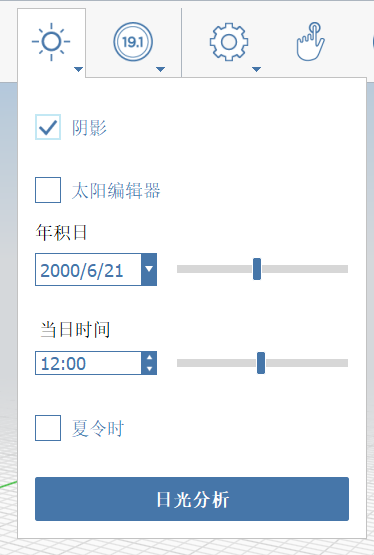

# 日光和能源分析

現在已建立模型，我們可以利用它來研究設計的**日光和能源影響**。這些功能內建在 FormIt 中，因此您可以從建築效能的角度了解您最早的研究。這些功能只有 **FormIt Pro** 才提供，如果您繼續使用網頁應用程式，可能沒有存取權。

如果您沒有完成上一節，請按一下「檔案」&gt;「開啟」，然後從「FormIt Primer」資料夾中選擇 **farnsworth08.axm**。

## 陰影

在使用這些分析工具之前，您必須先[設定位置]()。這可讓 FormIt 存取精確的太陽、陰影和氣候資料

1. 按一下[**動作工具列**](../../formit-introduction/tool-bars.md)中的「太陽」圖示，然後勾選**「陰影 \(DS\)」**

   

2. 調整**「天」**和**「時間」**滑棒，以查看陰影如何變更

   

3. 請注意有遮蓋的露台在夏季最熱的幾個小時當中如何遮蔽，這肯定不是意外，而是設計的結果！

**注意事項**：陰影可能會導致應用程式效能降低。有兩種緩解此問題的建議：如果您發現導覽變慢，請關閉陰影；或關閉研究陰影時不需要的圖層，例如**家具**

## 日光分析

設計師是有視覺的人，因此可以從熱圖 \(例如我們將要建立的熱圖\) 學習和傳達驚人的資訊量

1. 在[**「日光」功能表**](../../formit-introduction/tool-bars.md)底部，按一下**「日光分析」**按鈕
2. 您會進入一個停用**陰影**、**鍵盤快速鍵**和其他**工具列**的特殊模式
3. 選取行為在**「日光分析」**模式中經過修改。您可以選取**多個群組**，無需按住 **Ctrl** 或 **Shift** 即可加到選集中，也可以再按一下群組以取消選取。您可以**按一下**、**按兩下**或**窗選**幾何圖形
4. 選擇您要研究的面。**按一下** **屋頂**的頂部和**樓板**的頂部。避免選取小元素，例如家具

   

5. 在圖元區的左上角，找到**「日光分析」**工具列。按一下**「分析」**。FormIt 將計算並彩現表面。分析完成前**和**後都可以調整此處的設定

   

6. **「月尖峰」**設定顯示指定月份的**峰值** \(以每平方英尺的 BTU 表示\)。此設定適用於**描影研究**。您可以變更月份設定，圖形會立即更新。**將游標懸停**在已分析的表面上，以取得**特定**值

   

7. **「年累計」**設定顯示整年的**累計**能量 \(以「千瓦小時/平方公尺」為單位\)。此設定適用於 **PV 潛力研究**

   

8. 您可以按一下**「檔案」&gt;「匯出 \(Ctrl + E\)」**，然後從左側清單中選擇**「影像」**，匯出這些**日光分析**研究

## 使用 Insight 進行能源分析

FormIt 整合了 Revit 所使用的相同建築效能分析工具。**Insight** 提供一個建築系統參數管控面板，您可以調整這些參數反映潛在的情況，不需要**重新分析**模型幾何圖形。Insight 搭配 FormIt **量體**幾何圖形運作地最好。

1. 確保您已登入您的 Autodesk 帳戶。關閉**所有**圖層\(**除了** **量體**圖層\)。您的幾何圖形必須至少套用一個**樓層**
2. FormIt 只會將**可見的**幾何圖形傳送至 Insight。請注意，即使是一個簡單的**量體**，也會從 **Insight** 產生大量資料

   

3. 按一下**「Insight」&gt;「產生見解」**按鈕。分析將在雲端執行，因此您可以在計算期間繼續塑型

   

4. 分析完成後，按一下**「檢視見解」**按鈕以查看您的**能源模型**和**效能係數** \(或者，您也可以直接造訪網站 [**http://insight.autodesk.com**](http://insight.autodesk.com/)\)

   

5. 在 Insight 管控面板上，您可以按一下係數並拖曳藍色圓點，來為每個**效能係數**工具集設定值 \(或值範圍\)。如果您還不知道建築物將使用的特定系統，範圍會很有幫助
6. 每變更一個**係數**，整體的**能源成本範圍** \(以「美元/平方公尺/年」為測量單位\) 就會更新。您可以針對基準 \(例如 **Ashrae 90.1** 和 **Architecture 2030** Challenge \) 查看您設計的效能
7. 如果設計形式發生顯著變更，您可以將更新的量體重新傳送至相同的管控面板。如果您要為更新的設計建立**新的**管控面板，則必須先在 FormIt 中**另存**
8. 如果能源分析失敗，您可能有和幾何圖形相關的**防水問題 \(DW\)**，您可以在 FormIt 中檢閱並修正這些問題
9. 關閉**量體**圖層，並重新開啟其他所有圖層

