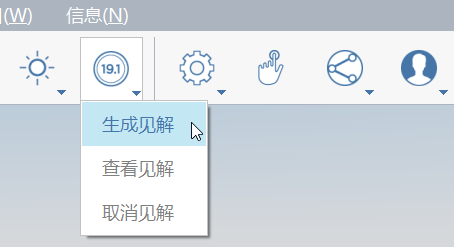

# Расчет инсоляции и энергопотребления

После создания модели мы можем использовать ее для исследования **инсоляции и энергопотребления** объектов проекта. Это встроенные функции FormIt, позволяющие анализировать эксплуатационные характеристики здания на ранних этапах работы по проекту. Эти функции доступны только в версии **FormIt Pro**. При работе в веб-приложении функции могут быть недоступны.

Если вы не работали с предыдущим разделом, щелкните «Файл» &gt; «Открыть» и выберите **farnsworth08.axm** в каталоге FormIt Primer.

## Тени

Перед использованием следующих инструментов анализа необходимо [задать местоположение](). Это обеспечивает FormIt доступ к точным данным о положения солнца, тенях и климате.

1. Щелкните значок солнца на [**панели «Действие»**](../../formit-introduction/tool-bars.md) и установите флажок **Тени \(DS\)**.

   

2. Передвигайте ползунки **День** и **Время**, чтобы посмотреть, как меняются тени.

   

3. Обратите внимание, как затеняется крытая терраса в самые жаркие часы летних месяцев: разумеется, это не случайность, а вопрос проектирования.

**Примечание**. Отображение теней может привести к снижению производительности приложения. Если замедляется навигация, можно отключить тени или слои, например **мебель**, если они не требуются для изучения теней.

## Расчет инсоляции

Работая с визуальными представлениями, проектировщики могут изучать и представлять невероятное количество информации с помощью схем тепловых карт, подобных тем, что мы создадим сейчас.

1. В нижней части [**меню «Солнце»**](../../formit-introduction/tool-bars.md) нажмите кнопку **Расчет инсоляции**.
2. Откроется специальный режим, в котором отключены **тени**, **клавиши быстрого доступа** и другие **панели инструментов**.
3. Способ выбора можно изменить в режиме **расчета инсоляции**. Можно выполнить выбор с помощью **групп**. При этом для добавления элементов в набор не нужно удерживать нажатой клавишу **CTRL** или **SHIFT**. Чтобы отменить выбор элементов, щелкните их еще раз. Объекты геометрии можно **щелкнуть один раз**, **щелкнуть дважды** или **выбрать рамкой**.
4. Выберите грани для исследования. **Щелкните** верхнюю часть **крыши** и верхнюю часть **перекрытий**. Не выбирайте мелкие элементы, такие как мебель.

   

5. Перейдите на панель инструментов **Расчет инсоляции** в левом верхнем углу активного окна. Нажмите кнопку **Расчет**. FormIt выполнит расчет и визуализацию поверхностей. Эти параметры можно настраивать до **и** после выполнения расчета.

   

6. Параметр **Пиковое значение за месяц** показывает **пиковые** значения \(в единицах БТЕ/кв. фут\) за указанный месяц. Он предназначен для **анализа затенения**. При изменении месяца графическое изображение сразу же обновится. **Наведите курсор** на анализируемую поверхность, чтобы посмотреть **конкретное** значение.

   

7. Параметр **Суммарно в год** показывает **суммарную** энергию за весь год. \(в кВт-ч/кв. м\). Он используется для **исследования фотоэлектрического потенциала**.

   

8. Чтобы экспортировать **расчет инсоляции**, выберите **Файл &gt; Экспорт \(CTRL + E\)**, а затем выберите **Изображение** из списка слева.

## Расчет энергопотребления с помощью Insight

В FormIt используются те же инструменты анализа эксплуатационных характеристик здания, что и в Revit. В **Insight** имеется панель управления системными параметрами здания, которые можно настроить для отражения потенциальных сценариев без необходимости **повторного анализа** геометрии модели. Insight эффективнее всего работает с геометрией **формообразующих элементов** FormIt.

1. Войдите в учетную запись Autodesk 360. Отключите **все** слои, **кроме** слоя **формообразующих элементов**. В объектах геометрии должен быть настроен хотя бы один **уровень**.
2. FormIt передает в Insight только **видимые** объекты геометрии. Обратите внимание, что даже простые **формообразующие элементы** будут учтены при генерации данных **Insight**.

   

3. Нажмите кнопку **Insight &gt; Создать аналитические данные**. Расчет будет выполняться в облаке, что позволит выполнять моделирование во время расчета.

   

4. По завершении расчета нажмите кнопку **Просмотреть аналитические данные**, чтобы просмотреть **модель энергопотребления** и **коэффициенты энергоэффективности** \(при необходимости можно перейти непосредственно на веб-сайт по адресу [**http://insight.autodesk.com**](http://insight.autodesk.com/)\).

   

5. На панели управления Insight можно задать значение \(или диапазон значений\) для каждого виджета **Коэффициент энергоэффективности**, щелкнув коэффициент и перетащив синие точки. Диапазон применяется в том случае, если вы еще не знаете, какая система будет применена в здании.
6. При каждом изменении **коэффициента** обновляется весь **диапазон энергозатрат** (измеряется в долларах США/кв. м/г\). Можно оценить эксплуатационные характеристики проекта по таким критериям, как **Ashrae 90.1** и **Architecture 2030**.
7. Если проект претерпел крупные изменения, можно повторно отправить обновленный формообразующий элемент в ту же панель управления. Чтобы создать **новую** панель управления для обновленного проекта, то сначала необходимо выполнить действие **Сохранить как** в FormIt.
8. Выполнению расчета энергопотребления могут препятствовать **проблемы непроницаемости \(DW\)** объектов геометрии. Их можно просмотреть и исправить в FormIt.
9. Отключите слой **формообразующих элементов** и включите все остальные слои.

