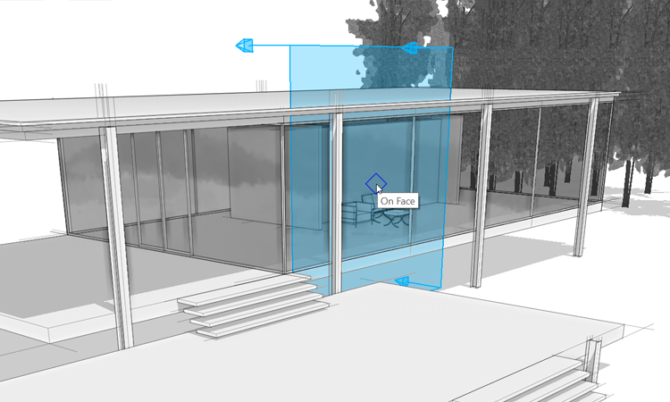
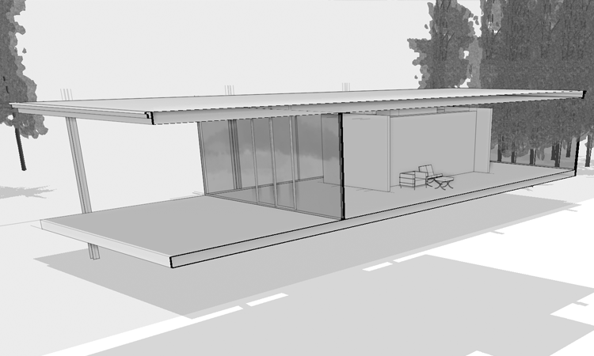
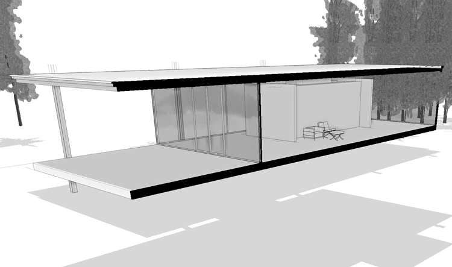

# Section Planes

Use **Section Planes** to cut your model, revealing interior spaces and structural elements. FormIt supports multiple Section Planes at once for a Section Box-like effect. 

1. Click the Section Plane tool from the **main toolbar.** You can also use the shortcut **SP** to activate the Section Plane tool.

   

2. Hover your mouse over one of the glass faces. The arrow indicators on the Section Plane indicate the direction of the section cut - in this case, towards the building.
3. Note that while placing the Section Plane, you can hit Tab to change the orientation of the plane.

   

4. **Click** to place the **Section plane**. The plane scales to the size of your model, and stays selected.
5. Click the plane again to start the **move** tool and push the plane **inward**. Click again to **place** the plane in its final location. Once you're happy with the position, hit **Esc** to clear the selection

   

6. Go to the **Layers** tab. Two new layers have been generated - **Section Indicators** and **Section Cut 1**. Toggle **Section Cut 1** off and back on. This controls the cut effect. Now toggle the **Section Indicator** layer off, this hides the plane, and the arrow indicators, but leaves the cut effective
7. Go to the **Visual Styles** tab. On the **Surfaces** panel, turn on the Poche color - it defaults to Black. This effect will color the inside faces of the section cut with a specified color

   

8. You can add up to **6 section cuts** to your model. You can experiment by navigating to the **Aerial View** scene and placing a section plane that removes the roof
9. Make sure to return to the Scenes tab and update your scenes, so that your Section graphics are stored as desired

