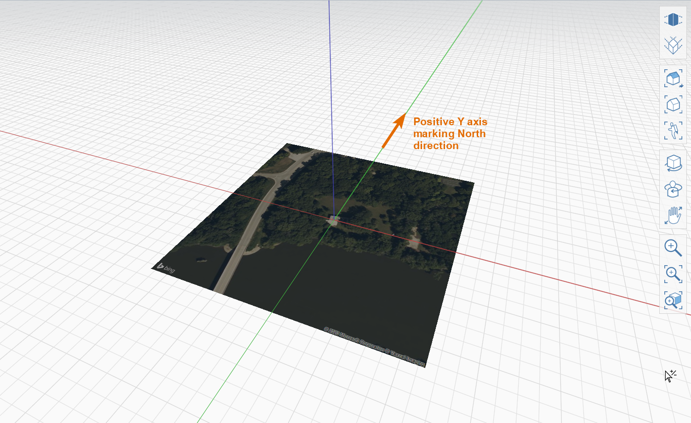

# Set the Location

Setting your project’s location in the world is relevant for the accuracy of future model analyses, like solar studies and accurate shadows. It also allows you to import 3D terrain and scaled satellite image to use as a background reference.

1. Click the Location Icon from the toolbar.

2. Search for **Farnsworth House** in the Bing Maps search bar.

3. Click **Import Satellite Image and Terrain** to set the location, and FormIt will prompt you to define the satellite image crop.

4. Set image crop by zooming in or out \(scroll button\) and panning the satellite image \(click and drag\). Then click the **Finish Importing** button to bring the image into FormIt.

5.The Satellite image is imported to real-world scale with true North facing ‘up’ \(along the positive y-axis\).

6 . To see the North Arrow, \(A\) go to the [**Visual Styles Palette**](https://onenote.officeapps.live.com/@formit3d/s/autodesk-formit-360-windows-help/formit-introduction/tool-bars/@drafts), \(B\) choose the **Environment** tab, and \(C\) toggle the **North Arrow** check box, and the North Arrow \(D\) will appear in the bottom left corner of the screen. You can also type the keyboard shortcut DN to toggle the North arrow on and off.

7. To adjust the satellite image’s transparency:

1. Select the satellite image ****by double-clicking it.
2. Go to the [**Properties Palette**](https://onenote.officeapps.live.com/@formit3d/s/autodesk-formit-360-windows-help/formit-introduction/tool-bars/@drafts)
3. Move the transparency slider about **1/3**.

A. Select the satellite image ****by double-clicking it.

B. Go to the [**Properties Palette**](https://onenote.officeapps.live.com/@formit3d/s/autodesk-formit-360-windows-help/formit-introduction/tool-bars/@drafts)

C. Move the transparency slider about **1/3**.

