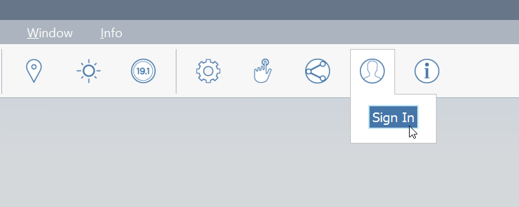
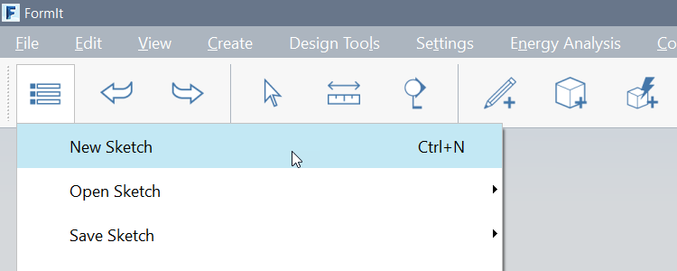
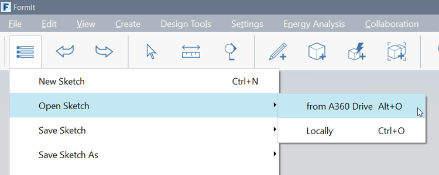
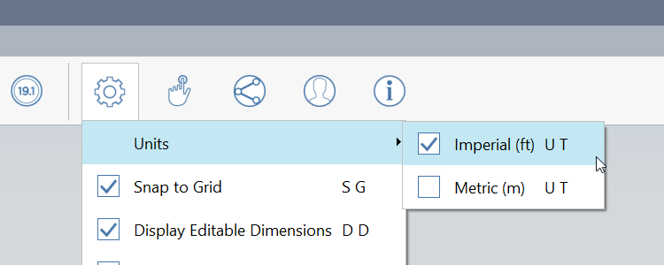

### Setting Up the Project
---
> Autodesk 360 Drive is the primary storage medium for FormIt. However, you can also open, save, import and export files from a local drive. We will use that method for loading datasets in the Farnsworth House Primer, but you will use your A360 drive accound to log into FormIt and save your work as you move through the course.

---

#### Download, Install, and Start FormIt 360
1. After downloading and installing FormIt 360 following the directions found [**here**](prerequisites-and-installation.md), open the program.

2. **Log into FormIt** using your own Autodesk 360 credentials in the [**User Identity menu in the Action Tool Bar**](../formit-introduction/tool-bars.md).   

3. Start a new 'sketch' by clicking the **Gallery button &gt; New**.  
    - Click the **Gallery button &gt; Save Sketch &gt; to A360 drive** to save this to the FormIt folder in your A360 Drive.
  
    - Name your FormIt Sketch.
    -  Each time you save to A360 two things happen:
        - A native FormIt file \(.AXM\) is saved to the FormIt folder in A360.
        - A few minutes later, a RVT File of the design will be copied to the FormIt folder in A360. We will review another way to bring FormIt.

4. Change the **Units** between Imperial and Metric using the [**Settings Menu in the Action Tool Bar**](../formit-introduction/tool-bars.md).

---

####Related Topics:
[Modifying Work Planes](../tool-library/work-planes.md)

[Modifying World Axes](../tool-library/world-axes.md)

