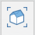
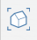
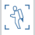
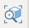

# Navigating the Scene

Use your mouse or touchscreen to easily navigate in and around your FormIt models:

* **Orbit** by right-clicking and dragging the mouse. This will use a point in 3D space about which to orbit the camera.
  * You can also hold Shift to Pan.
* **Zoom** in and out by scrolling the mouse wheel up and down. This will use a point in 3D space at which to zoom to, and will slow down the zoom as you approach a surface or another object.
  * You can also hold Ctrl to zoom at a constant rate, not affected by proximity to objects.
* **Pan** by middle-clicking a point on the screen and dragging the mouse.

You can also use the floating navigation toolbar to go into specific view presets or modes. Shortcuts noted in parentheses.

 **Orthographic views**: click to reveal a flyout of available [orthographic views](../tool-library/orthographic-views.md).

 **Default 3D View \(ZD\)** Navigates to the default 3D view

 **Walkthrough \(FT\)**  The “Jetpack” mode allows you to walk through the scene using keyboard. Use WASD to move forward/backward/left/right, and use Q/E to move up/down. Use spacebar to fly

 **Orbit \(O\)**  When enabled, left-click and drag the mouse to orbit around the model. You can also do this at any time by right-click and dragging.

 **Swivel \(SV\)** Use the swivel tool from the navigation toolbar to look around the scene from a fixed point.

 **Pan \(P\)**  Click and drag the middle mouse button, or use the pan \(hand\) tool from navigation toolbar to pan across the scene.

 **Zoom \(Z\)** Scroll the mouse wheel or use the zoom tool from the navigation toolbar to click drag the left mouse button to zoom

 **Zoom All \(ZE or ZA\)** Zoom to fit all the entire model into the current view

 **Zoom Selection \(ZS\)** Zoom to fit all of the currently selected object\(s\) into the current view

