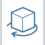

### Navigating the Scene

Here are the key tools on the Navigation Tool Bar for moving around the design area. 

**1. Orbit**
 
Right click and drag, or use the orbit tool from the navigation toolbar to click drag the left mouse button to orbit around the model.

**2. Zoom**
 
Scroll the mouse wheel or use the zoom tool from the navigation toolbar to click drag the left mouse button to zoom.

**3. Pan**

Click and drag the middle mouse button, or use the pan \(hand\) tool from navigation toolbar to click drag the left mouse button to pan.

**4. Walkthrough**

The “Jetpack” mode allows you to walk through the scene using keyboard inputs AWSD, then move up or down with Q and E - and even fly with the space bar.

**5. Swivel**

Use the swivel tool from the navigation toolbar to look around the scene from a stable point. 
