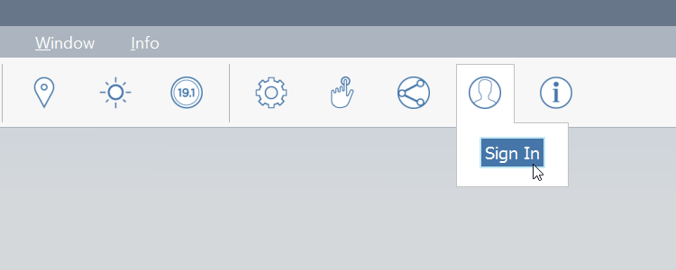
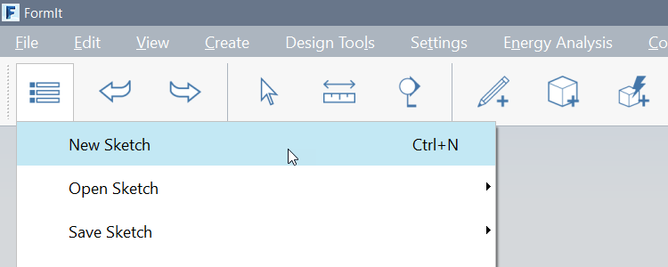
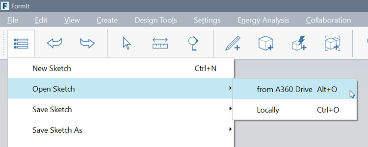

# Setting Up the Project

## Setting Up the Project

When you start FormIt, you'll be in an empty 3D environment. You can start drawing new geometry, 

FormIt allows opening, saving, and exporting to files both locally and on BIM 360 Docs. [Using BIM 360 Docs in FormIt](https://formit.autodesk.com/page/formit-bim-360-docs) is a great way to share models in the cloud.

## Saving Your Work

1. **Log into FormIt** using your Autodesk account

   

2. Start a new 'sketch' by clicking the **File button &gt; New** 

   

3. Click the **File button &gt; Save Sketch &gt; to A360 drive** to save this to the FormIt folder in your A360 Drive

   

4. Name your FormIt Sketch
5. Each time you save to A360 two things happen:
   * A FormIt AXM file is saved to the FormIt folder in A360
6. Change the **Units** between Imperial and Metric

   

