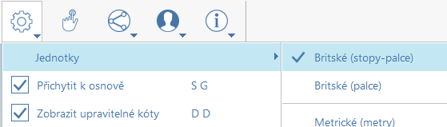
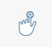

# Configuration d’un projet

## Démarrage

Lorsque vous démarrez FormIt, vous vous trouvez dans un environnement 3D. Prenez le temps d’apprendre à [naviguer dans l’espace 3D](navigating-the-scene.md), puis à construire un projet \([cliquez ici pour en savoir plus](../formit-primer/)\), à utiliser le menu Fichier pour ouvrir un projet FormIt existant ou à importer divers autres types de fichiers.

FormIt permet d’ouvrir, d’enregistrer et d’exporter des fichiers à la fois localement et dans BIM 360 Docs. [L’utilisation de BIM 360 Docs dans FormIt](https://formit.autodesk.com/page/formit-bim-360-docs) est un excellent moyen de partager des modèles dans le cloud.

En ce qui concerne l’enregistrement, FormIt [enregistre automatiquement votre travail](../tool-library/autosave.md) dès que vous modifiez votre modèle. Il est tout de même recommandé d’enregistrer souvent les fichiers, car cela permet de nettoyer le fichier de sauvegarde et d’économiser de l’espace.

## Paramètres de l’application

* Unités :

   

   * La configuration de ce paramètre affecte les unités de tous les outils et de la géométrie importée, comme Dynamo et les types de fichiers sans unité tels que STL.

* Accrocher à la grille :
   * Ce paramètre oblige les outils avec des points de placement à s’accrocher aux points d’intersection de la grille. Notez que vous pouvez désactiver la grille dans les [styles visuels](../formit-primer/part-i/visual-settings.md). Si la grille est désactivée, l’accrochage à cette grille est également désactivé.
* Afficher les cotes modifiables :
   * Choisissez si vous souhaitez que les zones de cote restent visibles \(nous vous recommandons de conserver cette option activée si vous souhaitez dessiner avec précision\).
* Masquer le contexte/Afficher le groupe modifié uniquement :
   * Ce paramètre permet d’afficher ou de masquer les éléments environnants d’un groupe modifié. Vous pouvez facilement modifier ce paramètre à l’aide du raccourci \(H\). Activez ou désactivez la touche H lors de la modélisation dans et hors des groupes afin de visualiser les groupes de manière isolée et contextuelle, selon vos besoins.
* Mise en surbrillance de présélection :
   * Par défaut, FormIt « présélectionne » les objets lorsque vous passez le curseur dessus. Ce paramètre permet de s’assurer que l’objet que vous souhaitez sélectionner est bien celui que vous obtenez, mais il peut être gênant lors de la présentation d’une conception. Utilisez ce paramètre ou le raccourci pour activer/désactiver la mise en surbrillance de présélection, si nécessaire. Notez que ce paramètre doit être activé pour utiliser des fonctions telles que [Sélection intuitive](https://www.youtube.com/watch?v=akLeB1FADt4).

## Mode tactile

Si votre ordinateur est équipé d’un écran tactile, utilisez le mode tactile pour naviguer facilement dans votre modèle et créer une géométrie. Si vous utilisez aussi FormIt pour iOS, ce n’est pas nouveau pour vous.

Lorsque le mode tactile est activé, l’interaction de FormIt ressemble davantage à FormIt sur iPad. Les outils de navigation et de modification sont calibrés pour l’interface tactile. Par conséquent, il est déconseillé d’utiliser FormIt avec une souris et un clavier lorsque le mode tactile est activé.

Lorsque le mode tactile est activé, il est mis en surbrillance dans la barre d’outils, et une bannière « Mode tactile » s’affiche dans le coin inférieur gauche de l’écran.

