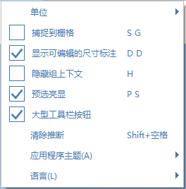

# Impostazioni

È possibile accedere a Impostazioni dal menu o dalla barra degli strumenti. Tutte le impostazioni vengono salvate dopo la chiusura di FormIt.

* **Unità**: consente di alternarsi tra unità imperiali e unità metriche.
* **Snap alla griglia**: consente di attivare e disattivare lo snap degli strumenti di disegno e modellazione alla griglia di posizionamento del terreno sottostante.
* **Visualizza quote modificabili**: consente di attivare e disattivare la visualizzazione delle quote durante il disegno e la modifica.
* **Nascondi contesto gruppo**: quando l'opzione è attivata, tutti gli altri gruppi vengono nascosti mentre un altro gruppo viene modificato.
* **Evidenziazione preselezione**: se l'opzione attivata, quando si posiziona il cursore del mouse su tutti gli oggetti, i bordi, le superfici e i punti mostrano un'evidenziazione visiva.
* **Pulsanti grandi barra degli strumenti**: consente di attivare e disattivare i pulsanti della barra degli strumenti di grandi dimensioni.
* **Tema app**: consente di passare tra i vari temi dell'interfaccia utente, Chiaro, Scuro e Blu.

## Modalità tocco

Modalità tocco consente di utilizzare Windows con touchscreen. Quando è attivata, è possibile utilizzare un singolo tocco e trascinare per selezionare e interagire con gli strumenti di disegno, modellazione e modifica. **Nota In Modalità tocco, gli strumenti di disegno e modifica non funzionano correttamente con il mouse.**

