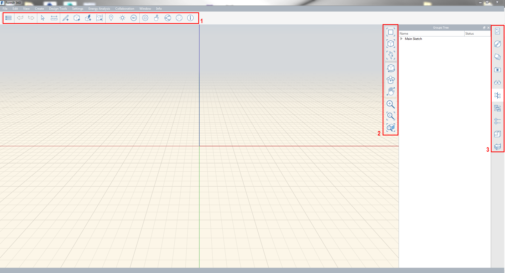
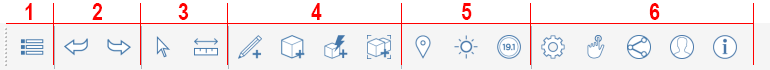
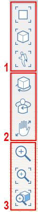
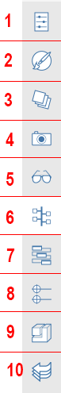

### Tool Bars
---

---

#### Action Tool Bar
The Action Tool Bar is found at the top of the screen. The tools here will help you create, edit, and share content.

1. Gallery Menu
2. Undo Redo
3. Selection and Measurement
4. Creation and Modification Tools
5. Location and Analysis Tools
6. User Identity

#### Navigation Tool Bar

1. Scene View Modes
2. 3D View Tools
3. Zoom Tools

#### Palette Bar

1. Properties
2. Materials
3. Layers
4. Scenes
5. Visual Styles
6. Group Tree
7. Dynamo
8. Levels
9. Content Library
10. Undo Manager