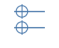

# Toolbars and Palettes

## Toolbars

The standard toolbar is enabled by default, but is split into the following sections. You can optionally enable, disable, and rearrange individual sections using the Windows menu.

### File

1. **File menu** with file operations like Open, Save, and Export
2. **Undo** your last change
3. **Redo** a change you undid

### Geometry

.png>)

1. \*\*\*\*[**Selection**](https://windows.help.formit.autodesk.com/tool-library/select-edge-face-or-object) _\*\*_and area selection filters
2. [**Measure** ](../tool-library/measure-tool.md)Distance and [**Measure Angle**](../tool-library/measure-angle-tool.md) _\*\*_tools
3. [**Section Planes**](../tool-library/section-planes.md)
4. [**3D Sketching Tools**](../formit-primer/part-i/3d-sketching.md)
5. [**Primitive** ](../tool-library/place-primitive-object.md)toolbar
6. [**Advanced Geometry**](tool-bars.md) toolbar with Join, Cut, Sweep, Loft, and Shell
7. [**Groups** ](../tool-library/groups.md)toolbar

### Settings

1. **Settings** menu for UI and app settings.
2. **Touch Mode** to enable interactions on touch screen devices.
3. [**Collaboration**](../tool-library/collaboration.md) for managing collaboration sessions with multiple users.
4. **Autodesk account login.**
5. **Information** menu for help and links.

### Design

1. [**Location** ](../tool-library/setting-location.md)
2. [**Sun, Shadows, and Solar Analysis**](../tool-library/solar-analysis.md)
3. [**Energy Analysis**](../tool-library/energy-analysis.md)

## Palette

.png>) [**Properties**](https://windows.help.formit.autodesk.com/tool-library/properties)\*\*\*\*

 [**Layers**](../tool-library/layers.md)

 [**Scenes**](../tool-library/scenes.md)

 [**Visual Styles**](../tool-library/visual-styles.md)

 [**Groups Tree**](../tool-library/groups-tree.md)

 [**Dynamo**](../tool-library/dynamo.md)

 [**Levels**](../tool-library/levels-and-area.md)

 [**Content Library**](../tool-library/content-library.md)

 [**Undo Manager**](https://github.com/FormIt3D/autodesk-formit-360-windows-help/tree/c377e7b8a3b8e43e684321d0b7de867608d317a3/tool-library/undo-manager.md)

 [**Plug-Ins**](https://windows.help.formit.autodesk.com/tool-library/plug-ins)\*\*\*\*

## Context Menu

Right-click on an element in the 3D canvas to display a menu of commands and modifications for that type of geometry. Hover over the icons to see their names.

## Keyboard Shortcuts

Customize your FormIt [k**eyboard shortcuts**](../plug-ins/how-to-develop-plug-ins/advanced-options/load-panel-based-and-toolbar-based-plugin/appendix/keyboard-shortcuts.md) in Edit > Preferences > Shortcuts.

