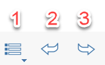
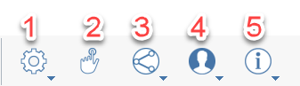
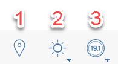
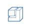
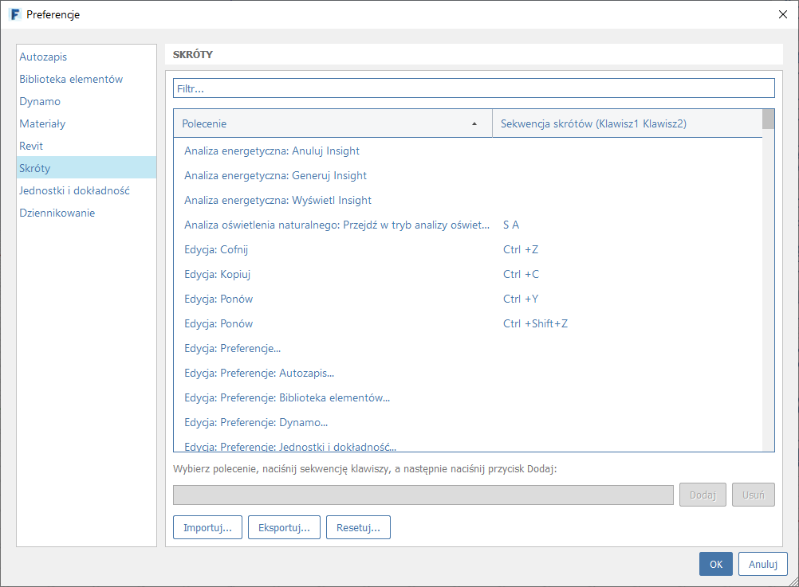

# Barras de ferramentas e paletas

## Barras Ferr.

A barra de ferramentas padrão é ativada por padrão, mas é dividida nas seções a seguir. Opcionalmente, é possível ativar, desativar e reorganizar seções individuais usando o menu do Windows.

### Arquivo

1. **Menu Arquivo** com operações de arquivo como Abrir, Salvar e Exportar
2. **Desfazer** a última alteração
3. **Refazer** uma alteração desfeita

### Geometria

1. \*\*\*\*[**Seleção**](https://windows.help.formit.autodesk.com/tool-library/select-edge-face-or-object) ****e filtros de seleção de área
2. Ferramentas [**Medir** ](../tool-library/measure-tool.md)distância e [**Medir ângulo**](../tool-library/measure-angle-tool.md) ****
3. [**Planos de corte**](../tool-library/section-planes.md)
4. [**Ferramentas de desenho 3D**](../formit-primer/part-i/3d-sketching.md)
5. Barra de ferramentas [**Primitivo**](../tool-library/place-primitive-object.md)
6. Barra de ferramentas [**Geometria avançada**]() com Unir, Cortar, Varredura, Elevar e Casca
7. Barra de ferramentas [**Grupos**](../tool-library/groups.md)

### Configurações

1. Menu **Configurações** para configurações da interface do usuário e do aplicativo.
2. **Modo de toque** para ativar interações em dispositivos de tela sensível ao toque.
3. [**Colaboração**](../tool-library/collaboration.md) para gerenciar sessões de colaboração com vários usuários.
4. **Login na Autodesk Account.**
5. Manu **Informações** para ajuda e links.

### Projeto

1. [**Localização** ](../tool-library/setting-location.md)
2. [**Análise de luz solar, de sombras e de sol**](../tool-library/solar-analysis.md)
3. [**Análise de energia**](../tool-library/energy-analysis.md)

## Paleta

[**Propriedades**](https://windows.help.formit.autodesk.com/tool-library/properties)\*\*\*\*

[**Camadas**](../tool-library/layers.md)

[**Cenas**](../tool-library/scenes.md)

[**Estilos visuais**](../tool-library/visual-styles.md)

[**Árvore de grupos**](../tool-library/groups-tree.md)

[**Dynamo**](../tool-library/dynamo.md)

[**Níveis**](../tool-library/levels-and-area.md)

[**Biblioteca de conteúdo**](../tool-library/content-library.md)

[**Gerenciador de desfazer**](https://github.com/FormIt3D/autodesk-formit-360-windows-help/tree/c377e7b8a3b8e43e684321d0b7de867608d317a3/tool-library/undo-manager.md)

[**Plug-ins**](https://windows.help.formit.autodesk.com/tool-library/plug-ins)\*\*\*\*

## Menu de contexto

Clique com o botão direito do mouse em um elemento na tela 3D para exibir um menu de comandos e modificações para aquele tipo de geometria. Passe o mouse sobre os ícones para ver seus nomes.

## Atalhos do teclado

Personalize os [atalhos **de teclado**](../appendix/keyboard-shortcuts.md) do FormIt em Editar > Preferências > Atalhos.

