# Tool Bars and Palettes

FormIt has a simple icon based interface, with only a few user interfacve components to learn

## Tool Bars

The Standard toolbar is split into the following sections. You can optionally enable, disable and arrange individual sections using the Window menu.

### File

The File Tool Bar is found at the top of the screen. The tools here will help you create, edit, and share your design

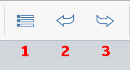

1. **File menu** with file operations like Open, Save, Export
2. **Undo**
3. **Redo**

### Geometry

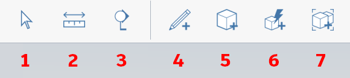

1. **Selection** and area selection filters
2. [**Measure** ](../tool-library/measure-tool.md)Distance and [**Measure Angle**](../tool-library/measure-angle-tool.md) ****tools
3. [**Section Planes**](../tool-library/section-planes.md)
4. [**3D Sketching Tools**](../building-the-farnsworth-house/3d-sketching.md)
5. [**Primitive** ](../tool-library/place-primitive-object.md) toolbar
6. [**Advanced Geometry**](../building-the-farnsworth-house/advanced-modeling.md) toolbar with Join, Cut, Sweep, Loft, Shell
7. [**Groups** ](../tool-library/groups.md)Toolbar

### Settings

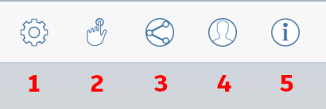

1. **Settings**
2. **Touch Mode**
3. [**Collaboration**](../tool-library/collaboration.md)
4. **A360 Log in**
5. **Information** help and Links

### Design

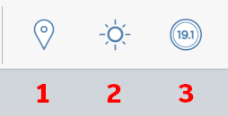

1. [**Location** ](../tool-library/setting-location.md)
2. [**Sun, Shadows and Solar Analysis**](../tool-library/solar-analysis.md)
3. [**Energy Analysis**](../tool-library/energy-analysis.md)

## Palette

The Palette Tabs are found at the right side of the screen. The tools here will help you manipulate and organize the elements you've created in the model

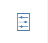 **Properties**

 [**Materials**](../tool-library/materials.md)

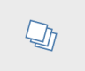 [**Layers**](../tool-library/layers.md)

 [**Scenes**](../tool-library/scenes.md)

 [**Visual Styles**](../tool-library/visual-styles.md)

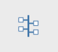 [**Groups Tree**](../tool-library/groups-tree.md)

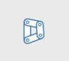 [**Dynamo**](../tool-library/dynamo.md)

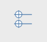 [**Levels**](../tool-library/levels-and-area.md)

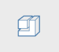 [**Content Library**](../tool-library/content-library.md)

 [**Undo Manager**](https://github.com/FormIt3D/autodesk-formit-360-windows-help/tree/c377e7b8a3b8e43e684321d0b7de867608d317a3/tool-library/undo-manager.md)

## Context Menu

The Context Menu is a circular menu with options to edit the selected element. You invoke it by right-clicking.The context menu will show you different tools depending on what you have selected.

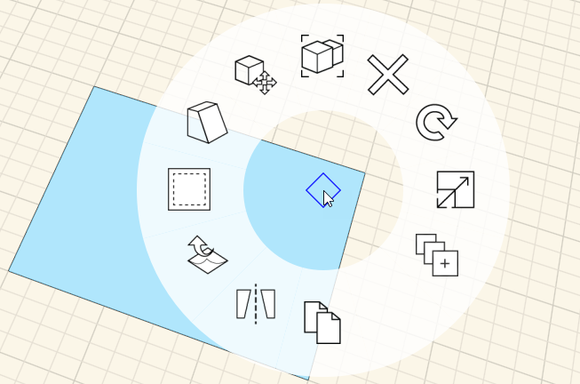

## Keyboard Shortcuts

The [**Keyboard shortcuts**](../appendix/keyboard-shortcuts.md) in FormIt are accessible via the Edit menu, preferences... and can be customized

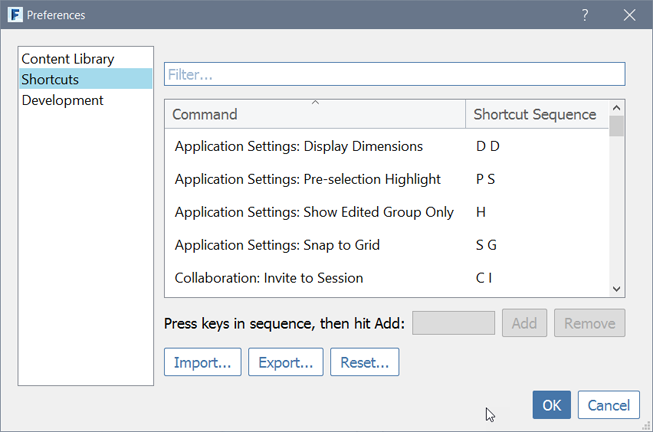

