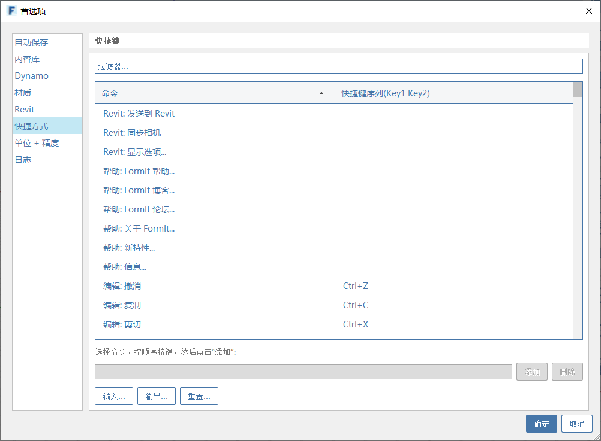

# Paski narzędzi i palety

## Paski narzędzi

Standardowy pasek narzędzi jest domyślnie włączony, ale jest podzielony na następujące sekcje. Za pomocą menu systemu Windows poszczególne sekcje można włączać i wyłączać oraz zmieniać ich kolejność.

### Plik

1. **Menu Plik** z operacjami na plikach, takimi jak Otwórz, Zapisz i Eksportuj
2. **Cofnij** ostatnią zmianę
3. **Wykonaj ponownie** cofniętą zmianę

### Geometria 

1. \*\*\*\*[**Wybór**](https://windows.help.formit.autodesk.com/tool-library/select-edge-face-or-object) ****i filtry wyboru powierzchni
2. Narzędzia [**Zmierz** ](../tool-library/measure-tool.md)odległość i [**Zmierz kąt**](../tool-library/measure-angle-tool.md) ***
3. [**Płaszczyzny tnące**](../tool-library/section-planes.md)
4. [**Narzędzia do szkicowania 3D**](../formit-primer/part-i/3d-sketching.md)
5. Pasek narzędzi [**prymitywów** ](../tool-library/place-primitive-object.md)
6. Pasek narzędzi [**zaawansowanej geometrii**]() z poleceniami Dołącz, Wytnij, Przeciągnij, Wyciągnięcie złożone i Powłoka
7. Pasek narzędzi [**grup** ](../tool-library/groups.md)

### Ustawienia

1. Menu **Ustawienia** z ustawieniami interfejsu użytkownika i aplikacji.
2. **Tryb dotyku** do włączania interakcji na urządzeniach z ekranem dotykowym.
3. [**Współpraca**](../tool-library/collaboration.md) do zarządzania sesjami współpracy z wieloma użytkownikami.
4. **Logowanie na koncie Autodesk.**
5. Menu **Informacje**, w którym znajdują się opcje pomocy i łącza.

### Projekt

1. [**Lokalizacja** ](../tool-library/setting-location.md)
2. [**Analiza słońca, cieni i oświetlenia naturalnego**](../tool-library/solar-analysis.md)
3. [**Analiza energetyczna**](../tool-library/energy-analysis.md)

## Paleta

 [**Właściwości**](https://windows.help.formit.autodesk.com/tool-library/properties)\*\*\*\*

 [**Warstwy**](../tool-library/layers.md)

 [**Sceny**](../tool-library/scenes.md)

 [**Style wizualne**](../tool-library/visual-styles.md)

 [**Drzewo grup**](../tool-library/groups-tree.md)

 [**Dynamo**](../tool-library/dynamo.md)

 [**Poziomy**](../tool-library/levels-and-area.md)

 [**Biblioteka elementów**](../tool-library/content-library.md)

 [**Menedżer cofania**](https://github.com/FormIt3D/autodesk-formit-360-windows-help/tree/c377e7b8a3b8e43e684321d0b7de867608d317a3/tool-library/undo-manager.md)

 [**Wtyczki**](https://windows.help.formit.autodesk.com/tool-library/plug-ins)\*\*\*\*

## Menu kontekstowe

Kliknij prawym przyciskiem myszy element w obszarze rysunku 3D, aby wyświetlić menu poleceń i modyfikacji dla tego typu geometrii. Ustawiaj kursor na ikonach, aby zobaczyć ich nazwy.

## Skróty klawiaturowe

Dostosuj [s**króty klawiaturowe**](../appendix/keyboard-shortcuts.md) programu FormIt w menu Edycja &gt; Preferencje &gt; Skróty.

