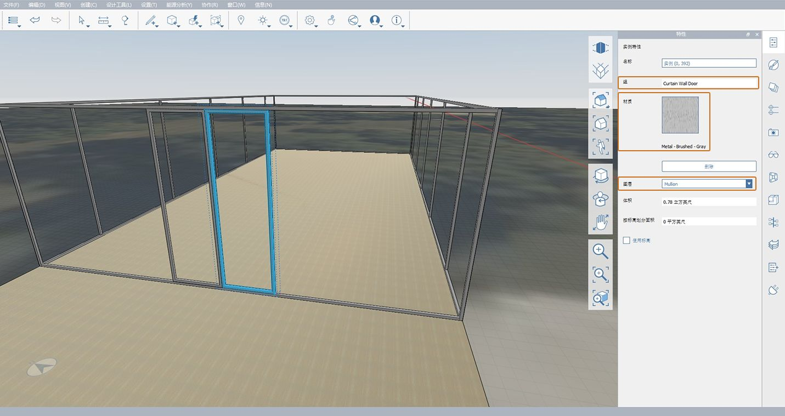

# 1.9 — Dodawanie szczegółów

_FormIt to doskonałe narzędzie zarówno do modelowania bryłowego, jak i tworzenia szczegółowych modeli. Zaczniemy dodawać do domu pani Farnsworth szczegóły w postaci drzwi i szprosów w pomieszczeniu ze szklanymi ścianami. Następnie omówimy pewne dodatkowe narzędzia i przećwiczymy proces dodawania geometrii, warstw i materiałów oraz zarządzania grupami._

_Jeśli nie ukończono poprzedniej sekcji, pobierz i otwórz plik_ _**1.9 — Adding Details.axm**_ _z folderu_ _**FormIt Primer Part 1 Datasets**._

## **Tworzenie ram okiennych**

_Utworzymy teraz wokół pomieszczenia ze szklanymi ścianami 2-calową ramę metalową ze szprosami. Pamiętaj, że szprosy celowo nakładają się na szklane ściany._

1 — Utwórz nową warstwę o nazwie **Szklane ściany** i przenieś na nią grupę **Szklana ściana**.

2 — Dla lepszej widoczności wyłącz warstwę **Dach**, dzięki czemu będzie można zobaczyć całe pomieszczenie ze szklanymi ścianami.

3 — Rozpocznij tworzenie pierwszej ramy okiennej:

1. Użyj **narzędzia Prostokąt \(R\)**, aby narysować nową powierzchnię bezpośrednio nad zewnętrzną powierzchnią szkła po zachodniej stronie budynku. Pamiętaj, aby utworzyć tę powierzchnię poza grupą **Szklane ściany**.
2. Wybierz nowo utworzoną powierzchnię i przeciągnij o **2 cale** w kierunku wnętrza. Naciśnij klawisz **Esc**, aby anulować wybór. Końcowy rezultat powinien wyglądać tak jak na poniższej ilustracji.
3. Kliknij jeden raz utworzoną powierzchnię. Kliknij prawym przyciskiem myszy, aby otworzyć **menu kontekstowe** i użyj **narzędzia Odsuń powierzchnię \(OF\).**

_**Uwaga:**_ _w przypadku problemów z wybraniem nowej powierzchni naciskaj klawisz_ _**Spacja**_ _, aby przechodzić między różnymi obiektami, które można wybrać, lub tymczasowo wyłącz warstwę_ _**Szklane ściany**_ _._

4 — Aby ustawić wymiar odsunięcia, przesuń wskaźnik myszy w kierunku środka powierzchni i wprowadź wartość **2 cale**, aby utworzyć nowy, mniejszy prostokąt.

5 — Kliknij nowo utworzony wewnętrzny prostokąt jeden raz, aby go wybrać. Kliknij ponownie i przeciągnij powierzchnię w kierunku wnętrza budynku, aż zniknie. Kliknij jeszcze raz, aby dokończyć usuwanie objętości ze środka geometrii ramy.

6 — Kliknij dwukrotnie, aby wybrać utworzoną geometrię, i dodaj ją do **Grupy \(G\)**. Nadaj grupie nazwę **Rama szprosu — wschód-zachód**.​

7 — Utwórz warstwę o nazwie **Szpros** i umieść na niej nową grupę.

8 — Ustaw materiał ramy:

1. Na **palecie Materiały** powiel materiał **Metal — matowy — kolorowy**, klikając go prawym przyciskiem myszy i wybierając polecenie **Powiel materiał**.
2. Kliknij dwukrotnie kafelek podglądu nowego materiału, aby go edytować.
3. Zmień jego nazwę na **Metal — matowy — szary**.
4. Zmień kolor materiału, klikając kafelek **Kolor** w sekcji **Mapy**, a następnie przyciemnij odcień szarości, zmieniając wartość **War:** na **150**.

9 — Kliknij przycisk **OK**, aby zapisać zmiany w nowym materiale, a następnie pomaluj nim grupę **Rama szprosu — wschód-zachód**. Po zakończeniu **paleta Właściwości** grupy powinna wyglądać tak, jak na poniższej ilustracji:

10 — Utwórz nowe wystąpienie ramy po wschodniej stronie za pomocą dowolnego z następujących narzędzi: **Szybka kopia**, **Szyk** lub **Odbicie lustrzane**.

11 — Powtórz powyższe czynności po północnej i południowej stronie pomieszczenia ze szklanymi ścianami. Nadaj nowej grupie nazwę **Rama szprosu — północ-południe**. Nie zapomnij pomalować elementów i umieścić ich na warstwie **Szpros**.

_**Uwaga:**_ _ramy szprosów nakładają się na siebie w narożnikach. To jest zamierzone. Powyżej przedstawiono wynikową geometrię ram szprosów z wyłączonymi warstwami_ _**Szklana ściana**_ _i_ _**Słup**_ _._

**Tworzenie szprosów**

1 — W jednej płaszczyźnie z zewnętrzną powierzchnią szkła po południowej lub północnej stronie budynku narysuj **Prostokąt \(R\) o wymiarach 2 cale x 10 stóp i 10 cali** sięgający dolnej i górnej krawędzi ramy szprosu. Nie przejmuj się dokładnym położeniem prostokąta względem ramy — przeniesiemy go w odpowiednie miejsce w kolejnych krokach.

2 — Wyciągnij prostokąt o **2 cale** w tył, a następnie dodaj go do **grupy \(G\)** o nazwie **Szpros — pionowy**. Umieść grupę na warstwie **Szpros** i pomaluj ją materiałem **Metal — matowy — szary**.

**Określanie położenia szprosów**

_Teraz ustawimy położenie pierwszego szprosu, tak aby był wyśrodkowany względem_ _**punktu środkowego**_ _słupa._

1 — Aby ponownie wyświetlić słupy, włącz warstwę **Słup**, jeśli była wyłączona. Na **palecie Warstwy** można również wyłączyć warstwy **Dolny taras** i **Obraz rzutu**, aby ułatwić wykonywanie kolejnych kroków.

2 — Przesuń szpros w nowe położenie:

1. Kliknij utworzoną grupę szprosu pionowego jeden raz, aby ją wybrać. **Powiększ \(Z\)** widok i kliknij **punkt środkowy** dolnej krawędzi zewnętrznej szprosu, oznaczony czerwonym trójkątem**.**
2. Rozpocznij przesuwanie geometrii w poziomie w kierunku słupa. Naciśnij klawisz **Shift**, aby zablokować ruch na czerwonej osi \(**osi X**\). Pamiętaj, że po zablokowaniu ruchu czerwona oś zostanie pogrubiona.
3. Pomniejszaj widok, aż będzie widać podstawę słupa. Trzymając wciśnięty klawisz **Shift**, kliknij **punkt środkowy** u podstawy zewnętrznej powierzchni słupa. Szpros będzie nadal przesuwany tylko wzdłuż czerwonej osi \(**osi X**\), ale zostanie wyrównany do klikniętego **punktu środkowego**.

_**Uwaga:**_ _szpros znajduje się teraz bezpośrednio za słupem. Wyłącz warstwę_ _**Słup**_ _lub użyj narzędzia_ _**Obróć\(O\)**_ _, aby zobaczyć szpros._

3 — Naciśnij klawisz **Esc**, aby wyczyścić narzędzie **Przesuń**.

4 — Za pomocą narzędzia **Szyk \(AR\)** lub **Szybka kopia** utwórz jeszcze cztery \(4\) szprosy pionowe po tej samej stronie, rozmieszczone w odstępach **11 stóp**. Aby dowiedzieć się, jak używać **narzędzia Szyk**, zapoznaj się z poprzednimi rozdziałami.

5 — Użyj klawisza Tab, aby wybrać wszystkie grupy szprosów **pionowych** i skopiować je na przeciwną stronę budynku, tak aby ramy **północna** i **południowa** miały identyczny układ szprosów, co pokazano na poniższej ilustracji:

## **Tworzenie szprosów drzwi**

1 — **Obróć \(O\)** widok perspektywiczny w celu pokazania środka ramy szprosów po zachodniej stronie.

2 — Podobnie jak podczas tworzenia ram szprosów narysuj panel drzwi o szerokości **3 stóp i 6 cali** z ramą **2 x 2 cale**. Dodaj go do **grupy \(G\)** o następujących właściwościach: nazwa grupy: **Drzwi ściany kurtynowej**; warstwa: **Szpros**; materiał: **Metal — matowy — szary**.

3 — Skopiuj tę grupę, aby utworzyć drugą ramę drzwi, i przesuń ramy w taki sposób, aby były wyśrodkowane względem grupy **Rama szprosu — wschód-zachód**, jak pokazano poniżej.

## **Tworzenie gzymsu dachowego przy użyciu narzędzia Przeciągnięcie**

_Teraz utworzymy gzyms domu pani Farnsworth za pomocą jednego z zaawansowanych narzędzi do modelowania programu FormIt — __**Przeciągnięcie**. Aby poznać inne zaawansowane funkcji modelowania, zapoznaj się z rozdziałem_ **2.2 —** _**Modelowanie zaawansowane**_ _w sekcji_ _**FormIt Primer — część II**._

_Pierwszym krokiem procesu tworzenia_ _**Przeciągnięcia**_ _jest narysowanie profilu prostopadłego do wyciągnięcia. W tym celu użyjemy geometrii dachu jako wzoru._

1 — Włącz warstwę **Dach** i powiększ jeden z jej narożników.

2 — Używając jednej z pionowych powierzchni dachu jako odniesienia, narysuj dwa sąsiadujące prostokąty. Pierwszy będzie miał wysokość **6 cali** i szerokość **4 i 5/8** cala, a drugi — **2 x 2 cale**. Usuń linię dzielącą oba prostokąty, aby utworzyć jedną powierzchnię. Rezultat powinien wyglądać tak, jak poniżej.

3 — Utwórz przeciągnięcie:

1. Bez wybranej geometrii kliknij przycisk **Zaawansowane narzędzia modelowania** na **standardowym pasku narzędzi** i wybierz **Przeciągnięcie \(SW\)**.
2. Zostanie uruchomiony **Kreator wyboru przeciągnięcia** i zobaczysz monit **Należy wybrać powierzchnię \(lub krawędzie\) dla profilu przeciągnięcia**. Wybierz powierzchnię profilu utworzoną w poprzednim kroku.
3. Po wybraniu profilu zostanie wyświetlony monit **Należy wybrać powierzchnię \(lub krawędzie\) dla ścieżki przeciągnięcia, a następnie kliknąć przycisk Zakończ**. Wybierz górną powierzchnię dachu. Program FormIt automatycznie użyje obwiedni wybranej powierzchni jako ścieżki przeciągnięcia i utworzy przeciągnięcie wokół całego dachu.

_**Uwaga:**_ _w przypadku problemów z wybraniem dowolnej z powierzchni użyj narzędzia_ _**Obróć \(O\)**_ _, aby lepiej zobaczyć powierzchnię, i spróbuj ponownie. Możesz też wybrać wszystkie krawędzie dachu zamiast jego górnej powierzchni, aby ukończyć tworzenie przeciągnięcia._

4 — Aby uporządkować model, utwórz grupę **Dach — gzyms**, dodaj ją do warstwy **Dach** i przypisz do niej materiał **Metal — matowy — kolorowy**.

5 — Na koniec włącz warstwę **Słup**. Zobaczysz, że nowo utworzony gzyms przecina górne części słupów. Aby to poprawić, edytuj dowolną grupę **Słup — wysoki** i przeciągnij górną powierzchnię w dół do momentu wyrównania z dolną powierzchnią gzymsu.

