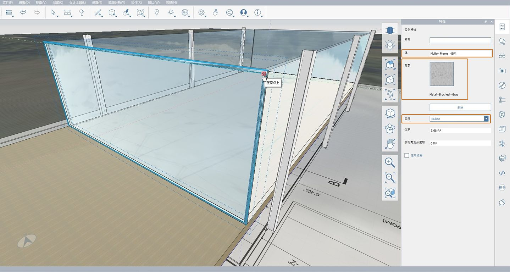
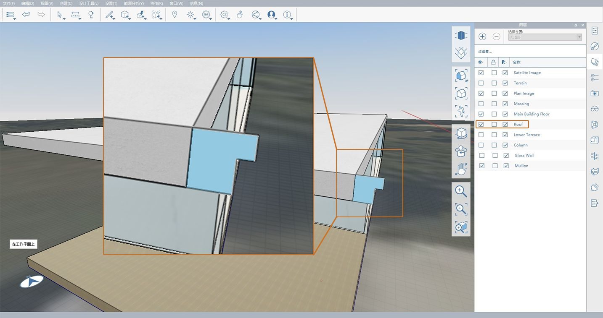

# 1.9 - 添加详图

_FormIt 既是一款出色的体量工具，也是一款出色的建模工具。我们将开始以玻璃盒子的门和竖梃的形式，向 Farnsworth 住宅添加详图。然后，我们将介绍一些其他工具，并练习添加新几何图形、图层、材质和组管理的过程。_

_如果未完成最后一部分，请从_ _**FormIt Primer Part 1 数据集**中下载并打开_ _**1.9 - Adding Details.axm**_ _文件。_

## **创建窗框**

_我们将在玻璃盒子周围创建 2" 的金属框架和竖梃。请注意，这些竖梃将有意地与玻璃盒子重叠。_

1 - 创建一个名为**“玻璃墙”**的新图层，并将**“玻璃墙”**组移动到该图层。

2 - 为了便于查看，请关闭**“屋顶”**图层，以便可以看到整个玻璃盒子。

3 - 开始创建第一个窗框的步骤：

1. 在建筑物的西侧，使用**“矩形工具(R)”**在外部玻璃面上直接绘制一个新曲面。确保在**“玻璃墙”**组之外创建曲面。
2. 选择新创建的面，并将其朝内部拖动 **2"**。按 **Esc** 键以清除选择。 最终结果应类似于下图。
3. 单击刚刚创建的面。单击鼠标右键以访问**“关联菜单”**，来使用**“偏移面工具(OF)”。**

_**注意：**_ _如果在选择新面时遇到问题，请按_ _**空格键**_ _键在不同可选对象之间进行切换，或临时关闭_ _**“玻璃墙”**_ _图层。_

4 - 要设置偏移尺寸，请将鼠标光标移向面的内侧，然后输入**“2"”**以创建一个新的较小矩形。

5 - 单击以选择刚刚创建的内部矩形。再次单击该面并将其拖向建筑物的内部，直到它消失。再次单击一下，以完成从结构件几何图形中删除中心体积。

6 - 双击以选中刚刚创建的几何图形，然后对其进行**“分组(G)”**。将该组命名为**“竖梃框架 – EW”**。

7 - 创建一个名为**“竖梃”**的图层，并将新组放置在该图层上。

8 - 设置框架的材质的步骤：

1. 在**“材质选项板”**中，通过在**“金属 - 拉丝 - 着色”**材质上单击鼠标右键并选择**“复制材质”**来复制该材质。
2. 双击新材质的预览磁贴以进行编辑。
3. 将其重命名为**“金属 – 拉丝 – 灰色”**。
4. 通过单击**“贴图”**区域中的**“颜色”**磁贴修改材质的颜色，然后通过将**“值:”**更改为**“150”**使灰色变暗。

9 - 单击**“确定”**以保存对材质进行的这些更改，然后使用它绘制**“竖梃框架 - EW”**组。之后，组的**“特性选项板”**应与下图中所示内容匹配：

10 - 使用以下任一工具在东侧创建框架的新实例：**“快速复制”**、**“阵列”**或**“镜像”**。

11 - 对玻璃盒子的南北侧重复上述步骤。将新组命名为**“竖梃框架 – NS”**。不要忘记绘制它们，并将它们放置在**“竖梃”**图层上！

_**注意：**_ _竖梃框架在角点处彼此重叠。这是有意为之。上述结果显示了在__**“玻璃墙”**__和__**“柱”**__图层关闭时所生成的竖梃框架几何图形。_

**创建竖梃**

1 - 在外部玻璃面位于建筑物的南侧或北侧的平面中，绘制一个从竖梃框架底部和顶部之间延伸的**“2” x 10’-10” 矩形(R)”**。不必担心矩形沿框架的确切位置，我们将在以下步骤中将其移至适当位置。

2 - 将矩形向后拉伸 **2”**，然后对该矩形**“分组(G)”**，并将该组命名为**“竖梃 - 垂直”**。将组放置在**“竖梃”**图层上，然后使用**“金属 - 拉丝 - 灰色”**材质进行绘制。

**定位竖梃**

_现在，我们将设置第一个竖梃的位置，使其中心位于柱的__**中点**__上。_

1 - 要再次查看柱，请打开**“柱”**图层（如果已关闭）。在**“图层选项板”**中时，还可以关闭**“下阶地”**和**“平面图像”**图层，以简化后续步骤。

2 - 将竖梃移动到其新位置的步骤：

1. 单击以选择刚刚创建的垂直竖梃组。**“放大(Z)”**，然后单击竖梃底部外部边的**“中点”**（由红色三角形**符号化）。**
2. 开始将几何图形水平移向柱。按 **Shift** 键，以锁定红色轴（即 **X 轴**）中的移动。请注意，一旦锁定移动，红色轴将变厚。
3. 缩小视图，直到可以看到柱的底部。在仍按住 **Shift** 键的同时，单击柱外部面底部的**“中点”**。竖梃将继续仅沿红色轴（即 **X 轴**）移动，但会与刚刚单击的**“中点”**对齐。

_**注意：**_ _竖梃现在位于柱的正后面。关闭__**“柱”**__图层或__**“环绕(O)”**__，以可视化竖梃。_

3 - 按 **Esc** 键以清除**“移动”**工具。

4 - 使用**“阵列(AR)”**或**“快速复制”**工具，以沿同一侧再创建四 (4) 个垂直竖梃（间距为 **11’**）。要了解如何使用**“阵列工具”**，请参见前面各章。

5 - 使用 Tab 键选择所有**“垂直”**竖梃组，然后将它们复制到建筑物的另一侧，以便**“北”**和**“南”**框架具有相同的竖梃布局，如下图所示：

## **创建门竖梃**

1 -**“环绕(O)”**透视视图，直到您看到西竖梃框架的中心。

2 - 与创建竖梃框架类似，绘制一个 **3’-6”** 宽的门板（其中框架为 **2”x 2”**）。使其成为具有以下特性的**“组(G)”**：组名称为**“幕墙门”**；图层为**“竖梃”**；材质为**“金属 - 拉丝 - 灰色”**。

3 - 复制此组以创建第二个门框，然后移动它们，以使它们位于**“竖梃框架 - EW”**组的中心，如下图所示。

## **使用扫掠创建屋顶檐口**

_现在，我们将使用 FormIt 的高级建模工具之一（_ _**“扫掠”**）创建 Farnsworth 住宅的檐口。要了解其他高级建模，请查看 _ __ _**FormIt Primer - Part II** 中的 _**2.2 -** _**高级建模**一章。_

_创建__**“扫掠”**__的第一步是绘制与扫掠“拉伸”垂直的轮廓。为此，我们将屋顶几何图形用作指导。_

1 - 打开**“屋顶”**图层，并放大其一个角。

2 - 使用屋顶的一个垂直边作为参照，绘制两个相邻的矩形。第一个矩形高度为 **6”**，宽度为**4 5/8”**；第二个矩形尺寸为 **2”x 2”**。删除分割两个矩形的线，以创建一个面。结果应如下所示。

3 - 创建扫掠的步骤：

1. 在未选择几何图形的情况下，单击**“标准工具栏”**中的**“高级建模工具”**按钮，然后选择**“扫掠(SW)”**。
2. **“扫掠选择向导”**将启动，并提示您**“选择要用于扫掠轮廓的面(或边)”**。选择刚刚创建的轮廓面。
3. 选择轮廓后，系统将提示您**“选择要用于扫掠路径的面(或边)”**，然后单击“完成”。选定屋顶的顶面。FormIt 将自动使用选定面的边界作为扫掠的路径，并将围绕整个屋顶创建扫掠。

_**注意：**_ _如果在选择其中一个面时遇到问题，请_ _**“环绕(O)”**_ _以更好地查看面，然后重试。作为替代选项，选择屋顶的所有边（而不是屋顶的顶面）以完成扫掠。_

4 - 使模型保持井然有序，方法是创建**“屋顶 - 檐口”**组、将其添加到**“屋顶”**图层，然后为其指定**“金属 - 拉丝 - 着色”**材质。

5 - 要完成操作，请打开**“柱”**图层，您将看到新创建的扫掠与柱顶部相交。通过编辑任一**“柱高”**组，然后向下拖动顶面，直到其与檐口底部对齐，即可解决此问题。

