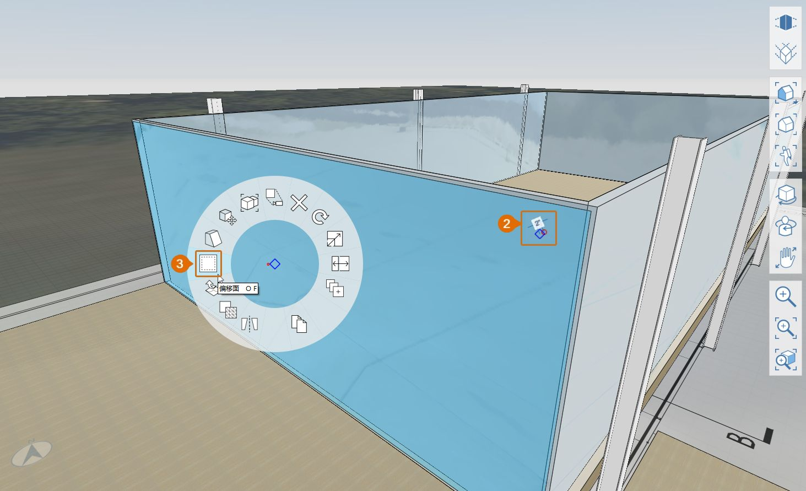

# 1.9 – Adicionar detalhes

_O FormIt é uma excelente ferramenta de massa, além de uma excelente ferramenta de modelagem. Vamos começar a adicionar detalhes à “Farnsworth House”, sob a forma de portas e montantes para a caixa de vidro. Em seguida, vamos abordar algumas ferramentas adicionais e praticar o processo de adicionar nova geometria, camadas, materiais e gerenciamento de grupos._

_Se você não concluiu a última seção, faça o download e abra o arquivo_ _**1.9 – Adding Details.axm**_ _nos_ _**Conjuntos de dados da Parte 1 do Manual do FormIt**._

## **Criar molduras de janela**

_Vamos criar montantes e uma moldura de metal de 2" em torno da caixa de vidro. Observe que esses montantes serão intencionalmente sobrepostos com a caixa de vidro._

1 – Crie uma nova camada chamada **Paredes de vidro** e mova o grupo **Parede de vidro** para essa camada.

2 – Para facilitar a visualização, desative a camada **Telhado** para que possamos ver toda a caixa de vidro.

3 – Para começar a criar a primeira moldura de janela:

1. No lado oeste do edifício, use a **ferramenta Retângulo \(R\)** para desenhar uma nova superfície diretamente sobre a face de vidro externa. Certifique-se de criar a superfície fora do grupo **Paredes de vidro**.
2. Selecione e arraste a face recém-criada **2"** em direção ao interior. Pressione **ESC** para limpar a seleção. O resultado final deve ser parecido com a imagem abaixo.
3. Clique uma vez na face que você acabou de criar. Clique com o botão direito do mouse para acessar o **Menu de contexto** para usar a **ferramenta Deslocar face \(DE\).**

_**Observação:**_ _Se você tiver problemas para selecionar a nova face, pressione a tecla_ _**barra de espaço**_ _para alternar entre diferentes objetos selecionáveis ou desative temporariamente a camada_ _**Paredes de vidro**_ _._

4 – Para definir a dimensão de deslocamento, mova o mouse em direção ao interior da face e insira **2"** para criar um novo retângulo menor.

5 – Clique uma vez para selecionar o retângulo interno que você acabou de criar. Clique novamente e arraste a face em direção ao interior do edifício até que ela desapareça. Clique mais uma vez para concluir a remoção do volume central da geometria da estrutura.

6 – Clique duas vezes para selecionar a geometria que acabamos de criar e **Agrupar \(G\)** a geometria. Nomeie o grupo **Moldura do montante – LO**.​

7 – Crie uma camada denominada **Montante** e coloque o novo grupo nessa camada.

8 – Para definir o material da estrutura:

1. Na **paleta Materiais**, duplique o material **Metal – Escovado – Colorido** clicando com o botão direito do mouse e selecionando a opção **Duplicar material**.
2. Clique duas vezes na miniatura de visualização do novo material para editá-lo.
3. Renomeie-o como **Metal – Escovado – Cinza**.
4. Modifique a cor do material clicando na miniatura **Cor**, na seção **Mapas**, e escureça a cor cinza ao alterar o **Valor:** para **150**.

9 – Clique em **OK** para salvar essas alterações no novo material e, em seguida, pinte o grupo **Moldura do montante – LO** com base nessas definições. Depois, a **paleta Propriedades** do grupo deve coincidir com o que é mostrado na imagem abaixo:

10 – Crie uma nova instância da moldura no lado leste usando qualquer uma das seguintes ferramentas: **Cópia rápida**, **Matriz** ou **Espelhar**.

11 – Repita as etapas indicadas acima para os lados norte e sul da caixa de vidro. Nomeie o novo grupo como **Moldura do montante – NS**. Não se esqueça de pintá-los e colocá-los na camada **Montante**.

_**Observação:**_ _As molduras de montante se sobrepõem nos cantos. Isso é intencional. O resultado acima mostra a geometria resultante da moldura do montante com as camadas_ _**Parede de vidro**_ _e_ _**Coluna**_ _desativadas._

**Criar montantes**

1 – No plano com a face de vidro externa nos lados sul ou norte do edifício, desenhe um retângulo de **2" x 10’-10" \(R\)** que se estende entre as partes inferior e superior da moldura do montante. Não se preocupe com a posição exata do retângulo ao longo da moldura, nós vamos movê-lo para o lugar certo nas etapas seguintes.

2 – Faça novamente a extrusão do retângulo em **2"** e, em seguida, **agrupe \(G\)** o retângulo e nomeie o grupo como **Montante – Vertical**. Coloque o grupo na camada **Montante** e pinte-o com o material **Metal – Escovado – Cinza**.

**Localizar os montantes**

_Agora, vamos definir a localização do primeiro montante para que ele fique centralizado no __**ponto médio**__ de uma coluna._

1 – Para ver as colunas novamente, ative a camada **Coluna**, se estiver desativada. Enquanto estiver na **paleta Camadas**, também é possível desativar as camadas **Terraço inferior** e **Imagem da planta** para facilitar as próximas etapas.

2 – Para mover o montante para a nova localização:

1. Clique uma vez para selecionar o grupo de montante vertical acabado de criar. Aplique **Zoom \(Z\)** e clique no **ponto médio** da aresta externa inferior do montante, simbolizado por um triângulo vermelho**.**
2. Comece a mover a geometria horizontalmente em direção a uma coluna. Pressione **Shift** para travar o movimento no eixo vermelho \(**Eixo X**\). Observe que o eixo vermelho fica mais espesso quando o movimento é travado.
3. Diminua o zoom até que seja possível ver a base da coluna. Enquanto mantém pressionada a tecla **Shift**, clique no **ponto médio** na base da face externa da coluna. O montante vai continuar movendo-se somente ao longo do eixo vermelho \(**Eixo X**\), mas vai alinhar-se com o **ponto médio** no qual você acabou de clicar.

_**Observação:**_ _Agora, o montante está diretamente atrás da coluna. Desative a camada_ _**Coluna**_ _ou use a_ _**Órbita \(O\)**_ _para visualizar o montante._

3 – Pressione **Esc** para limpar a ferramenta **Mover**.

4 – Use a ferramenta **Matriz \(AR\)** ou **Cópia rápida** para criar mais quatro \(4\) montantes verticais ao longo do mesmo lado, espaçados a **11’** de distância. Para saber como usar a **ferramenta Matriz**, consulte os capítulos anteriores.

5 – Use a tecla Tab para selecionar todos os grupos de **Montantes verticais** e os copie para o lado oposto do edifício, de modo que as molduras **Norte** e **Sul** tenham layouts de montantes idênticos, como mostrado na próxima imagem:

## **Criar montantes de porta**

1 – Use a **Órbita \(O\)** para girar a vista em perspectiva até que você esteja olhando para o centro da moldura do montante Oeste.

2 – De forma semelhante à criação de molduras de montante, desenhe um painel de porta com a largura de **3’-6"** e uma moldura de **2"x 2"**. Torne-o num **Grupo \(G\)** com as seguintes propriedades: Nome do grupo: **Porta de parede cortina**; camada: **Montante**; material: **Metal – Escovado – Cinza**.

3 – Copie esse grupo para criar a segunda moldura de porta e mova-os para que fiquem centralizados no grupo **Moldura do montante – LO**, como mostrado abaixo.

## **Criar a cornija de telhado com varredura**

_Agora, vamos criar a cornija da “Farnsworth House” usando uma das ferramentas avançadas de modelagem do FormIt:_ _**Varredura**. Para saber mais sobre outras modelagens avançadas, confira o capítulo_ **2.2 –** _**Modelagem avançada** no_ _**Manual do FormIt – Parte II**._

_O primeiro passo para criar uma __**Varredura**__ é desenhar um perfil perpendicular à “extrusão” da varredura. Para isso, vamos usar a geometria do telhado como guia._

1 – Ative a camada **Telhado** e aumente o zoom em um de seus cantos.

2 – Usando um dos lados verticais do telhado como referência, desenhe dois retângulos adjacentes. O primeiro terá **6"** de altura por **4 5/8**" de largura e o segundo será de **2"x 2"**. Exclua a linha que divide os dois retângulos para criar uma única face. O resultado deve ser tal como mostrado abaixo.

3 – Para criar a varredura:

1. Sem geometria selecionada, clique no botão **Ferramentas avançadas de modelagem**, na **barra de ferramentas padrão**, e selecione **Varredura \(SW\)**.
2. O **Assistente de seleção de varredura** será iniciado e você será solicitado a **selecionar uma face \(ou arestas\) para o perfil de varredura**. Selecione a face do perfil que acabamos de criar.
3. Uma vez selecionado o perfil, você será solicitado a **selecionar uma face \(ou aresta\) para o caminho de varredura e, em seguida, deve clicar em Concluir**. Selecione a face superior do telhado. O FormIt usará automaticamente os limites da face selecionada como o caminho da varredura. A varredura será criada em torno de todo o telhado.

_**Observação:**_ _Se você estiver com problemas para selecionar uma das faces, use_ _**Órbita \(O\)**_ _para visualizar a face que esteja um pouco melhor e tente novamente. Como uma opção alternativa, selecione todas as arestas do telhado em vez da face superior do telhado para concluir a varredura._

4 – Mantenha o modelo organizado criando um grupo **Telhado – Cornija**, adicionando-o à camada **Telhado** e atribuindo o material **Metal – Escovado – Colorido** ao grupo.

5 – Para concluir, ative a camada **Coluna** e você verá que a varredura recém-criada efetua uma interseção com o topo das colunas. Resolva isso editando qualquer um dos grupos **Altura das colunas** e arrastando a face superior para baixo até que ela se alinhe com a parte inferior da cornija.

