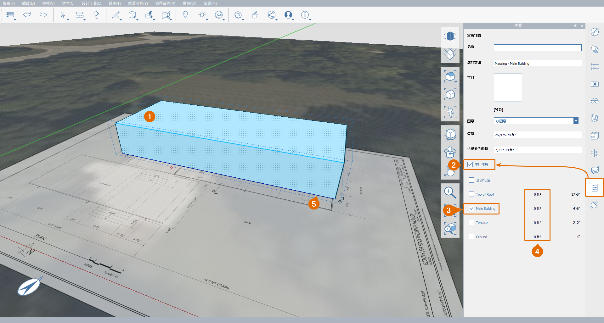
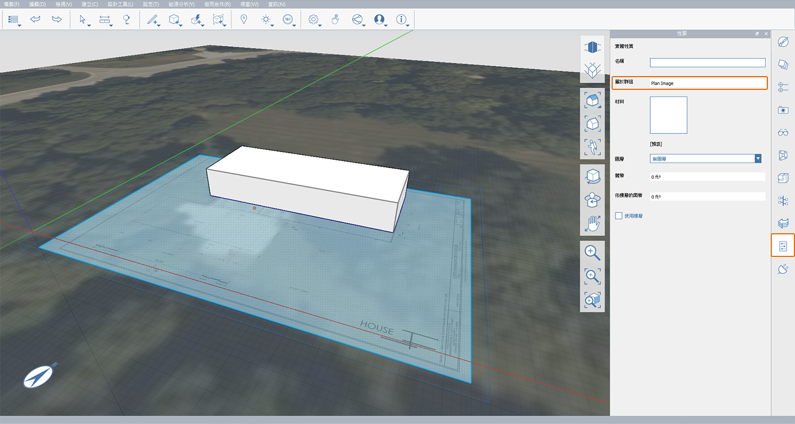

# 1.5 – Gruppieren von Objekten

_Gruppen in FormIt funktionieren ähnlich wie Familien in Revit und Komponenten in SketchUp. Durch Gruppieren verschiedener Objekte wird verhindert, dass ihre Geometrie verbunden wird. Kopien einer Gruppe fungieren als Exemplar der ursprünglichen Geometrie, d. h., Änderungen an einer Kopie wirken sich auf alle Kopien aus._

_Wenn Sie den letzten Abschnitt nicht bearbeitet haben, laden Sie die Datei_ _**1.5 – Group Objects.axm**_ _aus dem Ordner_ _**FormIt Primer Part 1 Datasets** herunter und öffnen sie._

## **Erstellen einer Gruppe**

1 – Wählen Sie den oberen Terrassenkörper durch Doppelklicken aus.

2 – Klicken Sie mit der rechten Maustaste, und wählen Sie **Gruppe \(G\)** aus, oder drücken Sie einfach **G**.

3 – Beachten Sie, dass Sie nach dem Erstellen einer Gruppe automatisch im Werkzeug Verschieben platziert werden.

## **Verschieben einer Gruppe**

1 – Um den Modellierungsprozess zu vereinfachen, aktivieren Sie den **Rasterfang \(SG\)**, falls deaktiviert.

2 – Um das ausgewählte Objekt zu verschieben, während der Befehl **Verschieben \(M\)** aktiv ist, klicken Sie einmal auf eine beliebige untere Ecke des Körpers. Bewegen Sie den Cursor dann nach oben. Nun sollte eine blaue Achsenlinie \(Z\) angezeigt werden. Diese Linie hilft Ihnen dabei, das Objekt gerade nach oben zu bewegen.

3 – Wenn die blaue Achse sichtbar ist, geben Sie **4'-6"** ein, und ein Dialogfeld für die Bemaßung wird angezeigt. Klicken Sie nach der Eingabe der Bemaßung auf **OK**, oder drücken Sie die **EINGABETASTE** auf der Tastatur. Dadurch wird der gesamte Körper entlang der **Z-Achse** von der Grundplatte nach oben verschoben.

_**Anmerkung:**_ _Ähnlich wie in Revit können Sie auch_ _**4'6**,_ _**4'6"**_ _oder_ _**4.5** eingeben. Das Programm interpretiert den Wert bei Verwendung von britischen Einheiten als 4\(Fuß\) 6\(Zoll\)._

## **Bearbeiten einer Gruppe**

1 – Doppelklicken Sie auf den Körper, um in den **Gruppenbearbeitungsmodus** zu wechseln.

1. Benennen Sie in der **Eigenschaftenpalette** die Gruppe **Massing – Main Building** um.
2. Um die Änderungen zu speichern und den **Gruppenbearbeitungsmodus** zu beenden, klicken Sie auf das Häkchensymbol für **Gruppenbearbeitung fertig stellen** in der oberen linken Ecke des Ansichtsbereichs, oder doppelklicken Sie im Raum.

_**Anmerkungen**:_

* _Weitere Informationen zu den Optionen für_ _**Kategorie**_ _finden Sie im Kapitel_ _**Arbeiten mit Revit**__._‌
* _Jede Gruppe verfügt über einen eigenen Rückgängig-/Wiederherstellen-Verlauf, der sich vom Gesamtprojekt unterscheidet. Sie können auf die Pfeile_ _**Rückgängig**_ _und_ _**Wiederherstellen**_ _im_ _**Gruppenbearbeitungsassistenten**_ _in der linken oberen Ecke des Ansichtsbereichs klicken._

## **Ebenen auf eine Gruppe anwenden**

_**Anmerkung:**_ _Durch Gruppieren einer Geometrie werden die vorherigen Einstellungen überschrieben, die Sie möglicherweise auf die Geometrie angewendet haben. Aus diesem Grund müssen Sie die Ebenen aus der vorherigen Übung erneut anwenden._

1 – So wenden Sie Ebenen auf eine Gruppe an

1. Klicken Sie auf die Gruppe **Massing** **– Main Building**, um sie auszuwählen.
2. Wechseln Sie zur **Eigenschaftenpalette**, und aktivieren Sie **Ebenen verwenden**
3. Behalten Sie nur die Ebene **Main Building** bei, indem Sie alle anderen deaktivieren.
4. Im Feld **Fläche nach Ebene** wird die aktuell ausgewählte Objekt-Bruttofläche angezeigt. Der Bereich jeder **Ebene** wird vor dem Namen der jeweiligen **Ebene** angezeigt.
5. Wenn keine blaue Ebenenlinie das Objekt horizontal kreuzt, aktivieren Sie die Ebenenanzeige, indem Sie zum **Menü Einstellungen &gt; Visueller Stil &gt; Ebenen anzeigen \(DL\) navigieren.**

_**Anmerkung**: Wenn für die Ebene_ _**Main Building**_ _keine Fläche gemeldet wird, schneidet die Geometrie die Ebene möglicherweise nicht. Diese sollte 4'-6" hoch sein. Beheben Sie Fehler, indem Sie die Geometrie oder die_ _**Ebene**_ _so neu positionieren, dass sie sich schneiden._

2 – Heben Sie die Auswahl der Gruppe auf, indem Sie **ESC** drücken oder die Auswahl im Raum durch einfaches Klicken aufheben. Wenn kein Objekt ausgewählt ist, wird in der **Eigenschaftenpalette** die Bruttofläche der gesamten Skizze und nicht die Fläche eines bestimmten Objekts angezeigt.

## **Verwalten von Gruppen**

1 – So zeigen Sie alle Gruppen in der Skizze an und verwalten sie

1. Wechseln Sie zur **Palette Gruppenstruktur**. Hier sehen Sie Folgendes:
   * Gruppe **Terrain** – Gruppe wird automatisch erstellt, wenn das **Satellitenbild importiert wurde**.
   * **Massing – Main Building** – Die soeben erstellte Geometriegruppe für den Gebäudekörper.
   * **Group 2** – Unbenannte Gruppe, die das Grundrissbild enthält.
2. Um **Gruppe 2** über die Palette Gruppenstruktur umzubenennen, doppelklicken Sie auf **Group 2** und geben dann **Plan Image** ein.

_**Anmerkungen:**_

* _Um ein übersichtliches Modell zu erhalten, wird empfohlen, aussagekräftige Gruppennamen zu verwenden._
* _Dies ist eine praktische Methode zum Verwalten und Bearbeiten aller Gruppen im Modell von einem Ort aus._

2 – Navigieren Sie bei ausgewählter Gruppe **Plan Image** zur **Eigenschaftenpalette**. Beachten Sie, dass der Gruppenname auch im Feld **Gruppe** aktualisiert wurde.

## **Gruppenkontext ausblenden**

_Dieses Werkzeug ist eine schnelle Möglichkeit, um die gesamte Geometrie außerhalb der Gruppe, die Sie gerade bearbeiten, auszublenden. Es ist sehr praktisch, wenn Sie ein großes und komplexes Modell haben und andere Geometrien im Weg sind._

1 – So isolieren Sie eine Gruppe

1. Doppelklicken Sie auf die Geometrie, um die Gruppe zu bearbeiten.
2. Navigieren Sie zu **Einstellungen** im **Hauptmenü**, und aktivieren Sie **Gruppenkontext ausblenden**, oder drücken Sie einfach die Taste **H** auf der Tastatur. Beachten Sie, wie der Layer **Plan Image** ausgeblendet wird.
3. Beenden Sie die Bearbeitung der Gruppe. Beachten Sie, dass der Modus **Gruppenkontext ausblenden \(H\)** nur innerhalb des **Gruppenbearbeitungsassistenten** aktiv ist.
4. Um diesen Modus wieder zu deaktivieren, drücken Sie einfach **H**. Diese Option kann jederzeit innerhalb oder außerhalb einer Gruppe umgeschaltet werden.

