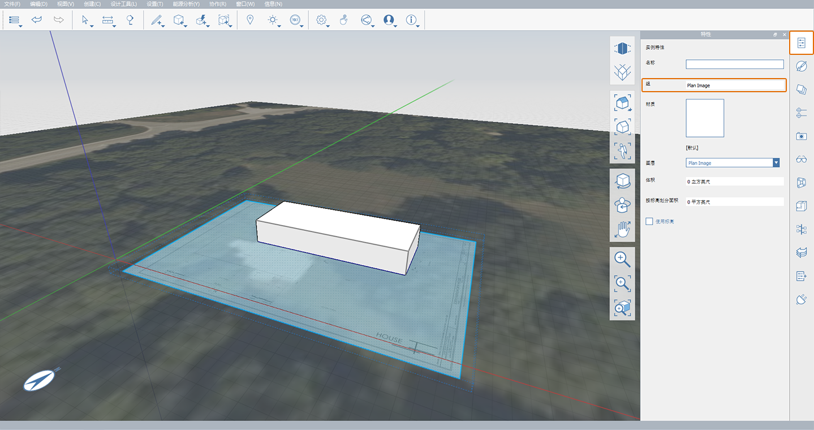

# 1.5 — Grupowanie obiektów

_Grupy w programie FormIt działają podobnie do rodzin w programie Revit i komponentów w programie SketchUp. Grupowanie różnych obiektów zapobiega łączeniu ich geometrii. Kopie grupy działają jak wystąpienie oryginalnej geometrii, co oznacza, że zmiany wprowadzone w jednej kopii będą miały wpływ na wszystkie._

_Jeśli ostatnia sekcja nie została ukończona, pobierz i otwórz plik_ _**1.5 - Group Objects.axm**_ _z zestawów danych_ _**FormIt Primer Part 1 Datasets**._

## **Tworzenie grupy**

1 — Wybierz bryłę górnego tarasu, klikając ją dwukrotnie.

2 — Kliknij prawym przyciskiem myszy i wybierz opcję **Grupuj \(G\)** lub po prostu naciśnij klawisz „**G**”.

3 — Zwróć uwagę, że po utworzeniu grupy automatycznie przejdziesz do narzędzia Przenieś.

## **Przenoszenie grupy**

1 — Aby uprościć proces modelowania, włącz opcję **Przyciąganie do siatki \(SG\)**, jeśli była wyłączona.

2 — Aby rozpocząć przenoszenie wybranego obiektu, w narzędziu **Przenieś \(M\)** kliknij raz w dowolnym dolnym rogu bryły. Następnie przesuń kursor w górę. Powinna zostać wyświetlona niebieska linia osi \(Z\). Linia ta pomaga w przenoszeniu obiektu w górę.

3 — Przy widocznej niebieskiej osi wpisz **4'-6"**. Zostanie wyświetlone okno dialogowe wymiaru. Po wprowadzeniu wymiaru kliknij przycisk **OK** lub naciśnij klawisz **Enter** na klawiaturze. Spowoduje to przeniesienie całej bryły w górę z płaszczyzny podstawy wzdłuż **osi Z**.

_**Uwaga:**_ _Podobnie jak w programie Revit, możesz również wpisać_ _**4’6**,_ _**4’6”,**_ _lub_ _**4,5**, a program zinterpretuje tę wartość jako 4\(stopy\) 6\(cali\) w przypadku korzystania z jednostek calowych._

## **Edycja grupy**

1 — Aby przejść do **trybu edycji grupy**, kliknij dwukrotnie bryłę.

1. Na **palecie Właściwości** zmień nazwę grupy **„Massing - Main Building”**.
2. Aby zapisać zmiany i wyjść z **trybu edycji grupy**, kliknij ikonę znacznika wyboru **Zakończ edycję grupy** w lewym górnym rogu obszaru rysunku lub kliknij dwukrotnie w przestrzeni.

_**Uwagi**:_

* _Aby dowiedzieć się więcej na temat opcji_ _**Kategoria**_ _, przejdź do rozdziału_ _**Praca z programem Revit**_ _._‌
* _Każda grupa ma własną historię cofania/ponawiania, która różni się od całego projektu — w lewym górnym rogu obszaru rysunku można klikać strzałki_ _**Cofnij**_ _i_ _**Wykonaj ponownie**_ _w_ _**kreatorze edycji grupy**_ _._

## **Stosowanie poziomów do grupy**

_**Uwaga:**_ _Zgrupowanie geometrii powoduje zastąpienie poprzednich ustawień, które mogły być zastosowane do geometrii. Z tego powodu konieczne będzie ponowne zastosowanie poziomów z poprzedniego ćwiczenia._

1 — Aby zastosować poziomy do grupy:

1. Kliknij raz grupę **Massing** **- Main Building**, aby ją wybrać.
2. Przejdź do **palety Właściwości** i zaznacz pole wyboru **Użyj poziomów.**
3. Zachowaj tylko poziom **Main Building**, usuwając zaznaczenie wszystkich pozostałych.
4. W polu **Powierzchnia wg poziomu** zostanie wyświetlona powierzchnia całkowita aktualnie wybranych obiektów. Obszar każdego **poziomu** jest wyświetlany przed nazwą każdego **poziomu**.
5. Jeśli nie widzisz niebieskiej linii przecinającej obiekt w poziomie, włącz wyświetlanie poziomu, wybierając opcje **Ustawienia &gt; Styl wizualny &gt; Wyświetl poziomy \(DL\).**

_**Uwaga**: Jeśli w przypadku poziomu_ _**Main Building**_ _nie jest podawana powierzchnia, geometria może nie przecinać się z poziomem, który powinien być na wysokości 4’-6”. Rozwiąż ten problem, zmieniając położenie geometrii lub wysokość_ _**poziomu**_ _tak, aby się przecinały._

2 — Usuń zaznaczenie grupy, naciskając klawisz **Esc** lub klikając raz w przestrzeni. Gdy nie został wybrany żaden obiekt, na **palecie Właściwości** będzie wyświetlana całkowita powierzchnia szkicu, a nie powierzchnia określonego obiektu.

## **Zarządzanie grupami**

1 — Aby wyświetlić wszystkie grupy w szkicu i zarządzać nimi:

1. Przejdź do **palety Drzewo grup**. Zostaną wyświetlone następujące elementy:
   * Grupa **Terrain** — grupa tworzona automatycznie po **zaimportowaniu obrazu satelitarnego**.
   * **Massing — Main Building** — grupa geometrii bryły budynku, którą właśnie utworzyliśmy.
   * **group 2** — grupa bez nazwy zawierająca obraz rzutu kondygnacji.
2. Aby zmienić nazwę **group 2** za pomocą palety Drzewo grup, kliknij dwukrotnie pozycję **group 2**, a następnie wpisz **Plan Image**.

_**Uwagi:**_

* _W celu zachowania porządku w modelu zalecamy stosowanie opisowych nazw grup._
* _Jest to wygodny sposób edytowania wszystkich grup w modelu i zarządzania nimi z jednego miejsca._

2 — Mając wciąż wybraną grupę **Plan Image**, przejdź do **palety Właściwości**. Zwróć uwagę, że nazwa grupy została również zaktualizowana w polu **Grupa**.

## **Ukryj kontekst grupy**

_To narzędzie umożliwia szybkie ukrycie całej geometrii poza edytowaną grupą. Staje się ono bardzo przydatne, gdy model jest duży i złożony, a inne geometrie przeszkadzają._

1 — Aby wyizolować grupę:

1. Kliknij dwukrotnie geometrię grupy, aby edytować grupę.
2. Przejdź do opcji **Ustawienia** w **menu głównym** i zaznacz pole wyboru **Ukryj kontekst grupy** lub naciśnij klawisz **H** na klawiaturze. Zwróć uwagę, jak znika warstwa **Plan Image**.
3. Zakończ edycję grupy. Pamiętaj, że tryb **Ukryj kontekst grupy \(H\)** jest aktywny tylko w **kreatorze edycji grupy**.
4. Aby ponownie wyłączyć ten tryb, wystarczy nacisnąć klawisz **H**. Tę opcję można przełączyć w dowolnym momencie, w grupie lub poza nią.

