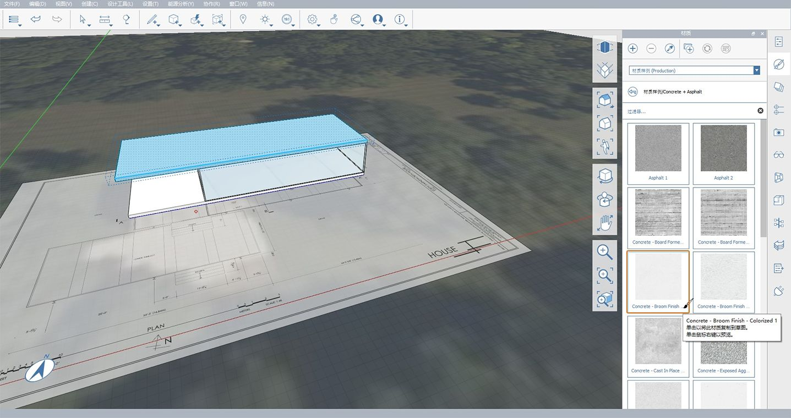

# 1.7 — Malowanie materiałami

Jak widzieliśmy we **wcześniejszym ćwiczeniu**, w programie FormIt można tworzyć własne materiały, a następnie malować powierzchnie przy użyciu tych materiałów. Podczas tego ćwiczenia utworzysz i edytujesz większą liczbę materiałów i zaimportujesz materiały z Biblioteki materiałów Autodesk.

_Jeśli nie ukończono poprzedniej sekcji, pobierz i otwórz plik_ _**1.7 — Paint with Materials.axm**_ _z folderu_ _**FormIt Primer Part 1 Datasets**._

## **Tworzenie szklanych ścian**

1 — Aby wyświetlić rzut zawierający wymiary, do których będziemy się odwoływać, przejdź do **palety Warstwy** i włącz warstwę **Obraz rzutu**.

2 — Wybierz **narzędzie Prostokąt \(R\)**. Utworzymy prostokąt bezpośrednio na powierzchni istniejącej grupy Podłoga. Pamiętaj, aby nie edytować grupy Podłoga, tylko rysować na powierzchni istniejącego zgrupowanego obiektu.

3 — Rozpocznij tworzenie prostokąta dla tafli szkła:

1. Kliknij w tylnym narożniku istniejącej podłogi i przesuń wskaźnik myszy wzdłuż jej krótszej krawędzi.
2. Wpisz **28’-8”**, aby zdefiniować długość pierwszej krawędzi, i kliknij przycisk **OK**. Ta długość powinna być taka sama, jak długość krótszej krawędzi istniejącej podłogi.
3. Aby zdefiniować drugą krawędź, zacznij przesuwać kursor myszy wzdłuż dłuższej krawędzi istniejącej podłogi. Wpisz **55 stóp i 5 i ½ cala**, aby ustawić długość drugiej krawędzi, a następnie kliknij przycisk **OK**.
4. Naciśnij klawisz **Esc**, aby zamknąć narzędzie Prostokąt. Kliknij jeden raz wewnątrz nowo utworzonego prostokąta, aby wybrać powierzchnię i rozpocząć przeciąganie jej w górę.

4 — Aby zdefiniować wysokość, przesuń wskaźnik myszy w górę wzdłuż **osi Z**, naciśnij klawisz **Tab** i wpisz **11 stóp i 2 cale**.

_**Uwaga:**_ _używając narzędzia, w którym można wprowadzić wymiar, możesz nacisnąć klawisz_ _**Tab**_ _lub po prostu zacząć wpisywanie liczb._

5 — Kliknij dwukrotnie nową geometrię i dodaj ją do **grupy \(G\)**.

6 — Kliknij dwukrotnie grupę, aby ją edytować. Na **palecie Właściwości** nadaj grupie nazwę **Szklane ściany.**

7 — Zdefiniuj grubość szklanej ściany:

1. Kliknij prawym przyciskiem myszy górną powierzchnię i wybierz **narzędzie Odsuń powierzchnię \(OF\).**
2. Przesuń kursor myszy do wewnątrz i wpisz wartość **4 cale.**
3. Naciśnij dwukrotnie klawisz **Esc**, aby zamknąć narzędzie i anulować wybór.

​_**Uwaga:**_ _jednostką domyślną dla projektów w jednostkach brytyjskich są stopy, podobnie jak w programie Revit. Jeśli wprowadzisz pojedynczą liczbę bez określonej jednostki, na przykład_ _**4**, otrzymasz_ _**4 stopy \(4’\)**_ _, a nie_ _**4 cale \(4”\)**._

8 — Aby wyciąć obszar wewnętrzny, kliknij górną powierzchnię wewnętrzną jeden raz, aby ją wybrać, a następnie kliknij ponownie, aby rozpocząć operację **przeciągania powierzchni**. Przesuwaj powierzchnię w dół, aż zniknie, a następnie kliknij w pustym obszarze, aby zakończyć ten proces.

_**Uwaga:**_ _w programie FormIt, inaczej niż w innych programach, nie można przypadkowo utworzyć ujemnego wyciągnięcia przez zbyt dalekie przesunięcie powierzchni, którą próbujesz usunąć._

9 — Zakończ tryb **edycji grupy**, klikając dwukrotnie w pustym obszarze lub naciskając klawisz **Esc.**

10 — Wybierz grupę **Szklane ściany** za pomocą pojedynczego kliknięcia i umieść ją na warstwie **Podłoga głównego budynku**.

## **Importowanie materiału z Biblioteki materiałów Autodesk**

1 — Ponownie edytuj grupę **Szklane ściany**, klikając ją dwukrotnie.

2 — Zaimportuj nowy materiał do modelu:

1. Przejdź do **palety Materiały**.
2. Wybierz **Przykłady materiałów** z menu rozwijanego u góry palety, aby przeglądać **Bibliotekę materiałów Autodesk.** ​
3. Kliknij folder **Szkło/Szklenie**, aby go otworzyć.
4. Znajdź materiał **Szkło — z odcieniem niebieskim** i kliknij go jeden raz, aby dodać go do biblioteki materiałów **W szkicu**.
5. Powinna być teraz znów widoczna biblioteka **W szkicu**, zawierająca nowo wybrany materiał.

3 — Po dodaniu materiału automatycznie powinno zostać wybrane narzędzie **Pędzel**. Jeśli tak nie jest, ponownie kliknij materiał **Szkło — z odcieniem niebieskim**. Aby pomalować wszystkie ściany, kliknij dwukrotnie geometrię za pomocą narzędzia **Pędzel**. Spowoduje to zastosowanie wybranego materiału do całego obiektu. ​

4 — Naciśnij klawisz **Esc**, aby zamknąć narzędzie **Pędzel**. Naciśnij ponownie klawisz **Esc** lub kliknij dwukrotnie w pustym obszarze, aby zakończyć pracę z grupą.

## **Szybkie kopiowanie podłogi w celu utworzenia dachu**

1 — Aby szybko utworzyć dach na podstawie geometrii podłogi, wykonaj te czynności:

1. Wybierz grupę **Podłoga** za pomocą pojedynczego kliknięcia.
2. Kliknij jeden z dolnych narożników, aby uruchomić narzędzie **Przesuń**.
3. Rozpocznij przesuwanie podłogi w górę wzdłuż niebieskiej osi \(**osi Z**\). Utwórz **szybką kopię**, naciskając klawisz **Ctrl**. Powinien zostać wyświetlony półprzezroczysty podgląd kopii. ​
4. Podczas przesuwania wzdłuż niebieskiej osi \(**osi Z**\) rozpocznij wpisywanie wartości **12 stóp i 2 cale** — zostanie wyświetlone **okno dialogowe Wymiar**. Kliknij przycisk **OK** lub naciśnij klawisz **Enter**, aby zakończyć określanie położenia.

## **Edytowanie dachu**

1 — Nie anulując wyboru skopiowanej grupy, użyj polecenia **Ustaw jako unikatowe \(MU\)**, aby usunąć skojarzenie tej grupy z grupą podłogi.

2 — Kliknij dwukrotnie grupę, aby ją edytować. Zmień nazwę grupy na **Dach** na **palecie Właściwości**. Zakończ pracę z grupą, klikając dwukrotnie w pustym obszarze.

3 — Na **palecie Warstwy** utwórz nową **warstwę** o nazwie **Dach** i dodaj do niej grupę **Dach**. Warstwę można włączać i wyłączać, aby sprawdzić, czy na dachu znajdują się odpowiednie elementy. Aby uzyskać więcej informacji na temat pracy z **warstwami**, zobacz **Rozdział 6**.

4 — Wróć do **palety Materiały** i zaimportuj materiał **Beton — ze szczotkowanym wykończeniem — koloryzowany 1** z folderu **Beton+asfalt** w bibliotece **Przykłady materiałów** **\(Produkcja\)**. Pamiętaj, że kliknięcie materiału spowoduje automatyczne pomalowanie wybranej geometrii i dodanie nowego materiału do biblioteki materiałów **W szkicu**.

_**Uwaga:**_ _malowanie grupy poza_ _**trybem edycji grupy**_ _jest przydatną techniką umożliwiającą malowanie różnych wystąpień tej samej grupy przy użyciu różnych materiałów._

## **Tworzenie dolnego tarasu**

1 — Na podstawie **obrazu rzutu** utwórz dolny taras jako **Prostokąt \(R\)** o długości **55 stóp i 3 cali** i szerokości **22 stóp i 7 i 3/4 cala**, a następnie wyciągnij go o 1 stopę. Umieść nowy prostokąt tak, aby znajdował się w odległości 8 i 5/8 cala od południowej krawędzi budynku głównego \(to głębokość słupów, które utworzymy później\).

_**Uwagi:**_

* _Sposób rysowania i wyciągania prostokątów przedstawiono w poprzednich rozdziałach._
* _Może być konieczne włączenie lub wyłączenie opcji_ _**Przyciągaj do siatki \(SG\)**_ _, aby kliknąć_ narożnik tarasu.

2 — Dokończ tworzenie tarasu dolnego:

1. Dodaj geometrię do **grupy \(G\)** i nazwij ją **Podłoga dolnego tarasu**.
2. **Przesuń** grupę w górę o **2 stopy i 2 cale** od płaszczyzny terenu.
3. Utwórz nową **Warstwę** o nazwie **Dolny taras** i dodaj do niej utworzoną grupę.
4. Dodaj do grupy **Poziom tarasu**.

_**Uwaga:**_ _ta ilustracja nie przedstawia procesu tworzenia i przypisywania geometrii do grup, poziomów i warstw krok po kroku. Więcej informacji na temat tych procesów można znaleźć w poprzednich rozdziałach tego przewodnika Primer._

3 — Zaimportuj materiał **Kamień &gt; Kamień — trawertyn**.

4 — Na **palecie Materiały** znajdź zaimportowany materiał **Trawertyn** i zmodyfikuj go:

1. Kliknij dwukrotnie kafelek podglądu, aby otworzyć wyskakujące okienko **Edytor materiałów**.
2. Kliknij kafelek podglądu **Kolor**, aby otworzyć wyskakujące okienko **Edytor kolorów**.
3. Zmień wartość w polu **War:** na **190**, aby zmienić odcień materiału na ciemniejszy.

5 — **Pomaluj** grupy **Podłoga** i **Podłoga dolnego tarasu** przy użyciu zmodyfikowanego materiału **Trawertyn**.

