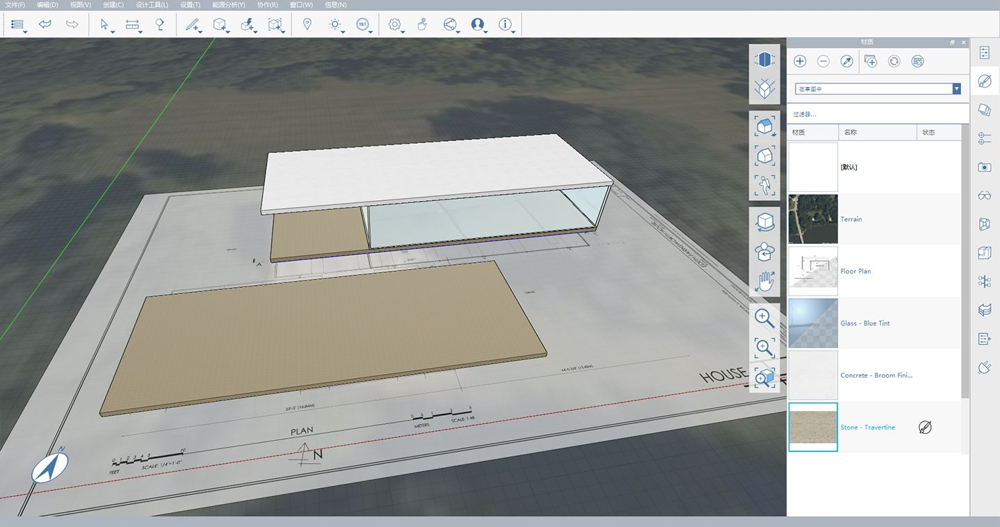

# 1.7 – Peinture avec matériaux

Comme nous l’avons vu dans un **exercice précédent**, vous pouvez créer vos propres matériaux, puis peindre des faces avec ces matériaux dans FormIt. Dans cet exercice, vous allez créer et modifier d’autres matériaux, et importer des matériaux à partir de la bibliothèque de matériaux d’Autodesk.

_Si vous n’avez pas terminé la dernière section, téléchargez et ouvrez le fichier_ _**1.7 – Paint with Materials.axm**_ _à partir du dossier_ _**FormIt Primer Part 1 Datasets** (Jeux de données de la partie I du guide FormIt Primer)._

## **Création des murs en verre**

1 – Pour afficher le plan contenant les cotes que nous allons référencer, accédez à la **palette Calques** et activez le calque **Plan Image** (Image du plan).

2 – Sélectionnez l’outil **Rectangle \(R\)**. Nous allons créer un rectangle directement sur le groupe Floor (Sol) existant. Assurez-vous que vous ne modifiez pas le groupe Floor (Sol), mais que vous dessinez par-dessus l’objet groupé existant.

3 – Pour commencer le rectangle pour la zone de verre, procédez comme suit :

1. Cliquez sur le coin arrière du sol existant et déplacez la souris le long de son arête la plus courte.
2. Saisissez **28 pi-8 po** pour définir la longueur de la première arête, puis cliquez sur **OK**. Cette longueur doit être identique à celle de l’arête courte du sol.
3. Pour définir la deuxième arête, commencez à déplacer la souris le long de l’arête la plus longue du sol existant. Saisissez **55 pi-5 ½ po** pour définir la longueur de la deuxième arête, puis cliquez sur **OK**.
4. Cliquez sur la touche **Échap** pour quitter l’outil Rectangle. Cliquez une fois à l’intérieur du nouveau rectangle pour sélectionner la face et commencez à la faire glisser vers le haut.

4 – Pour définir la hauteur, déplacez la souris vers le haut le long de l’**axe Z**, appuyez sur la touche **Tab** et saisissez **11 pi-2 po**.

_**Remarque :**_ _chaque fois que vous utilisez un outil pour lequel vous pouvez définir une cote, appuyez sur la touche_ _**Tab**_ _ou saisissez directement des nombres._

5 – Double-cliquez sur la nouvelle géométrie et utilisez l’outil **Grouper (G\)** pour la regrouper.

6 – Double-cliquez sur le groupe pour le modifier. Dans la **palette Propriétés**, nommez le groupe **Glass Walls (Murs en verre).**

7 – Pour définir l’épaisseur du mur en verre, procédez comme suit :

1. Cliquez avec le bouton droit de la souris sur la face supérieure et choisissez l’outil **Décaler la face \(OF\).**
2. Déplacez le curseur de la souris vers l’intérieur et saisissez **4 po.**
3. Cliquez deux fois sur **Échap** pour effacer l’outil et la sélection.

​_**Remarque :**_ _les unités par défaut des projets anglo-saxons sont les pieds, comme dans Revit. Si vous saisissez un seul nombre sans unité spécifiée, par exemple_ _**4**, vous obtenez_ _**4 pieds \(4 pi\)**_ _et non_ _**4 pouces \(4 po\)**._

8 – Pour creuser la zone intérieure, cliquez une fois sur la face supérieure intérieure pour la sélectionner, puis cliquez à nouveau pour **faire glisser la face**. Déplacez la face vers le bas jusqu’à ce qu’elle disparaisse, puis cliquez dans l’espace pour terminer le processus.

_**Remarque :**_ _contrairement à d’autres logiciels, FormIt vous empêche de déplacer accidentellement la face à supprimer « trop loin » (entraînant la création d’une extrusion négative)._

9 – Pour désactiver le mode **Modifier le groupe**, double-cliquez dans l’espace ou appuyez sur la touche **Échap.**

10 – Sélectionnez le groupe **Glass Walls** (Murs en verre) en un seul clic et placez-le sur le calque **Main Building Floor** (Sol du bâtiment principal).

## **Importation d’un matériau à partir de la bibliothèque de matériaux d’Autodesk**

1 – Double-cliquez sur le nouveau groupe **Glass Walls** (Murs en verre) pour le modifier.

2 – Pour importer un nouveau matériau dans le modèle, procédez comme suit :

1. Accédez à la **palette Matériaux**.
2. Choisissez **Échantillon de matériaux** dans le menu déroulant situé dans la partie supérieure de la palette pour naviguer dans la **bibliothèque de matériaux d’Autodesk.** ​
3. Cliquez sur le dossier **Glass+Glazing** (Verre+Vitrage) pour l’ouvrir.
4. Recherchez le matériau **Glass – Blue Tint** (Verre – Teinte bleue) et cliquez dessus pour l’ajouter à votre bibliothèque de matériaux **Dans l’esquisse**.
5. Notez que vous revenez normalement à la bibliothèque **Dans l’esquisse**, qui inclut désormais le matériau nouvellement sélectionné.

3 – Après l’ajout du matériau, vous devez automatiquement vous trouver dans l’outil **Pinceau**. Si ce n’est pas le cas, cliquez simplement une fois sur le matériau **Glass – Blue Tint** (Verre – Teinte bleue). Pour peindre tous les murs, double-cliquez sur la géométrie à l’aide de l’outil **Pinceau**. Le matériau sélectionné est alors appliqué à l’objet entier. ​

4 – Cliquez sur **Échap** pour quitter l’outil **Pinceau**. Appuyez de nouveau sur la touche **Échap** ou double-cliquez dans l’espace pour quitter le groupe.

## **Copie rapide du sol pour créer le toit**

1 – Pour créer rapidement le toit en fonction de la géométrie du sol, procédez comme suit :

1. Sélectionnez le groupe **Floor (Sol)** d’un simple clic.
2. Cliquez sur l’un des coins inférieurs pour lancer l’outil **Déplacer**.
3. Commencez à déplacer le sol vers le haut le long de l’axe bleu \(**axe Z**\). Pour créer une **copie rapide**, appuyez sur la touche **Ctrl**. Un aperçu « fantôme » de la copie doit s’afficher​. 
4. Lorsque vous vous déplacez le long de l’axe bleu \(**axe Z**\), commencez à saisir **12 pi 2 po** et la **boîte de dialogue Cote** s’affiche. Cliquez sur **OK** ou appuyez sur **Entrée** pour finaliser la position.

## **Modification du toit**

1 – Le groupe copié est toujours sélectionné, mais utilisez la commande **Rendre unique \(MU\)** pour le dissocier du groupe Floor (Sol).

2 – Double-cliquez sur le groupe pour le modifier. Renommez le groupe **Roof** (Toit) dans la **palette Propriétés**. Pour quitter le groupe, double-cliquez dans l’espace.

3 – Dans la **palette Calques**, créez un **calque** appelé **Roof** (Toit) et ajoutez-y le groupe **Roof** (Toit). Vous pouvez activer ou désactiver le calque pour vérifier que les éléments appropriés se trouvent sur le toit. Reportez-vous au **chapitre 6** pour plus d’informations sur l’utilisation des **calques**.

4 – Accédez à la **palette Matériaux** et importez le matériau **Concrete – Broom Finish – Colorized 1** (Béton – Fini brossé – Coloré 1) à partir du dossier **Concrete+Asphalt** (Béton+Asphalte) dans la bibliothèque **Échantillons de matériaux** **\(Production\)**. Notez qu’en cliquant sur le matériau, la géométrie sélectionnée est automatiquement peinte et le nouveau matériau est ajouté à la bibliothèque de matériaux **Dans l’esquisse**.

_**Remarque :**_ _peindre un groupe en dehors du_ _**mode de modification de groupe**_ _est une technique utile qui vous permet de peindre différentes occurrences du même groupe avec différents matériaux._

## **Création de la terrasse inférieure**

1 – En fonction du calque **Plan Image** (Image du plan), créez la terrasse inférieure sous la forme d’un **rectangle \(R\)** de **55 pi 3 po** de long et **22 pi-7 3/4 po** de large, puis extrudez-le de 1 pi. Positionnez le nouveau rectangle à 8 5/8 po du bord sud du bâtiment principal \(profondeur des poteaux que nous allons créer ultérieurement\).

_**Remarques**:_

* _Reportez-vous aux chapitres précédents pour savoir comment dessiner et extruder des rectangles._
* _Vous devrez peut-être activer ou désactiver l’option_ _**Accrocher à la grille \(SG\)**_ _pour cliquer sur _l’angle de la terrasse.

2 – Pour finaliser la terrasse inférieure, procédez comme suit :

1. Utilisez l’outil **Grouper \(G\)** pour regrouper la géométrie et nommez-la **Lower Terrace Floor** (Sol de la terrasse inférieure).
2. **Déplacez** le groupe de **2 pi-2 po** par rapport au plan du sol.
3. Créez un **calque** appelé **Lower Terrace** (Terrasse inférieure) et ajoutez-y le groupe.
4. Ajoutez la géométrie **Terrace Level Floor** (Sol de la terrasse inférieure) au groupe.

_**Remarque :**_ _cette image ne représente pas le processus détaillé de création et d’affectation de la géométrie aux groupes, niveaux et calques. Pour plus d’informations sur ces processus, reportez-vous aux chapitres précédents de ce guide._

3 – Importez le matériau **Stone > Stone – Travertine** (Pierre > Pierre – Travertin).

4 – Dans la **palette Matériaux**, recherchez le matériau **Travertine** (Travertin) importé et modifiez-le comme suit :

1. Double-cliquez sur la miniature d’aperçu pour ouvrir la fenêtre contextuelle **Éditeur de matériaux**.
2. Cliquez sur la mosaïque d’aperçu **Color** (Couleur) pour ouvrir la fenêtre contextuelle **Éditeur de couleurs**.
3. Définissez le champ **Val** sur **190** pour assombrir la teinte du matériau.

5 – **Peignez** les groupes **Floor** (Sol) et **Lower Terrace Floor** (Sol de la terrasse inférieure) avec le matériau **Travertine** (Travertin) modifié.

