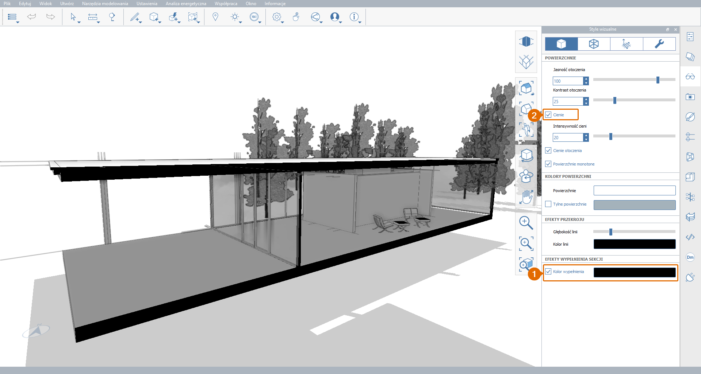

# 1.13 - 단면 평면

_이 장에서는 __**단면 평면**__을 사용하여 모델을 절단하고 내부 공간 및 구조 요소를 표시하는 방법을 알아봅니다. FormIt은 단면 상자와 같은 효과를 위해 여러 개의_ _**단면 평면**__을 한 번에 지원합니다._

_이전 장을 완료하지 않은 경우_ _**1. 13 - Section Planes.axm**_ _파일을_ _**FormIt 입문서 1부 데이터세트**에서 다운로드하여 여십시오._

1 - 새 단면 평면을 작성하려면

1. **표준 도구막대**에서 **단면 평면\(SP\)** 버튼을 클릭합니다.
2. 모델 위에 마우스 커서를 놓으면 참조로 사용할 평면을 식별할 수 있습니다. **단면 평면**의 코너에 있는 화살표는 단면 절단 방향을 나타냅니다. 필요한 경우 **Tab** 키를 눌러 다른 평면으로 전환합니다.
3. **단면 평면**의 아무 곳이나 클릭하여 주 건물의 남쪽 유리 벽에 배치합니다. 평면은 모델 크기에 맞게 축척되고 선택된 상태로 유지됩니다.

2 - 단면 평면을 선택한 상태에서 클릭하여 아래 이미지와 유사하게 주 건물의 일부를 절단할 때까지 뒤로 이동합니다. 이는 단면 평면이 향하고 있는 방향에 수직인 축을 따라서만 이동할 수 있다는 점을 제외하고, 모델 요소를 이동하는 것과 유사하게 작동합니다. 위치가 만족스러우면 **Esc** 키를 눌러 선택을 취소합니다.

_**주:**_ _한 번에 최대 6개의 단면 절단을 모델에 추가할 수 있습니다._

3 - **레이어** **팔레트**를 엽니다. 2개의 새 레이어 **단면 표시기** 및 **단면 절단 1**이 생성되었습니다.

1. **단면 절단 1** 레이어를 껐다가 다시 켭니다. 이렇게 하면 단면이 모델을 절단하는지 여부를 제어할 수 있습니다.
2. 이제 **단면 표시기** 레이어를 끕니다. 이렇게 하면 단면 평면과 해당 화살표 표시기가 숨겨지지만 실제 단면 절단의 활성 여부는 영향을 받지 않습니다.

4 - **비주얼 스타일** **팔레트**의 **표면 탭**에서:

1. **지면 횡단면 색상** 옆에 있는 확인란을 선택하여 켭니다. 이 효과는 단면 평면에 의해 절단된 모든 솔리드에 지정된 색상을 지정합니다. 검은색이 기본 색상이지만 색상 미리보기를 클릭하여 변경할 수 있습니다.
2. **그림자\(DS\)**를 끕니다.

5 - 단면을 마무리하려면 **장면 팔레트**로 이동하고 **단면**이라는 새 장면을 작성하고 현재 **카메라** 위치, **레이어** 가시성 및 **비주얼 스타일** 설정을 저장합니다.

