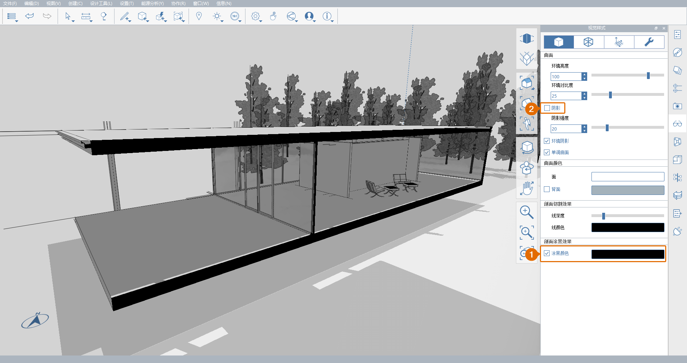

# 1.13 — Płaszczyzny przekroju

_Z tego rozdziału dowiesz się, jak używać_ _**płaszczyzn przekroju**_ _do cięcia modelu, odsłaniania pomieszczeń wewnętrznych i elementów konstrukcyjnych. Program FormIt obsługuje jednocześnie wiele_ _**płaszczyzn przekroju**_ _w celu uzyskania efektu przypominającego zakres przekroju._

_Jeśli poprzedni rozdział nie został ukończony, pobierz i otwórz plik_ _**1. 13 — Section Planes.axm**_ _z zestawów danych_ _**FormIt Primer Part 1 Datasets**._

1 — Tworzenie nowej płaszczyzny przekroju:

1. Kliknij przycisk **Płaszczyzna przekroju \(SP\)** na **standardowym pasku narzędzi**.
2. Ustaw kursor na modelu, aby zidentyfikować płaszczyznę, która ma służyć jako odniesienie. Zwróć uwagę na strzałki w narożnikach **płaszczyzny przekroju**, które wskazują kierunek cięcia przekroju. Naciśnij klawisz **Tab**, aby w razie potrzeby przełączać się między różnymi płaszczyznami.
3. Kliknij, aby umieścić **płaszczyznę przekroju** w dowolnym miejscu na południowej ścianie szklanej budynku głównego. Płaszczyzna zostanie przeskalowana do rozmiaru modelu i pozostanie wybrana.

2 — Przy nadal wybranej płaszczyźnie przekroju kliknij, aby rozpocząć przesuwanie jej do tyłu, aż przetnie część budynku głównego, jak na poniższej ilustracji. Działa to podobnie do przesuwania dowolnego elementu modelu, ale płaszczyzna przekroju może się przesuwać tylko wzdłuż osi prostopadłej do kierunku, w którym jest skierowany jej front. Po uzyskaniu zadowalającego położenia naciśnij klawisz **Esc**, aby anulować wybór.

_**Uwaga:**_ _Do modelu można dodać jednocześnie maksymalnie 6 przekrojów._

3 — Otwórz **paletę** **Warstwy**. Zauważ, że wygenerowano dwie \(2\) nowe warstwy — **Wskaźniki przekroju** i **Cięcie przekroju 1**.

1. Włącz i wyłącz warstwę **Cięcie przekroju 1**. Steruje to tym, czy przekrój przecina model.
2. Teraz wyłącz warstwę **Wskaźniki przekroju**. Powoduje to ukrycie płaszczyzny przekroju i jej wskaźników w postaci strzałek, ale nie wpływa na to, czy samo cięcie przekroju jest aktywne, czy nie.

4 — Na **karcie Powierzchnia** na **palecie** **Style wizualne**:

1. Zaznacz pole wyboru obok opcji **Kolor wypełnienia**, aby ją włączyć. Efekt ten spowoduje pokolorowanie wszystkich brył przeciętych przez płaszczyznę przekroju określonym kolorem. Domyślnym kolorem jest kolor czarny, ale wystarczy kliknąć podgląd koloru, aby go zmienić.
2. Wyłącz opcję **Cienie \(DS\)**.

5 — Aby zakończyć tworzenie przekroju, przejdź do **palety Sceny** i utwórz nową scenę o nazwie **Section**, zapisując bieżącą pozycję **kamery**, widoczność **warstw** i ustawienia **stylów wizualnych**.

