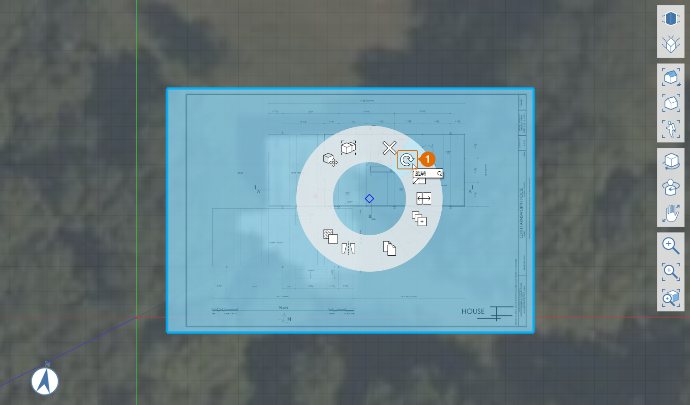

# 1.2 - Impostazione del progetto con immagini e griglia

_È possibile importare immagini PNG o JPG sul piano del terreno del modello selezionando File > Importa dalla barra di navigazione. Tuttavia, per ottenere un maggiore controllo sulla scala e sulla posizione di un'immagine importata, è possibile creare un materiale personalizzato e applicarlo ad un rettangolo che abbiamo disegnato da soli._

_Se non è stata completata l'ultima sezione, scaricare e aprire il file_ _**1.2 - Project Set Up with Images and Grid.axm**_ _dai_ _**set di dati della Parte I della Guida introduttiva di Primer**._

## **Calcolo della dimensione dell'immagine**

Il file **plan.png** fornito è un'immagine di una pianta stampata su un foglio da 24" x 26" \(ARCH D\), che è 3600 pixel di larghezza per 2400 pixel di altezza. Conoscendo la scala del disegno \(¼"=1'-0"\) e le quote dell'immagine, è possibile calcolare 1' = 25 pixel, il che significa che l'immagine deve essere 144' x 96' quando viene importata in FormIt in scala intera.

## **Importazione di un'immagine in scala**

1 - Fare clic sull'icona **Vista dall'alto** sulla **barra degli strumenti Navigazione mobile** per visualizzare la scena dall'alto.

2 - Scegliere lo **strumento Rettangolo \(R\)** dalla barra degli strumenti di disegno 3D.

3 - Per creare un rettangolo che sia esattamente **144'** x **96'**, fare clic in un punto qualsiasi dell'area di lavoro per definire il punto iniziale, quindi spostare il mouse per visualizzare l'anteprima e definire la lunghezza del primo lato. Iniziare a digitare un valore di quota per accedere ad una finestra di dialogo in cui è possibile immettere la quota esatta. Fare clic su **OK** o premere il tasto **INVIO** per applicare la quota. Ripetere la procedura per impostare la lunghezza del secondo lato e terminare il rettangolo.

4 - Per creare il nuovo materiale "Floor Plan":

1. Aprire la **tavolozza Materiali**.
2. Fare clic sull'icona **+** per creare un nuovo materiale.
3. Assegnare al nuovo materiale il nome "**Floor Plan".**
4. In **MAPPE**, fare clic sul riquadro di anteprima delle **trame** e individuare **plan.png** nella cartella **Farnsworth House Data Set &gt; Supporting Files &gt; Images**. Quindi fare clic su **Apri**.
5. In **PROPRIETÀ**, modificare la scala dell'immagine immettendo **144'** nel campo **Scala orizzontale** e **96'** nel campo **Scala verticale**. Tenere presente che lo sblocco della scala orizzontale e verticale \(icona della **catena**\) potrebbe essere necessario per inserire valori che modificano le proporzioni dell'immagine.
6. Selezionare **Trasparenza** e impostarla su circa la metà. In questo modo, l'immagine della pianta del pavimento importata verrà allineata all'immagine satellitare.
7. Fare clic su **OK** per terminare il materiale.

5 - Per dipingere il rettangolo:

1. Nella **tavolozza Materiali**, fare un singolo clic sul riquadro del **materiale Floor Plan** per dipingere con questo materiale. 
2. Fare clic sul rettangolo disegnato per dipingerlo. Premere **ESC** per uscire dallo strumento del pennello.

6 - Se il materiale viene visualizzato invertito o all'indietro, potrebbe essere necessario invertire la superficie. A tale scopo, fare clic con il pulsante destro del mouse per accedere al **menu contestuale** e selezionare il pulsante Inverti superficie \(FF\).

## **Allineamento dell'immagine importata all'immagine satellitare**

1 - Per spostare l'immagine, selezionare innanzitutto il rettangolo facendo doppio clic. Quindi fare clic e trascinare il rettangolo, quindi spostarlo fino a quando non si sovrappone all'edificio nell'immagine satellitare. Torneremo ad allinearlo perfettamente in un secondo momento, ma cercheremo di fare del nostro meglio per ora.

2 - Per ruotare il rettangolo in modo da allinearlo all'immagine satellitare:

1. Fare clic con il pulsante destro del mouse sul rettangolo per visualizzare il menu contestuale. Scegliere **Ruota \(Q\).**
2. Viene visualizzato il **widget Ruota** al centro del rettangolo. Selezionare il widget facendo clic una volta sul grip arancione al centro. Spostare il widget nell'angolo inferiore sinistro del rettangolo. Verrà eseguito lo snap all'angolo. Fare clic per posizionarlo.
3. Digitare **9**. Verrà visualizzata la casella di quota. Fare clic su **OK** per ruotare il rettangolo in senso antiorario di 9 gradi.

## **Allineamento della griglia all'immagine satellitare**

1 - Ora allineeremo la griglia all'immagine satellitare e alla pianta del pavimento. Fare clic con il pulsante destro del mouse in un punto qualsiasi del **piano del terreno** e scegliere **Imposta assi \(SZ\)**.

2 - Viene visualizzato il widget **Imposta assi**. Spostare l'asse nell'angolo inferiore sinistro del rettangolo, dove dovrebbe essere eseguito lo snap. Fare clic per posizionarlo.

3 - Fare clic sul grip all'estremità dell'asse rosso. Spostare il grip nell'angolo inferiore destro del rettangolo in modo che l'asse rosso si allinei con il bordo inferiore del piano. Fare clic nello spazio per applicare questa modifica.

4 - Per allineare la vista alla nuova griglia, fare clic sull'icona Vista dall'alto sulla barra di navigazione per reimpostare la scena.

5 - Per garantire che l'edificio in entrambe le immagini si sovrapponga, selezionare la pianta per spostarla nuovamente fino a quando non si sovrappone correttamente all'immagine satellitare.

6 - L'immagine satellitare, il rettangolo e la griglia sono ora allineati, il che semplifica il disegno 3D.

