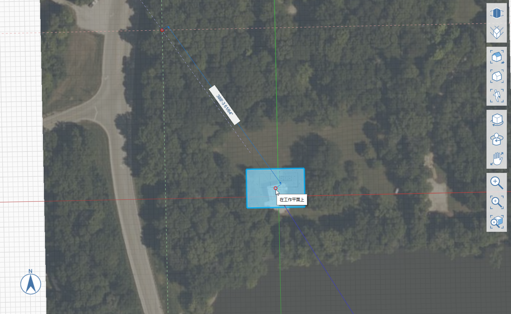

# 1.2 - イメージとグリッドを使用したプロジェクトの設定

_ナビゲーション バーの[ファイル] &gt; [読み込み]から、モデルの地盤面に PNG または JPG イメージを読み込むことができます。ただし、読み込んだイメージの尺度と位置をより詳細にコントロールするために、カスタム マテリアルを作成し、自分で描いた長方形に適用することができます。_

_直前のセクションを完了していない場合は、_ _**1.2 - Project Setup with Images and Grid.axm**_ _ファイルを_ _**FormIt Primer Part 1 Datasets**からダウンロードして開きます。_

## **イメージ サイズを計算する**

用意されている **plan.png** は、幅 3600 x 高さ 2400 ピクセルの 24" x 26" シート\(ARCH D\)に印刷された平面図のイメージです。図面の尺度\(¼" = 1'-0"\)とイメージの寸法から、1 = 25 ピクセルと計算できます。つまり、フル スケールで FormIt に読み込むと、このイメージは 144'x96' になります。

## **イメージを読み込んで尺度変更する**

1 - **[浮動ナビゲーション バー]**の**[上面ビュー]**アイコンをクリックして、上からシーンを表示します。

2 - [3D スケッチ]ツールバーから**[長方形\(R\)]ツール**を選択します。

3 - 正確に **144'** x **96'** の長方形を作成するには、ワークスペース内の任意の場所をクリックして始点を定義し、マウスを動かして最初の辺の長さをプレビューして定義します。寸法の値の入力を開始すると、正確な寸法を入力できるダイアログ ボックスが表示されます。**[OK]**をクリックするか**[Enter]**キーを押して寸法を確定します。このプロセスを繰り返して、2 番目の辺の長さを設定し、長方形を完成させます。

4 - 新しい「Floor Plan」マテリアルを作成するには、次のように操作します。

1. **[マテリアル]パレット**を開きます。
2. **[+]**アイコンをクリックして、新しいマテリアルを作成します。
3. 新しいマテリアルに **Floor Plan**
4. **[マップ]**セクションの**テクスチャ** プレビュー タイルをクリックし、**Farnsworth House Data Set &gt; Supporting Files &gt; Images** フォルダの **plan.png** を参照します。次に**[開く]**をクリックします。
5. **[プロパティ]**セクションで、**[水平スケール]**フィールドに **144'**、**[垂直スケール]**フィールドに **96'** とそれぞれ入力してイメージのスケールを変更します。イメージの比率を変更する値を挿入する場合は、**鎖**アイコンをクリックして、水平スケールと垂直スケールのロックを解除しなければならないことがあります。
6. **[透過度]**をオンにし、約半分に設定します。これで、読み込まれた平面図イメージを衛星画像の位置に合わせることができます。
7. **[OK]**をクリックしてマテリアルを終了します。

5 - 長方形をペイントするには、次のように操作します。

1. **[マテリアル]パレット**でペイントするマテリアルとして**[Floor Plan]マテリアル**のタイルをクリックして選択します。
2. スケッチした長方形をクリックしてペイントします。**[Esc]**を押し、ペイントブラシ ツールを終了します。

6 - マテリアルが反転または逆方向に表示される場合は、必要に応じて面を反転します。マウスで右クリックして表示される**コンテキスト メニュー**から、[面を反転\(FF\)]ボタンを選択します。

## **読み込まれたイメージを衛星画像に合わせる**

1 - イメージを移動するには、まずイメージをダブルクリックして長方形を選択します。次に、長方形をクリックしてドラッグし、衛星画像の建物と重なるまで移動させます。後で完全な位置合わせを行うので、ここではだいたいの調整を行います。

2 - 衛星画像に合わせて長方形を回転させるには、次のように操作します。

1. 長方形を右クリックして、コンテキストメニューを表示します。**[回転\(Q\)]**
2. 長方形の中央に**回転ウィジェット**が表示されます。中央のオレンジ色のグリップをクリックして、ウィジェットを選択します。ウィジェットを長方形の左下コーナーに移動します。コーナーにスナップします。クリックすると配置されます。
3. **9** と入力すると、寸法ボックスが表示されます。**[OK]**をクリックして、長方形を反時計回りに 9 度回転します。

## **グリッドを衛星画像に位置合わせする**

1 - 次に、衛星画像と平面図にグリッドを位置合わせします。**地盤面**上で右クリックし、**[軸を設定(SZ)]**を選択します。

2 - **[軸を設定]**のウィジェットが表示されます。スナップする長方形の左下コーナーに軸を移動します。クリックすると配置されます。

3 - 赤い軸の端にあるグリップをクリックします。グリップを長方形の右下コーナーに移動して、赤い軸を平面の下部エッジに揃えます。スペースの任意の場所をクリックして、この変更を確定します。

4 - ビューを新しいグリッドに位置合わせするには、ナビゲーション バーの[上面ビュー]アイコンをクリックしてシーンをリセットします。

5 - 両方のイメージの建物を確実に重ねるには、平面図を選択し、衛星画像に重なるまで動かします。

6 - 衛星画像、長方形、グリッドが位置合わせされ、3D スケッチがしやすくなります。

