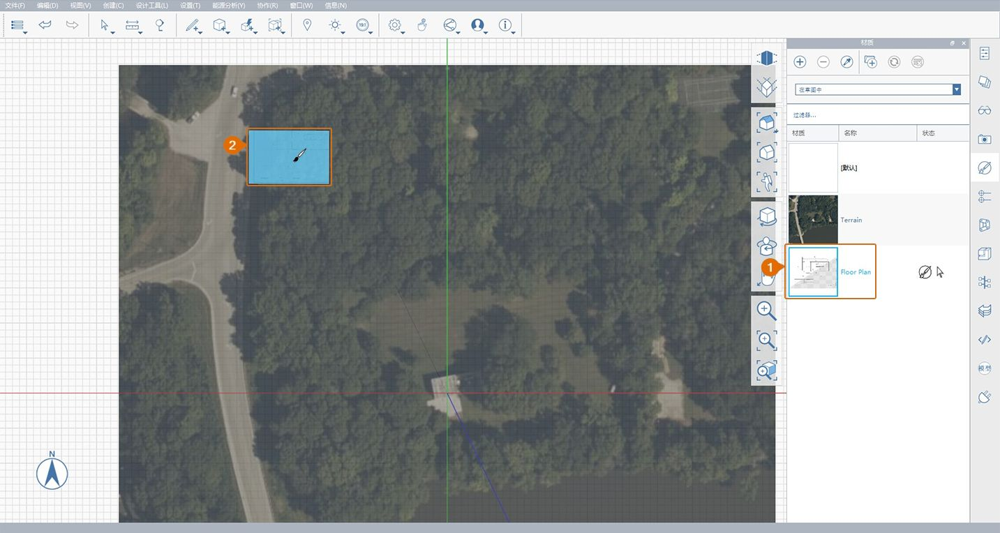

# 1.2 - Configuración de proyectos con imágenes y rejilla

_Puede importar imágenes PNG o JPG en el plano de suelo del modelo. Para ello, seleccione Archivo > Importar desde la barra de navegación. Sin embargo, para obtener un mayor control sobre la escala y la posición de una imagen importada, podemos crear un material personalizado y aplicarlo a un rectángulo que hemos dibujado nosotros mismos._

_Si no ha completado la última sección, abra el archivo_ _**1.2 - Project Set Up with Images and Grid.axm**_ _del_ _**conjunto de datos de la parte 1 de FormIt Primer**._

## **Calcular el tamaño de la imagen**

El archivo **plan.png** proporcionado es una imagen de un plano impreso en un hoja \(ARCH D\) de 24" x 26", cuya anchura es de 3600 píxeles y su altura es de 2400 píxeles. Al conocer la escala de dibujo \(¼"=1'-0"\) y las cotas de imagen, puede calcular que 1' es igual a 25 píxeles, lo que significa que la imagen debe presentar un tamaño de 144' x 96' cuando se importa a escala completa en FormIt.

## **Importar una imagen para ajustar su escala**

1 - Haga clic en el icono **Vista superior** de la **barra de navegación flotante** para ver la escena desde arriba.

2 - Seleccione la **herramienta Rectángulo \(R\)** en la barra de herramientas Boceto 3D.

3 - Para crear un rectángulo con un tamaño exacto de **144'** x **96'**, haga clic en cualquier lugar del espacio de trabajo para definir el punto inicial y, a continuación, mueva el ratón para obtener una vista preliminar y definir la longitud del primer lado. Empiece a escribir un valor de cota para acceder a un cuadro de diálogo en el que puede introducir la cota exacta. Haga clic en **Aceptar** o pulse la tecla **Intro** para confirmar la cota. Repita el proceso para establecer la longitud del segundo lado y finalizar el rectángulo.

4 - Para crear el nuevo material "Plano de planta", realice lo siguiente:

1. Abra la **paleta Materiales**.
2. Haga clic en el icono **+** para crear un material nuevo.
3. Asigne al nuevo material el nombre "**Plano de planta".**
4. En **MAPAS**, haga clic en el mosaico de vista preliminar de **textura** y vaya al archivo **plan.png** de la carpeta **Farnsworth House Data Set &gt; Supporting Files &gt; Images**. A continuación, haga clic en **Abrir**.
5. En **PROPIEDADES**, cambie la escala de la imagen. Para ello, introduzca **144'** en el campo **Escala horizontal** y **96'** en el campo **Escala vertical**. Tenga en cuenta que puede que sea necesario desbloquear la escala horizontal y vertical \(**icono de eslabón de cadena**\) para insertar valores que cambien las proporciones de la imagen.
6. Active **Transparencia** y establezca su valor en aproximadamente la mitad. Esto ayudará a alinear la imagen del plano de planta importada con la imagen de satélite.
7. Haga clic en **Aceptar **para finalizar el material.

5 - Para pintar el rectángulo, realice lo siguiente:

1. En la **paleta Materiales**, haga clic una vez en el mosaico **Material de plano de planta** para pintar con este material.
2. Haga clic en el rectángulo que ha dibujado para pintarlo. Pulse **Esc** para salir de la herramienta Pincel.

6 - Si el material aparece invertido o hacia atrás, es posible que deba invertir la cara. Para ello, haga clic con el botón derecho del ratón para acceder al **menú contextual** y seleccione el botón Invertir cara \(FF\).

## **Alinear la imagen importada con la imagen de satélite**

1 - Para mover la imagen, seleccione primero el rectángulo. Para ello, haga doble clic en él. A continuación, haga clic en el rectángulo y arrástrelo hasta que solape con el edificio de la imagen de satélite. Volveremos a alinearlo perfectamente más tarde; por el momento, solo vamos a intentar acercarlo.

2 - Para rotar el rectángulo a fin de alinearlo con la imagen de satélite:

1. Haga clic con el botón derecho en el rectángulo para abrir el menú contextual. Seleccione **Rotar \(Q\).**
2. El **widget de rotación** aparece en el centro del rectángulo. Seleccione el widget. Para ello, haga clic una vez en el pinzamiento naranja situado en el centro. Desplace el widget a la esquina inferior izquierda del rectángulo. Se forzará el cursor a la esquina. Haga clic para colocarlo.
3. Introduzca **9**; aparecerá el cuadro de cota. Haga clic en el botón **Aceptar** para rotar el rectángulo 9 grados en sentido antihorario.

## **Alinear la rejilla con la imagen de satélite**

1 - Ahora, vamos a alinear la rejilla con la imagen de satélite y el plano de planta. Haga clic con el botón derecho en cualquier lugar del **plano de suelo** y seleccione **Establecer ejes \(SZ\)**.

2 - Aparecerá el widget para **establecer ejes**. Desplace el eje a la esquina inferior izquierda del rectángulo, donde se debería forzar el cursor. Haga clic para colocarlo.

3 - Haga clic en el pinzamiento situado en el extremo del eje rojo. Desplace el pinzamiento a la esquina inferior derecha del rectángulo para que el eje rojo se alinee con el borde inferior del plano. Haga clic fuera del espacio para confirmar este cambio.

4 - Para alinear la vista con la nueva rejilla, haga clic en el icono Vista superior de la barra de navegación para restablecer la escena.

5 - Para garantizar que el edificio de ambas imágenes se solape, seleccione el plano para desplazarlo una vez más hasta que se solape correctamente con la imagen de satélite.

6 - La imagen de satélite, el rectángulo y la rejilla ahora están alineados, lo que simplificará el boceto 3D.

