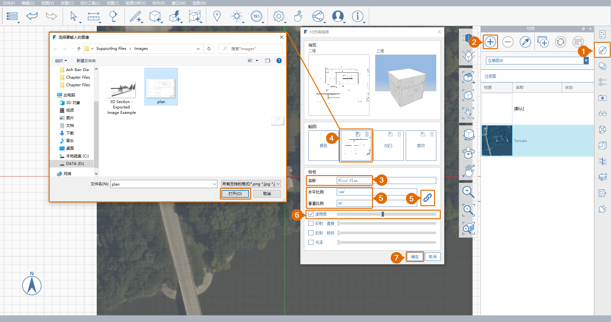

# 1.2. Настройка проекта с использованием изображений и сетки

_Чтобы импортировать изображения PNG и JPG на нулевую плоскость модели, выберите «Файл &gt; Импорт» на панели навигации. Для того чтобы лучше контролировать масштабом и размещение импортированного изображения, можно создать настроенный материал и применить его к нарисованному прямоугольнику._

_Если вы не работали с предыдущим разделом, загрузите и откройте файл_ _**1.2 - Project Set Up with Images and Grid.axm**_ _из_ _**наборов данных для части I руководства FormIt Primer**._

## **Расчет размера изображения**

Предоставленный файл **plan.png** — это изображение плана, напечатанного на листе размером 24 x 26 дюймов \(ARCH D\) шириной 3600 пикселей и высотой 2400 пикселей. Зная масштаб чертежа \(¼"=1'-0"\) и размеры изображения, можно вычислить, что 1’ = 25 пикселей, а значит, при импорте в FormIt в полном масштабе размер изображения должен составлять 144' x 96' (144 фута на 96 футов).

## **Импорт изображения в масштабе**

1 – Щелкните значок **Вид сверху** на **плавающей панели навигации**, чтобы просмотреть сцену сверху.

2 - Выберите **инструмент «Прямоугольник» \(R\)** на панели «3D-эскиз».

3 – Чтобы создать прямоугольник размером ровно **144’** x **96’**, щелкните в любом месте рабочего пространства и определите начальную точку, а затем переместите мышь для предварительного просмотра и определения длины первой стороны. Начните вводить значение размера, чтобы открылось диалоговое окно, в котором можно указать точный размер. Нажмите **ОК** или клавишу **ENTER**, чтобы применить размер. Повторите процедуру, чтобы задать длину второй стороны и завершить построение прямоугольника.

4 - Чтобы создать новый материал «План этажа», выполните следующие действия.

1. Откройте **палитру материалов**.
2. Нажмите кнопку **+**, чтобы создать новый материал.
3. Присвойте новому материалу имя «**План этажа».**
4. В разделе **КАРТЫ** щелкните миниатюру **Текстура** и перейдите к файлу **plan.png** в каталоге **Farnsworth House Data Set &gt;  Supporting Files &gt; Images**. Затем нажмите **Открыть**.
5. В разделе **СВОЙСТВА** измените масштаб изображения, введя значение **144'** в поле **Масштаб по горизонтали** и значение **96'** в поле **Масштаб по вертикали**. Обратите внимание, что для вставки значений, изменяющих пропорции изображения, может потребоваться разблокирование масштаба по горизонтали и по вертикали \(значок **звена цепи**).
6. Установите флажок **Прозрачность** и задайте среднее значение. Это поможет выровнять импортированное изображение плана этажа со спутниковым снимком.
7. Нажмите кнопку **ОК**, чтобы завершить создание материала.

5 - Чтобы закрасить прямоугольник, выполните следующие действия.

1. На **палитре материалов** щелкните плитку **Материала плана этажа**, чтобы заполнить его выбранным материалом.
2. Щелкните прямоугольник для заполнения. Нажмите клавишу **ESC** для завершения работы с инструментом «Кисть».

6 - Если материал отображается обратной стороной, необходимо обратить грань. Для этого нажмите правую кнопку мыши, чтобы вызвать **контекстное меню**, и нажмите кнопку «Обратить грань» \(FF\).

## **Выравнивание импортированного изображения в соответствии со спутниковым снимком**

1 – Чтобы переместить изображение, сначала выберите прямоугольник двойным щелчком мыши. Затем щелкните прямоугольник и перетаскивайте его, пока он не перекроет здание на спутниковом снимке. Мы вернемся к выравниванию позже, а пока выполните перемещение как можно точнее.

2 - Чтобы повернуть прямоугольник для выравнивания в соответствии со спутниковым снимком, выполните следующие действия.

1. Щелкните прямоугольник правой кнопкой мыши, чтобы открыть контекстное меню. Выберите **Повернуть \(Q\).**
2. В середине прямоугольника появится **виджет поворота**. Выберите виджет, щелкнув ручку оранжевого цвета в центре. Переместите виджет в левый нижний угол прямоугольника. Он будет привязан к углу. Щелкните мышью для его размещения.
3. Введите **9**, и отобразится поле размера. Нажмите **ОК**, чтобы повернуть прямоугольник против часовой стрелки на 9 градусов.

## **Выравнивание сетки по спутниковому снимку**

1 - Теперь выровняем сетку по спутниковому снимку и плану этажа. Щелкните правой кнопкой мыши в любой точке **нулевой плоскости** и выберите **Задать оси \(SZ\)**.

2 – Появится виджет **Задать ось**. Переместите ось в левый нижний угол прямоугольника а то место, к которому ее необходимо привязать. Щелкните мышью для его размещения.

3 - Щелкните ручку в конце красной оси. Переместите ручку в правый нижний угол прямоугольника так, чтобы красная ось совпадала с нижним краем плоскости. Щелкните в свободном пространстве, чтобы применить это изменение.

4 - Чтобы выровнять вид по новой сетке, щелкните значок «Вид сверху» на панели навигации и сбросьте сцену.

5 - Чтобы выполнить наложение зданий на обоих изображениях, выберите план и перемещайте его до тех пор, пока он не будет правильно наложен на спутниковый снимок.

6 - Теперь спутниковый снимок, прямоугольник и сетка выровнены, что упрощает создание 3D-эскизов.

